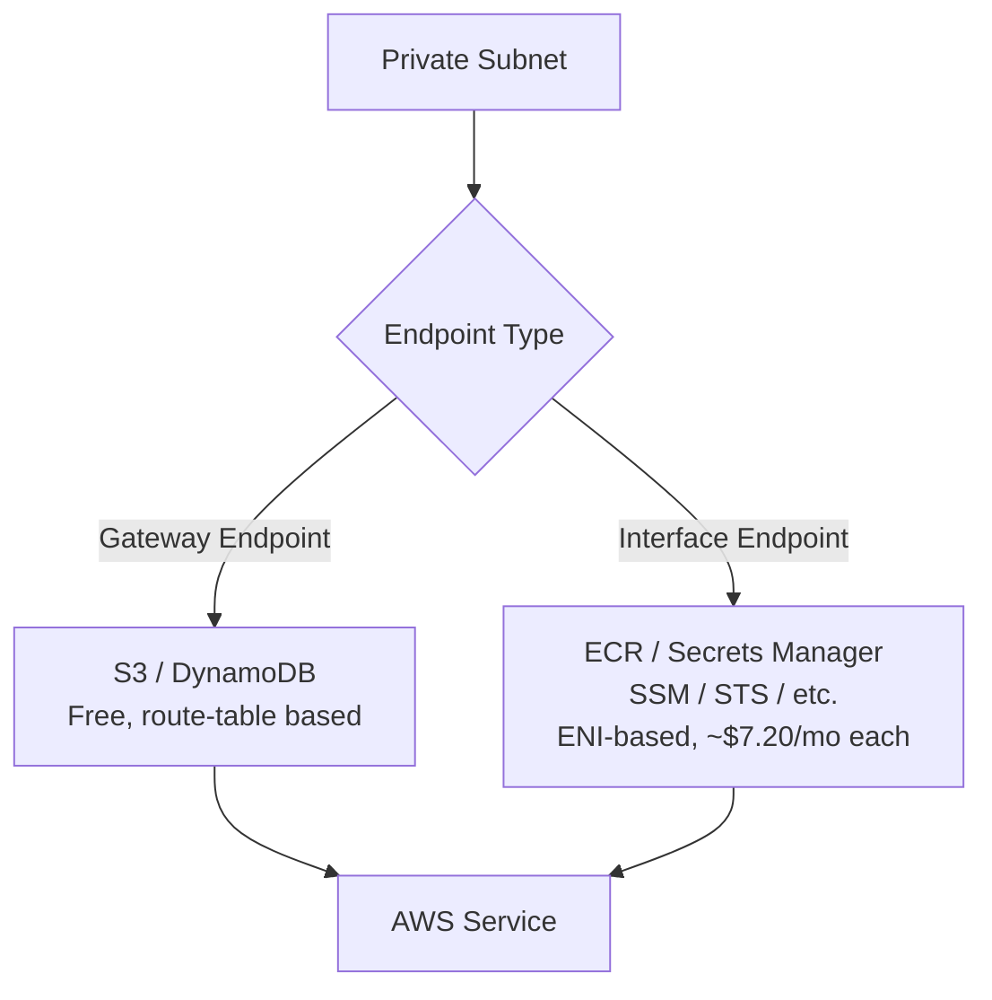

# How to Configure VPC Endpoints for AWS Services with OpenTofu

Author: [nawazdhandala](https://www.github.com/nawazdhandala)

Tags: OpenTofu, AWS, VPC Endpoints, S3, DynamoDB, ECR, Private Connectivity, Infrastructure as Code

Description: Learn how to create AWS VPC Gateway and Interface endpoints for S3, DynamoDB, ECR, Secrets Manager, and other AWS services using OpenTofu to eliminate NAT Gateway costs and improve security.

---

VPC endpoints allow resources in private subnets to access AWS services without routing through a NAT gateway or internet gateway. Gateway endpoints (S3, DynamoDB) are free; Interface endpoints (most other services) reduce NAT Gateway data processing costs and improve security by keeping traffic within the AWS network.

## VPC Endpoint Types



## Gateway Endpoints (S3 and DynamoDB)

```hcl
# gateway_endpoints.tf
resource "aws_vpc_endpoint" "s3" {
  vpc_id            = var.vpc_id
  service_name      = "com.amazonaws.${var.region}.s3"
  vpc_endpoint_type = "Gateway"
  route_table_ids   = var.private_route_table_ids

  tags = {
    Name        = "${var.prefix}-s3-endpoint"
    Environment = var.environment
    ManagedBy   = "opentofu"
  }
}

resource "aws_vpc_endpoint" "dynamodb" {
  vpc_id            = var.vpc_id
  service_name      = "com.amazonaws.${var.region}.dynamodb"
  vpc_endpoint_type = "Gateway"
  route_table_ids   = var.private_route_table_ids

  tags = {
    Name        = "${var.prefix}-dynamodb-endpoint"
    Environment = var.environment
    ManagedBy   = "opentofu"
  }
}
```

## Interface Endpoints for ECR and Container Services

```hcl
# interface_endpoints.tf

locals {
  # ECR requires both endpoints
  ecr_endpoints = {
    ecr_api = "com.amazonaws.${var.region}.ecr.api"
    ecr_dkr = "com.amazonaws.${var.region}.ecr.dkr"
  }

  # Additional common endpoints
  optional_endpoints = {
    sts             = "com.amazonaws.${var.region}.sts"
    ssm             = "com.amazonaws.${var.region}.ssm"
    ssmmessages     = "com.amazonaws.${var.region}.ssmmessages"
    ec2messages     = "com.amazonaws.${var.region}.ec2messages"
    secretsmanager  = "com.amazonaws.${var.region}.secretsmanager"
    logs            = "com.amazonaws.${var.region}.logs"
    kms             = "com.amazonaws.${var.region}.kms"
  }
}

resource "aws_security_group" "endpoints" {
  name        = "${var.prefix}-vpc-endpoints"
  description = "Allow HTTPS inbound for VPC interface endpoints"
  vpc_id      = var.vpc_id

  ingress {
    from_port   = 443
    to_port     = 443
    protocol    = "tcp"
    cidr_blocks = [var.vpc_cidr]
  }

  tags = {
    Name = "${var.prefix}-vpc-endpoints"
  }
}

resource "aws_vpc_endpoint" "ecr" {
  for_each = local.ecr_endpoints

  vpc_id              = var.vpc_id
  service_name        = each.value
  vpc_endpoint_type   = "Interface"
  subnet_ids          = var.private_subnet_ids
  security_group_ids  = [aws_security_group.endpoints.id]
  private_dns_enabled = true

  tags = {
    Name        = "${var.prefix}-${each.key}-endpoint"
    Environment = var.environment
  }
}

resource "aws_vpc_endpoint" "optional" {
  for_each = var.enabled_interface_endpoints  # e.g., toset(["sts", "ssm", "secretsmanager"])

  vpc_id              = var.vpc_id
  service_name        = local.optional_endpoints[each.value]
  vpc_endpoint_type   = "Interface"
  subnet_ids          = var.private_subnet_ids
  security_group_ids  = [aws_security_group.endpoints.id]
  private_dns_enabled = true

  tags = {
    Name        = "${var.prefix}-${each.value}-endpoint"
    Environment = var.environment
  }
}
```

## EKS-Required Endpoints

```hcl
# eks_endpoints.tf — required for EKS nodes in private subnets
locals {
  eks_required_endpoints = {
    ec2         = "com.amazonaws.${var.region}.ec2"
    eks         = "com.amazonaws.${var.region}.eks"
    sts         = "com.amazonaws.${var.region}.sts"
    ecr_api     = "com.amazonaws.${var.region}.ecr.api"
    ecr_dkr     = "com.amazonaws.${var.region}.ecr.dkr"
    s3          = "com.amazonaws.${var.region}.s3"  # Use Gateway type
    logs        = "com.amazonaws.${var.region}.logs"
    ssm         = "com.amazonaws.${var.region}.ssm"
    ssmmessages = "com.amazonaws.${var.region}.ssmmessages"
    ec2messages = "com.amazonaws.${var.region}.ec2messages"
    elasticloadbalancing = "com.amazonaws.${var.region}.elasticloadbalancing"
    autoscaling = "com.amazonaws.${var.region}.autoscaling"
  }
}
```

## Endpoint Policy for S3

```hcl
# Restrict S3 gateway endpoint to specific buckets
resource "aws_vpc_endpoint" "s3_restricted" {
  vpc_id            = var.vpc_id
  service_name      = "com.amazonaws.${var.region}.s3"
  vpc_endpoint_type = "Gateway"
  route_table_ids   = var.private_route_table_ids

  policy = jsonencode({
    Version = "2012-10-17"
    Statement = [
      {
        Effect    = "Allow"
        Principal = "*"
        Action    = ["s3:GetObject", "s3:PutObject", "s3:ListBucket"]
        Resource  = [
          "arn:aws:s3:::${var.allowed_bucket_name}",
          "arn:aws:s3:::${var.allowed_bucket_name}/*",
          # Also allow access to Amazon-managed S3 buckets (for EKS, SSM, etc.)
          "arn:aws:s3:::amazonlinux.${var.region}.amazonaws.com/*",
          "arn:aws:s3:::amazonlinux-2-repos-${var.region}/*",
        ]
      }
    ]
  })
}
```

## Best Practices

- Always create S3 and DynamoDB gateway endpoints — they're free and immediately reduce NAT gateway data processing costs for any traffic to these services.
- For EKS clusters in private subnets, create all ECR, STS, EC2, and CloudWatch Logs endpoints — without these, nodes cannot pull images or register with the cluster.
- Use `private_dns_enabled = true` on interface endpoints so applications use the standard AWS service endpoint hostname without any code changes.
- Create endpoint security groups that allow HTTPS (port 443) from the VPC CIDR — interface endpoints are ENIs and require security group rules.
- Calculate break-even for interface endpoints: each endpoint costs ~$7.20/month per AZ; compare against NAT gateway data processing at $0.045/GB. For a private VPC with moderate API traffic, endpoints usually pay for themselves.
