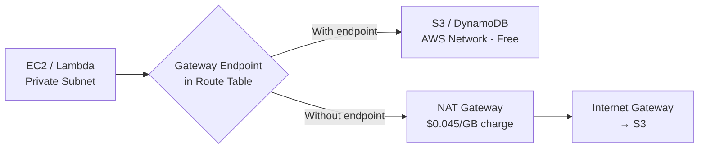

# How to Configure VPC Gateway Endpoints for S3 and DynamoDB with OpenTofu

Author: [nawazdhandala](https://www.github.com/nawazdhandala)

Tags: OpenTofu, AWS, VPC, Gateway Endpoints, S3, DynamoDB, Cost Optimization, Infrastructure as Code

Description: Learn how to create AWS VPC Gateway endpoints for S3 and DynamoDB using OpenTofu to route traffic privately without NAT gateways, reducing costs and improving security.

---

VPC Gateway endpoints for S3 and DynamoDB route traffic to these services through the AWS network without requiring a NAT gateway or internet gateway. They're free, require no ENIs, and can significantly reduce NAT gateway data transfer costs for workloads with high S3 or DynamoDB traffic.

## Gateway Endpoint Traffic Flow



## S3 Gateway Endpoint

```hcl
# s3_endpoint.tf

data "aws_vpc" "main" {
  id = var.vpc_id
}

# S3 gateway endpoint - free, no ENI needed
resource "aws_vpc_endpoint" "s3" {
  vpc_id            = var.vpc_id
  service_name      = "com.amazonaws.${var.region}.s3"
  vpc_endpoint_type = "Gateway"

  # Add to all private and database route tables
  route_table_ids = concat(
    var.private_route_table_ids,
    var.database_route_table_ids
  )

  # Optional: restrict which S3 buckets can be accessed via this endpoint
  policy = var.restrict_s3_access ? jsonencode({
    Version = "2012-10-17"
    Statement = [
      {
        Effect    = "Allow"
        Principal = "*"
        Action    = ["s3:GetObject", "s3:PutObject", "s3:ListBucket"]
        Resource = [
          "arn:aws:s3:::${var.allowed_bucket}",
          "arn:aws:s3:::${var.allowed_bucket}/*",
          # Always allow Amazon-managed buckets for patching, SSM, etc.
          "arn:aws:s3:::amazonlinux.${var.region}.amazonaws.com/*",
          "arn:aws:s3:::amazonlinux-2-repos-${var.region}/*",
          "arn:aws:s3:::aws-ssm-${var.region}/*",
          "arn:aws:s3:::amazon-ssm-packages-${var.region}/*",
        ]
      }
    ]
  }) : null

  tags = {
    Name        = "${var.prefix}-s3-gateway-endpoint"
    Environment = var.environment
    ManagedBy   = "opentofu"
  }
}
```

## DynamoDB Gateway Endpoint

```hcl
# dynamodb_endpoint.tf
resource "aws_vpc_endpoint" "dynamodb" {
  vpc_id            = var.vpc_id
  service_name      = "com.amazonaws.${var.region}.dynamodb"
  vpc_endpoint_type = "Gateway"

  route_table_ids = concat(
    var.private_route_table_ids,
    var.database_route_table_ids
  )

  tags = {
    Name        = "${var.prefix}-dynamodb-gateway-endpoint"
    Environment = var.environment
    ManagedBy   = "opentofu"
  }
}
```

## Route Table Integration

```hcl
# routes.tf - example of how route tables include gateway endpoint routes
# (Routes are managed by the vpc_endpoint resource, not manually)

resource "aws_route_table" "private" {
  count  = length(var.private_subnet_ids)
  vpc_id = var.vpc_id

  route {
    cidr_block     = "0.0.0.0/0"
    nat_gateway_id = var.nat_gateway_ids[count.index]
  }

  # S3 and DynamoDB routes are automatically added by aws_vpc_endpoint
  # When you list this route table in route_table_ids above

  tags = {
    Name = "${var.prefix}-private-rt-${count.index}"
  }
}
```

## Security: Bucket Policy to Enforce VPC Endpoint Access

```hcl
# bucket_policy.tf - require all S3 access through VPC endpoint
resource "aws_s3_bucket_policy" "enforce_vpc_endpoint" {
  bucket = aws_s3_bucket.data.id

  policy = jsonencode({
    Version = "2012-10-17"
    Statement = [
      {
        Sid    = "DenyAccessNotFromVPCEndpoint"
        Effect = "Deny"
        Principal = "*"
        Action = ["s3:GetObject", "s3:PutObject", "s3:DeleteObject"]
        Resource = [
          aws_s3_bucket.data.arn,
          "${aws_s3_bucket.data.arn}/*"
        ]
        Condition = {
          StringNotEquals = {
            "aws:SourceVpce" = aws_vpc_endpoint.s3.id
          }
        }
      }
    ]
  })
}
```

## Cost Analysis

```hcl
# outputs.tf - expose endpoint IDs for cost tracking
output "s3_endpoint_id" {
  description = "S3 VPC endpoint ID - use in bucket policies to enforce VPC-only access"
  value       = aws_vpc_endpoint.s3.id
}

output "dynamodb_endpoint_id" {
  description = "DynamoDB VPC endpoint ID"
  value       = aws_vpc_endpoint.dynamodb.id
}

# Cost savings calculation (example):
# Before: 1TB/month S3 traffic through NAT = $45.00/month
# After: 1TB/month S3 traffic through gateway endpoint = $0.00/month
# Annual savings: $540.00 per VPC
```

## Verification

```bash
# Verify gateway endpoints are routing correctly
# From an EC2 instance in a private subnet:

# Check route table includes endpoint route
aws ec2 describe-route-tables \
  --filters "Name=association.subnet-id,Values=subnet-xxx" \
  --query 'RouteTables[].Routes[?GatewayId!=null]'

# Verify S3 traffic goes through endpoint (no NAT)
# CloudWatch: check NAT gateway bytes processed - should decrease after adding endpoint

# Test S3 access from private subnet
aws s3 ls s3://your-bucket/  # Should work without internet access
```

## Best Practices

- Always add S3 and DynamoDB gateway endpoints to every VPC - they're free and immediately reduce NAT gateway costs for any S3/DynamoDB traffic.
- Add gateway endpoints to all private route tables including database subnets - RDS and Lambda in database subnets often make AWS API calls that would otherwise go through NAT.
- Use endpoint policies to restrict which S3 buckets can be accessed - this prevents a compromised instance from exfiltrating data to an attacker-controlled S3 bucket in another account.
- When using S3 for application data, enforce bucket policies that require VPC endpoint access (`aws:SourceVpce` condition) - this ensures traffic stays within the AWS network even if a bucket policy is misconfigured.
- After adding endpoints, monitor NAT gateway bytes processed in CloudWatch - you should see a reduction proportional to your S3/DynamoDB traffic volume.
