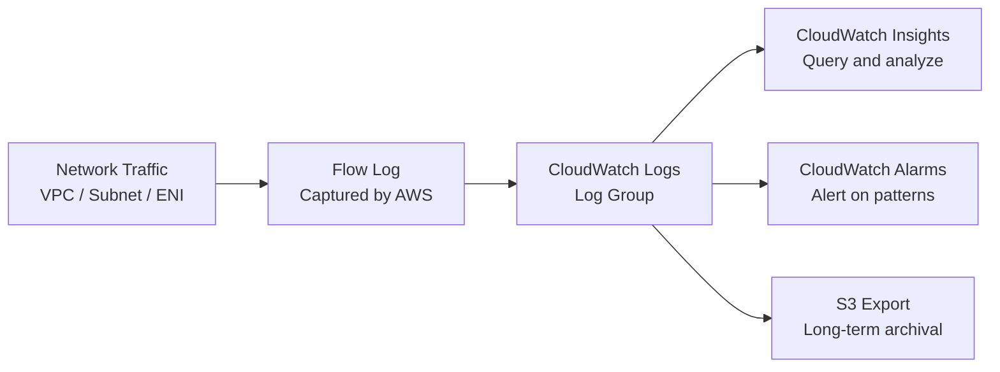

# How to Configure VPC Flow Logs to CloudWatch with OpenTofu

Author: [nawazdhandala](https://www.github.com/nawazdhandala)

Tags: OpenTofu, AWS, VPC, Flow Logs, CloudWatch, Network Security, Monitoring, Infrastructure as Code

Description: Learn how to enable VPC Flow Logs to CloudWatch Logs using OpenTofu for network traffic analysis, security investigation, and connectivity troubleshooting.

---

VPC Flow Logs capture information about IP traffic to and from network interfaces in your VPC. Sending them to CloudWatch Logs enables real-time alerting, log insights queries, and security analysis. OpenTofu manages the flow log configuration, IAM roles, and CloudWatch log groups.

## Flow Logs Architecture



## IAM Role for Flow Logs

```hcl
# iam.tf
resource "aws_iam_role" "flow_logs" {
  name = "${var.prefix}-vpc-flow-logs"

  assume_role_policy = jsonencode({
    Version = "2012-10-17"
    Statement = [{
      Effect = "Allow"
      Principal = {
        Service = "vpc-flow-logs.amazonaws.com"
      }
      Action = "sts:AssumeRole"
    }]
  })
}

resource "aws_iam_role_policy" "flow_logs" {
  name = "flow-logs-cloudwatch"
  role = aws_iam_role.flow_logs.id

  policy = jsonencode({
    Version = "2012-10-17"
    Statement = [{
      Effect = "Allow"
      Action = [
        "logs:CreateLogGroup",
        "logs:CreateLogStream",
        "logs:PutLogEvents",
        "logs:DescribeLogGroups",
        "logs:DescribeLogStreams",
      ]
      Resource = "*"
    }]
  })
}
```

## CloudWatch Log Group

```hcl
# log_group.tf
resource "aws_cloudwatch_log_group" "vpc_flow_logs" {
  name              = "/aws/vpc/flow-logs/${var.prefix}"
  retention_in_days = var.log_retention_days  # 90 for security compliance, 7-30 for cost

  # Optional: encrypt logs with KMS
  kms_key_id = var.enable_kms_encryption ? aws_kms_key.flow_logs[0].arn : null

  tags = {
    Name        = "${var.prefix}-vpc-flow-logs"
    Environment = var.environment
    ManagedBy   = "opentofu"
  }
}
```

## VPC Flow Logs

```hcl
# flow_logs.tf

# VPC-level flow logs — captures all traffic in the VPC
resource "aws_flow_log" "vpc" {
  iam_role_arn    = aws_iam_role.flow_logs.arn
  log_destination = aws_cloudwatch_log_group.vpc_flow_logs.arn
  traffic_type    = "ALL"  # ACCEPT, REJECT, or ALL
  vpc_id          = var.vpc_id

  # Custom log format — more fields than the default format
  log_format = "$${version} $${account-id} $${interface-id} $${srcaddr} $${dstaddr} $${srcport} $${dstport} $${protocol} $${packets} $${bytes} $${start} $${end} $${action} $${log-status} $${vpc-id} $${subnet-id} $${instance-id} $${tcp-flags} $${type} $${pkt-srcaddr} $${pkt-dstaddr}"

  tags = {
    Name        = "${var.prefix}-vpc-flow-logs"
    Environment = var.environment
    ManagedBy   = "opentofu"
  }
}

# Subnet-level flow logs for more granular control (optional)
resource "aws_flow_log" "subnet" {
  count = var.enable_subnet_flow_logs ? length(var.private_subnet_ids) : 0

  iam_role_arn    = aws_iam_role.flow_logs.arn
  log_destination = aws_cloudwatch_log_group.vpc_flow_logs.arn
  traffic_type    = "REJECT"  # Only rejected traffic for security analysis
  subnet_id       = var.private_subnet_ids[count.index]
}
```

## CloudWatch Insights Queries

```hcl
# saved_queries.tf
resource "aws_cloudwatch_query_definition" "rejected_traffic" {
  name = "${var.prefix}/rejected-traffic"

  log_group_names = [aws_cloudwatch_log_group.vpc_flow_logs.name]

  query_string = <<-EOT
    fields @timestamp, srcAddr, dstAddr, srcPort, dstPort, protocol, action
    | filter action = "REJECT"
    | sort @timestamp desc
    | limit 100
  EOT
}

resource "aws_cloudwatch_query_definition" "top_talkers" {
  name = "${var.prefix}/top-talkers-by-bytes"

  log_group_names = [aws_cloudwatch_log_group.vpc_flow_logs.name]

  query_string = <<-EOT
    fields @timestamp, srcAddr, dstAddr, bytes
    | filter action = "ACCEPT"
    | stats sum(bytes) as totalBytes by srcAddr, dstAddr
    | sort totalBytes desc
    | limit 20
  EOT
}
```

## Security Alerts on Flow Logs

```hcl
# alarms.tf
resource "aws_cloudwatch_metric_filter" "rejected_traffic" {
  name           = "${var.prefix}-rejected-traffic"
  pattern        = "[version, account, eni, source, destination, srcport, destport, protocol, packets, bytes, start, end, action=REJECT, log_status]"
  log_group_name = aws_cloudwatch_log_group.vpc_flow_logs.name

  metric_transformation {
    name      = "RejectedPackets"
    namespace = "VPCFlowLogs/${var.prefix}"
    value     = "1"
  }
}

resource "aws_cloudwatch_metric_alarm" "high_rejection_rate" {
  alarm_name          = "${var.prefix}-high-rejection-rate"
  comparison_operator = "GreaterThanThreshold"
  evaluation_periods  = 5
  metric_name         = "RejectedPackets"
  namespace           = "VPCFlowLogs/${var.prefix}"
  period              = 60
  statistic           = "Sum"
  threshold           = 100  # Alert if >100 rejected packets per minute

  alarm_description = "High rejected traffic may indicate a port scan or attack"
  alarm_actions     = [aws_sns_topic.security_alerts.arn]
}
```

## Best Practices

- Use `traffic_type = "ALL"` rather than `REJECT` only for VPC-level flow logs — ACCEPT traffic helps with troubleshooting and capacity planning, not just security.
- Use a custom `log_format` to capture additional fields (`vpc-id`, `subnet-id`, `instance-id`) — the default format lacks these identifiers, making it harder to correlate logs with resources.
- Set `retention_in_days = 90` for security compliance — many compliance frameworks require 90 days of network flow logs. Use 30 days for development to save costs.
- Create CloudWatch Insights saved queries for common investigations — this makes it fast for the team to run security queries without writing them from scratch during incidents.
- Alert on sustained high rejection rates — occasional rejected packets are normal, but sustained spikes indicate port scans, misconfigured applications, or active attacks.
