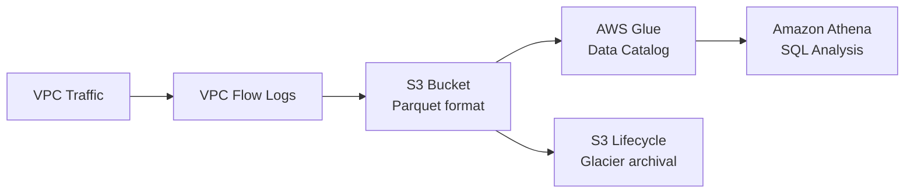

# How to Configure VPC Flow Logs to S3 with OpenTofu

Author: [nawazdhandala](https://www.github.com/nawazdhandala)

Tags: OpenTofu, AWS, VPC, Flow Logs, S3, Athena, Security, Network Analysis, Infrastructure as Code

Description: Learn how to send VPC Flow Logs to S3 using OpenTofu for cost-effective long-term storage and Athena-based analysis, with Parquet format optimization and lifecycle policies.

---

Sending VPC Flow Logs to S3 is more cost-effective than CloudWatch Logs for high-volume traffic and long-term retention. S3 storage with Parquet format and Athena enables efficient SQL-based analysis at a fraction of the cost of CloudWatch Logs Insights.

## Flow Logs to S3 Architecture



## S3 Bucket for Flow Logs

```hcl
# s3.tf

resource "aws_s3_bucket" "flow_logs" {
  bucket = "${var.prefix}-vpc-flow-logs-${data.aws_caller_identity.current.account_id}"

  tags = {
    Name        = "${var.prefix}-vpc-flow-logs"
    Environment = var.environment
    ManagedBy   = "opentofu"
  }
}

# Block public access
resource "aws_s3_bucket_public_access_block" "flow_logs" {
  bucket = aws_s3_bucket.flow_logs.id

  block_public_acls       = true
  block_public_policy     = true
  ignore_public_acls      = true
  restrict_public_buckets = true
}

# Encryption
resource "aws_s3_bucket_server_side_encryption_configuration" "flow_logs" {
  bucket = aws_s3_bucket.flow_logs.id

  rule {
    apply_server_side_encryption_by_default {
      sse_algorithm = "AES256"
    }
  }
}

# Lifecycle policy for cost optimization
resource "aws_s3_bucket_lifecycle_configuration" "flow_logs" {
  bucket = aws_s3_bucket.flow_logs.id

  rule {
    id     = "flow-logs-lifecycle"
    status = "Enabled"

    transition {
      days          = 30
      storage_class = "INTELLIGENT_TIERING"
    }

    transition {
      days          = 90
      storage_class = "GLACIER"
    }

    expiration {
      days = 365  # Delete after 1 year (adjust per compliance requirements)
    }
  }
}

# Bucket policy - allow VPC Flow Logs service to write
resource "aws_s3_bucket_policy" "flow_logs" {
  bucket = aws_s3_bucket.flow_logs.id

  policy = jsonencode({
    Version = "2012-10-17"
    Statement = [
      {
        Sid    = "AWSLogDeliveryWrite"
        Effect = "Allow"
        Principal = {
          Service = "delivery.logs.amazonaws.com"
        }
        Action   = "s3:PutObject"
        Resource = "${aws_s3_bucket.flow_logs.arn}/AWSLogs/${data.aws_caller_identity.current.account_id}/*"
        Condition = {
          StringEquals = {
            "s3:x-amz-acl" = "bucket-owner-full-control"
          }
        }
      },
      {
        Sid    = "AWSLogDeliveryAclCheck"
        Effect = "Allow"
        Principal = {
          Service = "delivery.logs.amazonaws.com"
        }
        Action   = "s3:GetBucketAcl"
        Resource = aws_s3_bucket.flow_logs.arn
      }
    ]
  })
}
```

## VPC Flow Logs to S3

```hcl
# flow_logs.tf
resource "aws_flow_log" "s3" {
  log_destination      = aws_s3_bucket.flow_logs.arn
  log_destination_type = "s3"
  traffic_type         = "ALL"
  vpc_id               = var.vpc_id

  # Parquet format for 5-10x cost reduction in Athena queries
  destination_options {
    file_format                = "parquet"
    hive_compatible_partitions = true   # Enables partition pruning in Athena
    per_hour_partition         = true   # Partition by hour for efficient queries
  }

  # Custom log format with additional fields
  log_format = "$${version} $${account-id} $${interface-id} $${srcaddr} $${dstaddr} $${srcport} $${dstport} $${protocol} $${packets} $${bytes} $${start} $${end} $${action} $${log-status} $${vpc-id} $${subnet-id} $${instance-id} $${type} $${pkt-srcaddr} $${pkt-dstaddr} $${region} $${az-id} $${sublocation-type} $${sublocation-id} $${pkt-src-aws-service} $${pkt-dst-aws-service} $${flow-direction} $${traffic-path}"

  tags = {
    Name        = "${var.prefix}-vpc-flow-logs-s3"
    Environment = var.environment
    ManagedBy   = "opentofu"
  }
}
```

## Athena Table for Flow Log Analysis

```hcl
# athena.tf
resource "aws_glue_catalog_database" "flow_logs" {
  name = "${replace(var.prefix, "-", "_")}_flow_logs"
}

resource "aws_athena_workgroup" "flow_logs" {
  name = "${var.prefix}-flow-logs"

  configuration {
    result_configuration {
      output_location = "s3://${aws_s3_bucket.flow_logs.id}/athena-results/"
    }
  }
}

resource "aws_glue_catalog_table" "flow_logs" {
  name          = "vpc_flow_logs"
  database_name = aws_glue_catalog_database.flow_logs.name

  table_type = "EXTERNAL_TABLE"

  parameters = {
    "EXTERNAL"            = "TRUE"
    "parquet.compression" = "SNAPPY"
  }

  storage_descriptor {
    location      = "s3://${aws_s3_bucket.flow_logs.id}/AWSLogs/${data.aws_caller_identity.current.account_id}/vpcflowlogs/${var.region}/"
    input_format  = "org.apache.hadoop.hive.ql.io.parquet.MapredParquetInputFormat"
    output_format = "org.apache.hadoop.hive.ql.io.parquet.MapredParquetOutputFormat"

    ser_de_info {
      serialization_library = "org.apache.hadoop.hive.ql.io.parquet.serde.ParquetHiveSerDe"
    }

    # Key columns for analysis
    columns {
      name = "srcaddr"
      type = "string"
    }
    columns {
      name = "dstaddr"
      type = "string"
    }
    columns {
      name = "action"
      type = "string"
    }
    columns {
      name = "bytes"
      type = "bigint"
    }
    columns {
      name = "packets"
      type = "bigint"
    }
  }

  partition_keys {
    name = "region"
    type = "string"
  }
  partition_keys {
    name = "year"
    type = "string"
  }
  partition_keys {
    name = "month"
    type = "string"
  }
  partition_keys {
    name = "day"
    type = "string"
  }
}
```

## Best Practices

- Use `file_format = "parquet"` with `hive_compatible_partitions = true` - Parquet columnar storage with partition pruning reduces Athena query costs by 90%+ compared to plain text format.
- Set `per_hour_partition = true` - hourly partitions allow Athena to scan only the relevant time window for security investigations.
- Use Intelligent Tiering lifecycle policy rather than directly to Glacier - flow logs have unpredictable access patterns (security incidents can happen months later), and Intelligent Tiering automatically moves data to the cheapest storage class.
- Grant `delivery.logs.amazonaws.com` write access via bucket policy rather than IAM role - S3 destination flow logs use service-based delivery, not IAM roles.
- Keep Athena results in a separate prefix in the same bucket - this simplifies lifecycle management and prevents analysis results from being treated as flow log data.
