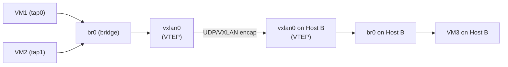

# How to Attach a VXLAN Interface to a Linux Bridge

Author: [nawazdhandala](https://www.github.com/nawazdhandala)

Tags: Linux, VXLAN, Bridge, Overlay Network, Layer 2, Networking, Container

Description: Attach a VXLAN interface to a Linux bridge to create a Layer 2 overlay network that connects containers or VMs on different hosts as if they share the same LAN.

## Introduction

Adding a VXLAN interface to a bridge creates a Layer 2 overlay network. Containers or VMs on the same bridge (on the same or different hosts connected by the VXLAN) are in the same L2 domain. This is how Kubernetes Flannel, Docker overlay networks, and many other SDN solutions work.

## Architecture



## Step 1: Create the VXLAN Interface

```bash
# On Host A (underlay: 10.0.0.1)

ip link add vxlan0 type vxlan \
    id 100 \
    dstport 4789 \
    local 10.0.0.1 \
    dev eth0

# DO NOT assign an IP to vxlan0 - the bridge will handle that
ip link set vxlan0 up
```

## Step 2: Create the Bridge

```bash
ip link add br0 type bridge
ip link set br0 type bridge stp_state 0
ip link set br0 up
```

## Step 3: Attach VXLAN to Bridge

```bash
# Add vxlan0 to the bridge
ip link set vxlan0 master br0

# Add local VM interfaces to the bridge
ip link set tap0 master br0
ip link set tap0 up
```

## Step 4: Assign IP to Bridge (for host management)

```bash
ip addr add 10.100.0.1/24 dev br0
```

## Step 5: Add Remote VTEP for BUM Flooding

```bash
# Add flood entry for Host B's VTEP
bridge fdb append 00:00:00:00:00:00 dev vxlan0 dst 10.0.0.2 permanent
```

## Repeat on Host B

```bash
# Host B: same setup but with different local IP and overlay IP
ip link add vxlan0 type vxlan id 100 dstport 4789 local 10.0.0.2 dev eth0
ip link set vxlan0 up

ip link add br0 type bridge
ip link set br0 up
ip link set vxlan0 master br0
ip addr add 10.100.0.2/24 dev br0

bridge fdb append 00:00:00:00:00:00 dev vxlan0 dst 10.0.0.1 permanent
```

## Verify L2 Overlay

```bash
# Host A and B should now be in the same L2 domain
# Host A bridge pings Host B bridge
ping -c 3 10.100.0.2

# Check FDB learning through VXLAN
bridge fdb show dev vxlan0

# Capture VXLAN traffic
tcpdump -i eth0 udp port 4789 -n
```

## Conclusion

Attaching a VXLAN interface to a bridge creates a Layer 2 overlay. The bridge forwards Ethernet frames locally between connected VM/container interfaces and remotely via the VXLAN tunnel to other hosts. Add flood entries for each remote VTEP with `bridge fdb append` for BUM traffic. This pattern is the foundation of virtually every container and VM overlay networking solution.
