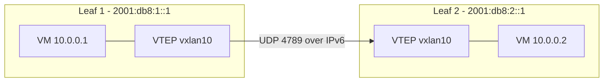

# How to Configure VXLAN with an IPv6 Underlay

Author: [nawazdhandala](https://www.github.com/nawazdhandala)

Tags: VXLAN, IPv6, Overlay, Linux, Networking, Data Center

Description: Configure VXLAN tunnels over an IPv6 underlay network on Linux including static FDB entries, multicast, and BGP EVPN underlay preparation.

## VXLAN over IPv6 Architecture



VXLAN frames are encapsulated in UDP datagrams. The outer IP headers can be IPv4 or IPv6 - using IPv6 underlay removes the need for IPv4 infrastructure and simplifies routing.

## Creating a VXLAN Interface on Linux

```bash
# Create VXLAN interface with IPv6 underlay

# VNI 10, local VTEP at 2001:db8:1::1
ip link add vxlan10 type vxlan \
    id 10 \
    local 2001:db8:1::1 \
    dstport 4789 \
    nolearning

# Assign bridge IP
ip link set vxlan10 up
ip link add br10 type bridge
ip link set vxlan10 master br10
ip link set br10 up
ip addr add 10.0.0.254/24 dev br10

echo "VXLAN10 created with IPv6 underlay"
```

## Static VXLAN FDB (Unicast Headend Replication)

Without multicast or BGP EVPN, manually add static FDB entries:

```bash
# On Leaf 1: tell VTEP how to reach Leaf 2's VTEP
# All MACs unknown for VNI 10 → forward to 2001:db8:2::1
bridge fdb append 00:00:00:00:00:00 dev vxlan10 dst 2001:db8:2::1 via vxlan10

# Specific MAC → VTEP mapping (after learning)
bridge fdb add 52:54:00:ab:cd:ef dev vxlan10 dst 2001:db8:2::1

# Show current FDB
bridge fdb show dev vxlan10
```

## VXLAN with IPv6 Multicast Group

Multicast-based VTEP discovery using an IPv6 multicast group:

```bash
# Create VXLAN with IPv6 multicast group for BUM traffic
# ff05:: is site-local multicast scope
ip link add vxlan10 type vxlan \
    id 10 \
    local 2001:db8:1::1 \
    group ff05::100 \
    dev eth0 \
    dstport 4789

# The 'dev eth0' specifies which interface to use for multicast
ip link set vxlan10 up
```

## Verifying VXLAN Tunnel Traffic

```bash
# Check kernel VXLAN state
ip -d link show vxlan10

# Capture VXLAN over IPv6 (UDP port 4789)
tcpdump -i eth0 -n \
    'ip6 and udp port 4789' \
    -w /tmp/vxlan6.pcap

# Show routing table for VTEP endpoint
ip -6 route get 2001:db8:2::1

# Check MTU - VXLAN adds 56 bytes overhead over IPv6
ip link show eth0 | grep mtu
```

## MTU Configuration

VXLAN over IPv6 adds 56 bytes of tunnel overhead: 40 (IPv6) + 8 (UDP) + 8 (VXLAN):

```bash
# If physical MTU is 1500, set VXLAN interface MTU to 1444
ip link set vxlan10 mtu 1444

# For jumbo frames (9000 byte physical MTU)
ip link set vxlan10 mtu 8944

# Configure VM vNIC MTU to match
ip link set eth0 mtu 1444  # Inside the VM

# Verify path MTU with tracepath6
tracepath6 2001:db8:2::1
```

## Systemd Network VXLAN Configuration

For persistent VXLAN configuration using systemd-networkd:

```ini
# /etc/systemd/network/vxlan10.netdev
[NetDev]
Name=vxlan10
Kind=vxlan

[VXLAN]
VNI=10
Local=2001:db8:1::1
DestinationPort=4789
MacLearning=no
```

```ini
# /etc/systemd/network/vxlan10.network
[Match]
Name=vxlan10

[Network]
Bridge=br10
```

## Conclusion

VXLAN over IPv6 underlay eliminates the need for IPv4 infrastructure in data centers that have completed IPv6 migration. The Linux kernel's VXLAN driver supports IPv6 tunnel endpoints via the `local` parameter accepting IPv6 addresses. Key considerations: set the VXLAN interface MTU to physical MTU minus 56 bytes for IPv6 overhead. For production deployments, use BGP EVPN (covered separately) instead of static FDB entries for scalable MAC/IP distribution.
