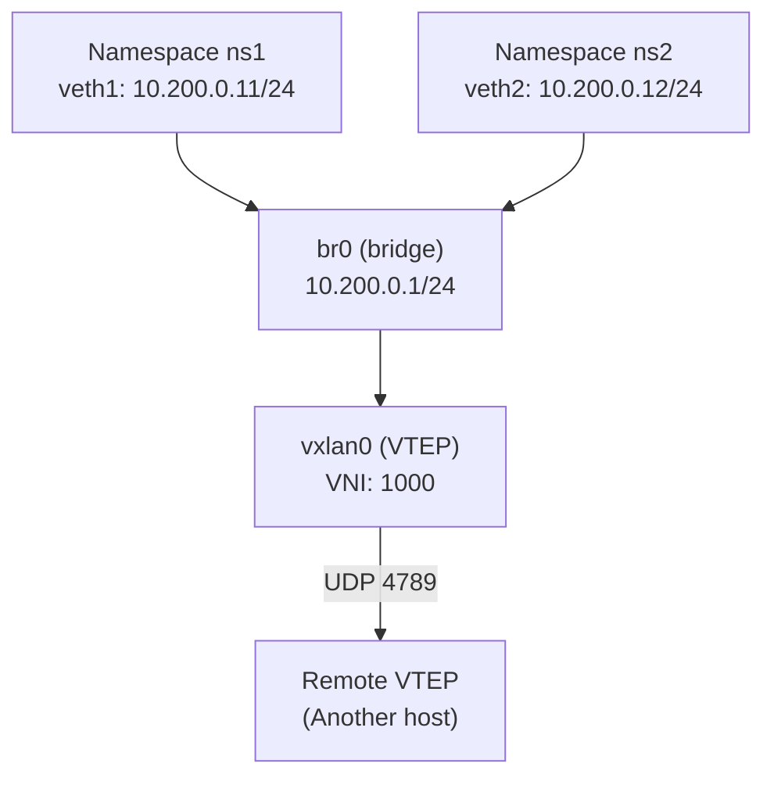

# How to Use VXLAN with Network Namespaces

Author: [nawazdhandala](https://www.github.com/nawazdhandala)

Tags: Linux, VXLAN, Network Namespaces, Container, Overlay Network, Networking, SDN

Description: Combine VXLAN and network namespaces to provide isolated VXLAN overlay segments for containers or processes, simulating per-tenant network isolation.

## Introduction

Combining VXLAN with network namespaces allows you to create isolated overlay networks for containers or processes. This is the fundamental mechanism behind Docker overlay networks and Kubernetes pod networking - each pod/container gets its own network namespace connected to a shared VXLAN overlay.

## Architecture



## Step 1: Create the VXLAN Bridge on the Host

```bash
# Create VXLAN interface

ip link add vxlan0 type vxlan id 1000 dstport 4789 local 10.0.0.1 dev eth0
ip link set vxlan0 up

# Create bridge and attach VXLAN
ip link add br-vxlan type bridge
ip link set br-vxlan type bridge stp_state 0
ip link set br-vxlan up
ip link set vxlan0 master br-vxlan

# Assign management IP to bridge
ip addr add 10.200.0.1/24 dev br-vxlan
```

## Step 2: Create Namespace and Connect to Bridge

```bash
# Create namespace ns1
ip netns add ns1
ip netns exec ns1 ip link set lo up

# Create veth pair
ip link add veth1 type veth peer name veth1-peer

# Move one end to the namespace
ip link set veth1-peer netns ns1

# Add host side to the bridge
ip link set veth1 master br-vxlan
ip link set veth1 up

# Configure namespace side
ip netns exec ns1 ip addr add 10.200.0.11/24 dev veth1-peer
ip netns exec ns1 ip link set veth1-peer up
ip netns exec ns1 ip route add default via 10.200.0.1
```

## Step 3: Add a Second Namespace

```bash
ip netns add ns2
ip netns exec ns2 ip link set lo up

ip link add veth2 type veth peer name veth2-peer
ip link set veth2-peer netns ns2
ip link set veth2 master br-vxlan
ip link set veth2 up

ip netns exec ns2 ip addr add 10.200.0.12/24 dev veth2-peer
ip netns exec ns2 ip link set veth2-peer up
ip netns exec ns2 ip route add default via 10.200.0.1
```

## Step 4: Add Remote VTEP for Multi-Host

```bash
bridge fdb append 00:00:00:00:00:00 dev vxlan0 dst 10.0.0.2 permanent
```

## Test Connectivity

```bash
# ns1 to ns2 (same host, through bridge)
ip netns exec ns1 ping -c 3 10.200.0.12

# ns1 to remote host overlay (through bridge + VXLAN)
ip netns exec ns1 ping -c 3 10.200.0.2
```

## Conclusion

VXLAN with network namespaces creates isolated per-container overlay networking. Each namespace connects to a shared bridge via veth pairs, and the bridge connects to the VXLAN for multi-host reachability. Namespaces cannot communicate with each other or the VXLAN directly - all traffic flows through the bridge. This pattern directly mirrors how container runtimes implement multi-host networking.
