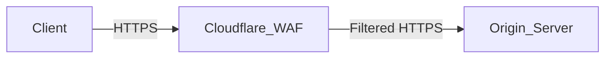

# How to Set Up a Web Application Firewall (WAF) in Front of HTTP/HTTPS Services

Author: [nawazdhandala](https://www.github.com/nawazdhandala)

Tags: WAF, Security, Nginx, ModSecurity, HTTP, HTTPS, OWASP

Description: Learn how to deploy ModSecurity with the OWASP Core Rule Set as a Web Application Firewall in front of HTTP/HTTPS services using Nginx.

## What Is a WAF?

A Web Application Firewall inspects HTTP/HTTPS traffic and blocks requests that match known attack patterns—SQL injection, cross-site scripting (XSS), path traversal, and more. Unlike network firewalls, a WAF operates at Layer 7 and understands HTTP semantics.

## Option 1: ModSecurity with Nginx

ModSecurity is the most widely used open-source WAF engine. The `ngx_http_modsecurity_module` embeds it into Nginx.

### Install ModSecurity and Nginx Connector

```bash
# Debian/Ubuntu
apt-get install -y libmodsecurity3 libmodsecurity-dev

# Clone the Nginx connector
git clone --depth 1 https://github.com/SpiderLabs/ModSecurity-nginx.git /opt/ModSecurity-nginx

# Compile Nginx with the module (add to existing configure flags)
./configure --with-compat --add-dynamic-module=/opt/ModSecurity-nginx
make modules
cp objs/ngx_http_modsecurity_module.so /etc/nginx/modules/
```

### Configure ModSecurity in Nginx

```nginx
# /etc/nginx/nginx.conf
load_module modules/ngx_http_modsecurity_module.so;

http {
    # Enable ModSecurity globally
    modsecurity on;
    modsecurity_rules_file /etc/nginx/modsecurity/modsecurity.conf;
}
```

### Enable OWASP Core Rule Set (CRS)

```bash
# Download OWASP CRS
git clone https://github.com/coreruleset/coreruleset /etc/nginx/owasp-crs

# Create ModSecurity config
cp /etc/nginx/owasp-crs/crs-setup.conf.example /etc/nginx/owasp-crs/crs-setup.conf
```

```nginx
# /etc/nginx/modsecurity/modsecurity.conf
Include /etc/modsecurity/modsecurity.conf
Include /etc/nginx/owasp-crs/crs-setup.conf
Include /etc/nginx/owasp-crs/rules/*.conf
```

Set to detection mode first:

```
# modsecurity.conf
SecRuleEngine DetectionOnly   # Change to 'On' to block
SecRequestBodyAccess On
SecResponseBodyAccess On
SecAuditLog /var/log/modsecurity/audit.log
```

## Option 2: Nginx with njs for Simple WAF Rules

For lightweight filtering without ModSecurity:

```nginx
# Block common attack patterns at the Nginx level
server {
    listen 443 ssl;
    server_name app.example.com;

    # Block requests with suspicious query strings
    if ($query_string ~* "(union|select|insert|drop|delete|update)") {
        return 403;
    }

    # Block common exploit paths
    location ~* "(\.\.\/|\.\.\\|etc/passwd|cmd=)" {
        return 403;
    }

    # Block user agents known for scanning
    if ($http_user_agent ~* "(nikto|sqlmap|nmap|masscan)") {
        return 403;
    }

    location / {
        proxy_pass http://127.0.0.1:3000;
    }
}
```

## Option 3: Cloudflare WAF (Managed Service)

For teams that prefer a managed solution, Cloudflare's WAF sits in front of your origin:



Enable the OWASP ruleset in the Cloudflare dashboard under Security > WAF > Managed Rules.

## Testing WAF Rules

```bash
# Test SQL injection detection (should be blocked/logged)
curl "https://app.example.com/search?q=1' OR '1'='1"

# Test XSS detection
curl "https://app.example.com/page?name=<script>alert(1)</script>"

# Check audit log for hits
tail -f /var/log/modsecurity/audit.log
```

## Conclusion

For self-hosted environments, ModSecurity with the OWASP CRS provides comprehensive WAF protection. Start in `DetectionOnly` mode to identify false positives, then switch to `On` to enforce blocking. For simpler setups, Nginx `if` directives can block common attacks. For zero-maintenance WAF, consider a managed CDN/WAF provider.
