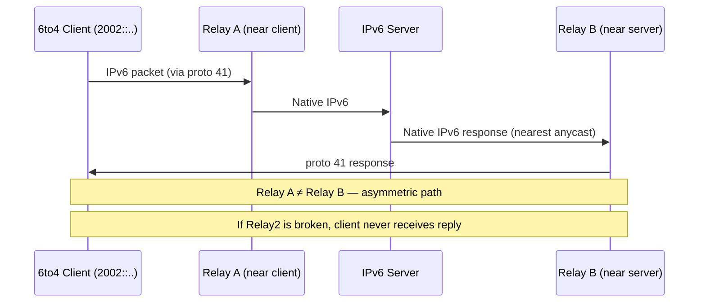

# How to Understand Why 6to4 Is Deprecated

Author: [nawazdhandala](https://www.github.com/nawazdhandala)

Tags: IPv6, 6to4, Deprecated, Tunneling, RFC 7526

Description: Learn why 6to4 IPv6 tunneling (RFC 3056) was deprecated in RFC 7526, the technical problems that caused widespread failures, and what to use instead.

## Overview

6to4 was a clever automatic IPv6 tunneling mechanism that derived an IPv6 address from a host's public IPv4 address and used anycast relays for connectivity. It was widely deployed from 2001 to 2012 as a quick path to IPv6. However, its reliance on uncontrolled anycast relays caused widespread, unpredictable failures — leading to formal deprecation in RFC 7526 (2015).

## How 6to4 Worked

```
IPv4 public address: 192.0.2.10
Hex representation:  c000:020a
6to4 address:        2002:c000:020a::/48
                     ┌──────────────────────────────────┐
                     │ 2002 │  IPv4 in hex  │ subnet │  │
                     │      │  c000:020a    │   /64  │  │
                     └──────────────────────────────────┘

6to4 relay anycast: 192.88.99.1
  → Any router announcing this anycast acts as a relay
  → No authentication, no quality guarantees
```

The host would send IPv6-in-IPv4 (proto 41) packets destined for `192.88.99.1`. The nearest router announcing the anycast would decapsulate and forward onto the native IPv6 internet.

## Why It Failed in Practice

### 1. Relay Quality Was Uncontrolled

```
Internet anycast topology for 192.88.99.1:
  North America → relay operated by ISP-X
  Europe        → relay operated by volunteer university
  Asia          → relay operated by unknown party

Problems:
  - Some relays had poor IPv6 upstreams
  - Some had filtering that dropped return traffic
  - Some were misconfigured or abandoned
  - No SLA, no operator accountability
```

### 2. Asymmetric Path Problem



Return traffic was routed to whichever relay was nearest to the *server*, not the client. If the relay near the server was broken, the client received no reply — but the IPv4 path worked fine, causing unpredictable failures.

### 3. "Happy Eyeballs" Paradox

Browsers implementing Happy Eyeballs would try IPv6 first. If 6to4 was broken (common), the connection would:
- Fail over IPv6 after timeout (250-3000ms)
- Fall back to IPv4 successfully

Users saw slow page loads. Websites started blocking or deprioritizing connections from `2002::/16` addresses.

### 4. NAT Incompatibility

6to4 requires a public IPv4 address. Behind NAT (RFC 1918 addresses), 6to4 simply does not work — the derived `2002:` address uses private IPv4, which has no global route.

```
Private IPv4: 10.0.0.5
6to4 address: 2002:0a00:0005::/48  ← not routable globally
```

This affected the majority of home users who are behind NAT, making 6to4 useless for end-user connectivity.

## RFC 7526 — Formal Deprecation

RFC 7526 (May 2015) officially deprecated 6to4 and the 192.88.99.0/24 anycast prefix:

> "6to4 can cause significant stability and usability problems for users and should be considered harmful. It SHOULD NOT be used."

Key actions from RFC 7526:
- The 192.88.99.0/24 prefix is no longer a 6to4 relay anycast — it may now be assigned for other uses
- OS vendors should disable 6to4 by default (Windows, Linux, macOS all complied)
- Network operators should filter `2002::/16` at borders

## What Still Uses 2002::/48 Addresses

If you see `2002:xxxx:xxxx::/48` addresses on hosts today, it means 6to4 is still active. This is problematic because:
- The relay anycast is gone — packets go nowhere
- Security tools may not inspect IPv6 inside IPv4 properly
- Attacker can potentially exploit the tunnel bypass

## Detection and Removal

```bash
# Linux — check for 6to4 addresses
ip addr show | grep "2002:"

# Remove 6to4 tunnel if present
ip tunnel del tun6to4 2>/dev/null
ip link del 6to4 2>/dev/null

# Disable 6to4 kernel module
echo "blacklist sit" >> /etc/modprobe.d/disable-6to4.conf

# Windows — disable 6to4
netsh interface 6to4 set state disabled

# Check if 6to4 state is disabled
netsh interface 6to4 show state
```

## Filter 6to4 at Network Border

```bash
# Block 6to4 prefixes at perimeter
# nftables
nft add rule inet filter forward ip6 saddr 2002::/16 drop
nft add rule inet filter forward ip6 daddr 2002::/16 drop

# ip6tables
ip6tables -I FORWARD -s 2002::/16 -j DROP
ip6tables -I FORWARD -d 2002::/16 -j DROP

# Block the relay anycast (if your ISP still routes it)
iptables -I FORWARD -d 192.88.99.0/24 -j DROP
```

## What to Use Instead

| Instead of 6to4 | Use |
|---|---|
| Automatic IPv6 from IPv4 | Native dual-stack from ISP |
| Home IPv6 without ISP support | Hurricane Electric tunnel broker (6in4) |
| Enterprise IPv6 |  Native from ISP or IXP |
| IPv6 over legacy ISP | 6rd (ISP-managed) |

## Summary

6to4 was deprecated by RFC 7526 in 2015 because uncontrolled anycast relays caused unpredictable connectivity failures, asymmetric routing made debugging impossible, and NAT compatibility prevented use by most home users. The 192.88.99.0/24 anycast prefix is no longer operated for 6to4. Disable 6to4 on all systems, filter `2002::/16` at network borders, and use native dual-stack or 6in4 tunnel brokers instead.
