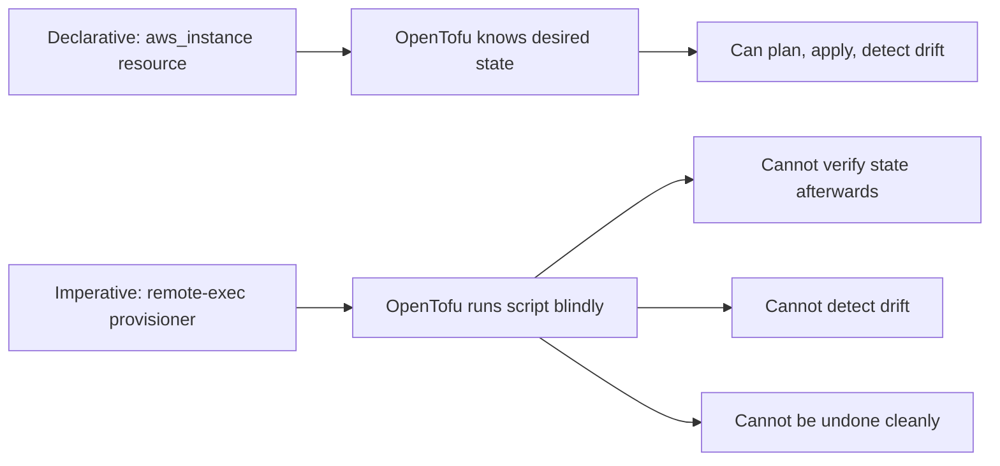

# How to Understand Why Provisioners Are a Last Resort in OpenTofu

Author: [nawazdhandala](https://www.github.com/nawazdhandala)

Tags: OpenTofu, Provisioner, Best Practice, Infrastructure as Code, Cloud-init

Description: Understand why OpenTofu's own documentation recommends provisioners as a last resort and what better alternatives exist for resource configuration and bootstrapping.

## Introduction

OpenTofu's documentation explicitly states that provisioners are "a last resort." This might seem surprising for such a prominent feature, but the reasons are well-founded. Understanding the limitations of provisioners-and the superior alternatives-is essential for writing maintainable, reliable infrastructure code.

## Why Provisioners Are Problematic

### 1. They Break the Declarative Model

OpenTofu is a declarative tool: you describe the desired state, and OpenTofu figures out how to achieve it. Provisioners introduce imperative, procedural logic that OpenTofu cannot reason about:



### 2. They Only Run Once

Creation-time provisioners run exactly once: when the resource is first created. If you later need to change the configuration applied by the provisioner, you must destroy and recreate the resource-which is often unacceptable in production.

### 3. They Create Ordering Dependencies

Provisioners require network connectivity to the target resource. This forces complex `depends_on` chains for security groups, internet gateways, and NAT gateways that would not otherwise be required.

### 4. Failure Taints Resources

A provisioner failure marks the resource as tainted, causing its destruction on the next apply. In environments where resources are expensive or slow to create (RDS, EKS clusters), this is a significant operational risk.

### 5. They Are Not Idempotent by Default

Shell scripts are not naturally idempotent. Running `apt-get install nginx` twice is harmless, but many setup tasks are not. This makes provisioner-configured resources unreliable in taint-and-recreate scenarios.

## Better Alternatives

### Cloud-Init / User Data

For bootstrapping EC2 instances (and most cloud VMs), cloud-init is far superior:

```hcl
resource "aws_instance" "web" {
  ami           = data.aws_ami.ubuntu.id
  instance_type = "t3.micro"

  # cloud-init runs reliably at boot, with no network dependency on OpenTofu
  user_data = <<-EOF
    #!/bin/bash
    apt-get update -y
    apt-get install -y nginx
    systemctl enable nginx
    systemctl start nginx
  EOF
}
```

### Packer

For complex software stacks, bake a custom AMI with Packer:

```hcl
# Use a pre-baked AMI instead of provisioners

data "aws_ami" "app" {
  most_recent = true
  owners      = ["self"]

  filter {
    name   = "name"
    values = ["myapp-*"]
  }
}

resource "aws_instance" "app" {
  # The AMI already has everything installed
  ami           = data.aws_ami.app.id
  instance_type = "t3.small"
}
```

### Proper Provider Resources

Most cloud resources have native OpenTofu provider support. Before reaching for `local-exec`, check if there is a resource type:

```hcl
# Instead of: local-exec to call the AWS CLI to create a Route53 record
# Use: the native provider resource
resource "aws_route53_record" "www" {
  zone_id = aws_route53_zone.main.zone_id
  name    = "www"
  type    = "A"
  ttl     = 300
  records = [aws_instance.web.public_ip]
}
```

### Configuration Management Tools

For configuration that changes over time, use proper CM tools:

- **Ansible**: Call from CI/CD after OpenTofu apply
- **Chef / Puppet**: Bootstrap agents via cloud-init; let CM manage the rest
- **AWS Systems Manager**: Use Run Command or State Manager for ongoing configuration

## When Provisioners Are Acceptable

Provisioners are acceptable in these narrow situations:

- Triggering an external API that has no OpenTofu provider.
- Running a one-time database seed or migration that has no resource equivalent.
- Integrating with legacy tools that cannot be replaced immediately.

## Conclusion

Provisioners are powerful but fragile. They work around OpenTofu's declarative model rather than with it. For the majority of use cases-software installation, configuration management, and cloud resource setup-cloud-init, Packer, and proper provider resources offer more reliable, maintainable solutions.
