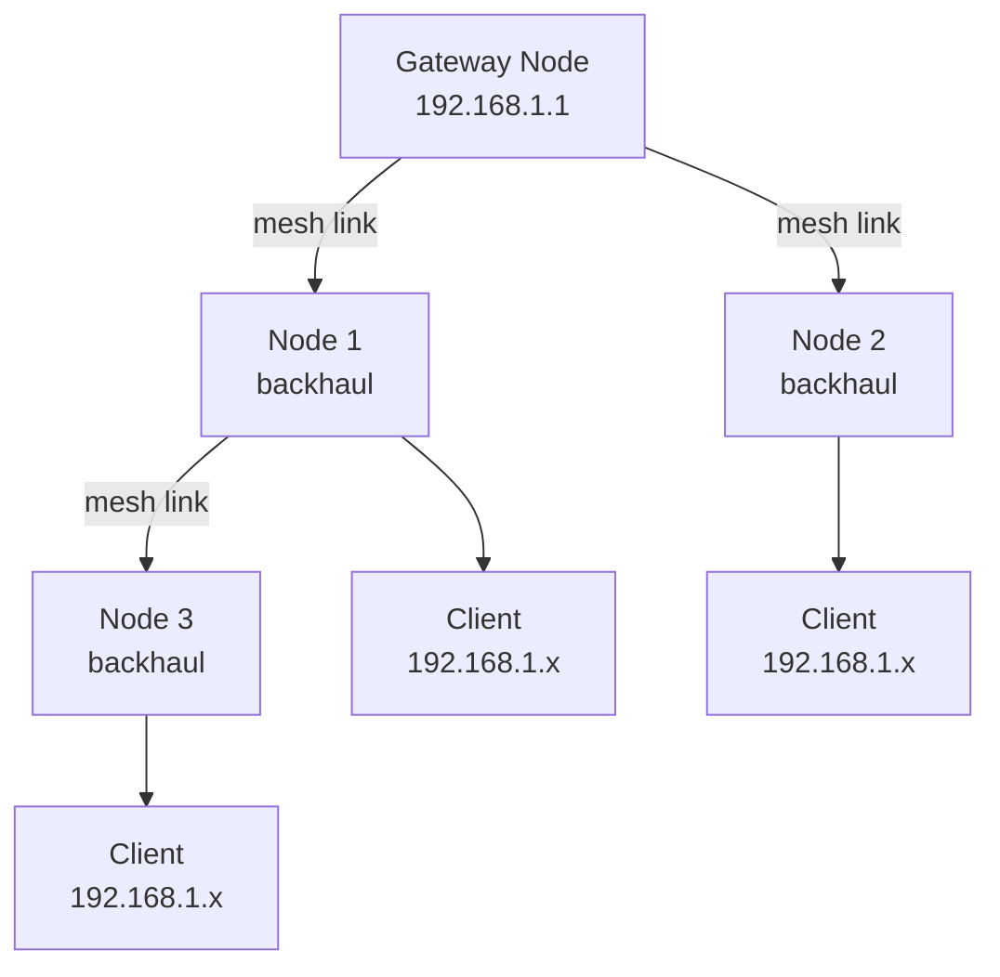

# How to Configure WiFi Mesh Networking with Proper IPv4 Subnetting

Author: [nawazdhandala](https://www.github.com/nawazdhandala)

Tags: WiFi Mesh, IPv4, Subnetting, 802.11s, Network Design

Description: Learn how to configure WiFi mesh networking (802.11s) with proper IPv4 subnetting, ensuring clients get consistent addressing across the mesh fabric.

## What Is WiFi Mesh Networking?

WiFi mesh (802.11s) allows access points to communicate wirelessly with each other, creating a self-configuring wireless backbone. Clients connect to any node in the mesh and can roam freely while maintaining their IPv4 address.



## Step 1: IPv4 Design for Mesh Networks

All mesh nodes should serve clients from the **same subnet** so clients can roam without IP changes:

```
Mesh Backbone (management): 10.0.0.0/24
  Gateway: 10.0.0.1
  Node 1: 10.0.0.2
  Node 2: 10.0.0.3
  Node 3: 10.0.0.4

Client Network (all nodes): 192.168.1.0/24
  DHCP pool: 192.168.1.100-200
  Gateway: 192.168.1.1 (only served by gateway node)
```

## Step 2: Configure 802.11s Mesh on OpenWrt

**Gateway node configuration:**
```bash
# /etc/config/wireless
config wifi-iface 'mesh_radio'
    option device 'radio1'       # Use 5GHz for mesh backhaul
    option mode 'mesh'
    option mesh_id 'my-mesh-id'
    option mesh_fwding '1'
    option encryption 'psk2'
    option key 'mesh-secret-key'
    option network 'mesh'

# /etc/config/network
config interface 'mesh'
    option type 'bridge'
    option proto 'static'
    option ipaddr '10.0.0.1'
    option netmask '255.255.255.0'

config interface 'lan'
    option proto 'static'
    option ipaddr '192.168.1.1'
    option netmask '255.255.255.0'
```

**Mesh node (non-gateway) configuration:**
```bash
# /etc/config/wireless - same mesh_id and key as gateway
config wifi-iface 'mesh_radio'
    option device 'radio1'
    option mode 'mesh'
    option mesh_id 'my-mesh-id'
    option mesh_fwding '1'
    option encryption 'psk2'
    option key 'mesh-secret-key'
    option network 'mesh'

# /etc/config/network - get backhaul IP from DHCP or static
config interface 'mesh'
    option proto 'static'
    option ipaddr '10.0.0.2'     # Different for each node
    option netmask '255.255.255.0'
    option gateway '10.0.0.1'
```

## Step 3: Configure DHCP Only on Gateway Node

DHCP should only run on the gateway to avoid IP conflicts:

```bash
# /etc/config/dhcp (gateway node only)
config dnsmasq
    option domainneeded '1'
    option localise_queries '1'
    option domain 'lan'

config dhcp 'lan'
    option interface 'lan'
    option start '100'
    option limit '150'
    option leasetime '12h'
    # Set DHCP gateway to point to this node
    list dhcp_option '3,192.168.1.1'
    list dhcp_option '6,8.8.8.8,8.8.4.4'
```

```bash
# On non-gateway nodes: DISABLE DHCP server
# /etc/config/dhcp
config dhcp 'lan'
    option interface 'lan'
    option ignore '1'    # Disable DHCP on this node
```

## Step 4: Configure Client SSID on All Nodes

All mesh nodes broadcast the same client SSID:

```bash
# /etc/config/wireless (same on all mesh nodes)
config wifi-iface 'client_wifi'
    option device 'radio0'       # Use 2.4GHz for client access
    option mode 'ap'
    option ssid 'MyMeshNetwork'
    option key 'wifi-password'
    option encryption 'psk2'
    option network 'lan'
    # Enable fast roaming
    option ieee80211r '1'
    option mobility_domain 'abcd'  # Same on all nodes
```

## Step 5: Verify Mesh Connectivity

```bash
# Check mesh peer status
iw dev wlan1 mpath dump

# Output shows paths to other mesh nodes:
# 10:20:30:40:50:60  10:20:30:40:50:60  wlan1  32  0  2914  0x1

# Check mesh path metric
iw dev wlan1 mpath get 10:20:30:40:50:60

# Ping between mesh nodes
ping 10.0.0.2    # Node 1
ping 10.0.0.3    # Node 2
```

## Conclusion

WiFi mesh networking requires all nodes to be configured with the same `mesh_id` and authentication, using a dedicated radio for backhaul and a separate radio for client access. Design the addressing with a private management subnet (10.0.0.0/24) for mesh nodes and a shared client subnet (192.168.1.0/24) served by a single DHCP server on the gateway node. Enable 802.11r with a shared `mobility_domain` across all nodes for seamless client roaming within the mesh.
