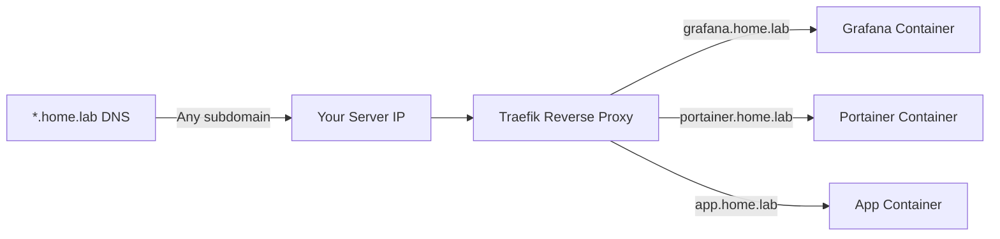

# How to Set Up Wildcard DNS for Portainer Services

Author: [nawazdhandala](https://www.github.com/nawazdhandala)

Tags: Portainer, DNS, Wildcard, Traefik, Let's Encrypt, Docker, Networking

Description: Learn how to configure wildcard DNS and wildcard SSL certificates so every new Portainer service automatically gets a subdomain without manual DNS changes.

---

With wildcard DNS, a single record like `*.home.lab` routes all subdomains to your server. Combined with Traefik's label-based routing, every new container you deploy in Portainer automatically gets a subdomain — no DNS changes required per service. This guide covers both local wildcard DNS and wildcard Let's Encrypt certificates.

---

## How Wildcard DNS Works



---

## Step 1: Configure Wildcard DNS Record

For **local/homelab DNS** (Pi-hole or AdGuard):

```bash
# Pi-hole: add to custom dnsmasq config inside the container
docker exec pihole bash -c \
  "echo 'address=/.home.lab/192.168.1.100' > /etc/dnsmasq.d/03-wildcard.conf && pihole restartdns"
```

For **public DNS** (Cloudflare or similar):

```
*.example.com    A    203.0.113.10
```

---

## Step 2: Deploy Traefik with DNS-01 Challenge for Wildcard SSL

Wildcard certificates require DNS-01 challenge (not HTTP-01). This example uses Cloudflare DNS.

```yaml
# traefik-wildcard-stack.yml
version: "3.8"

services:
  traefik:
    image: traefik:v3.0
    container_name: traefik
    restart: unless-stopped
    command:
      - "--providers.docker=true"
      - "--providers.docker.exposedbydefault=false"
      - "--entrypoints.web.address=:80"
      - "--entrypoints.websecure.address=:443"
      # DNS-01 challenge for wildcard certs
      - "--certificatesresolvers.cloudflare.acme.dnschallenge=true"
      - "--certificatesresolvers.cloudflare.acme.dnschallenge.provider=cloudflare"
      - "--certificatesresolvers.cloudflare.acme.email=admin@example.com"
      - "--certificatesresolvers.cloudflare.acme.storage=/letsencrypt/acme.json"
    environment:
      # Cloudflare API token with Zone:Read and DNS:Edit permissions
      CF_DNS_API_TOKEN: "your-cloudflare-api-token"
    ports:
      - "80:80"
      - "443:443"
    volumes:
      - /var/run/docker.sock:/var/run/docker.sock:ro
      - traefik_letsencrypt:/letsencrypt
    networks:
      - proxy

networks:
  proxy:
    external: true

volumes:
  traefik_letsencrypt:
```

---

## Step 3: Request a Wildcard Certificate

Add a Traefik router that requests the wildcard cert. This can be a catch-all router.

```yaml
# In your Traefik static config or a dedicated certificate service
# Add this to a container with labels to trigger cert generation:

labels:
  - "traefik.enable=true"
  - "traefik.http.routers.wildcard-cert.rule=Host(`example.com`)"
  - "traefik.http.routers.wildcard-cert.tls=true"
  # Request the wildcard certificate
  - "traefik.http.routers.wildcard-cert.tls.certresolver=cloudflare"
  - "traefik.http.routers.wildcard-cert.tls.domains[0].main=example.com"
  - "traefik.http.routers.wildcard-cert.tls.domains[0].sans=*.example.com"
```

---

## Step 4: Deploy Services with Subdomain Labels

Any new container deployed via Portainer just needs these labels to get a subdomain automatically.

```yaml
# grafana-stack.yml — automatically routed to grafana.example.com
version: "3.8"

services:
  grafana:
    image: grafana/grafana:latest
    restart: unless-stopped
    networks:
      - proxy
    labels:
      - "traefik.enable=true"
      - "traefik.http.routers.grafana.rule=Host(`grafana.example.com`)"
      - "traefik.http.routers.grafana.entrypoints=websecure"
      - "traefik.http.routers.grafana.tls=true"  # reuses wildcard cert
      - "traefik.http.services.grafana.loadbalancer.server.port=3000"

networks:
  proxy:
    external: true
```

---

## Testing

```bash
# Verify wildcard DNS resolves correctly
nslookup anything.example.com 1.1.1.1
# Should return: 203.0.113.10

nslookup grafana.example.com
# Should return: 203.0.113.10

# Check that HTTPS works
curl -I https://grafana.example.com
# Should return: HTTP/2 200
```

---

## Summary

Wildcard DNS combined with Traefik eliminates per-service DNS management. A single `*.example.com` DNS record routes all subdomains to your server, and Traefik's label-based routing directs each subdomain to the right container. The wildcard SSL certificate (obtained via DNS-01 challenge) covers all subdomains with a single certificate renewal.
