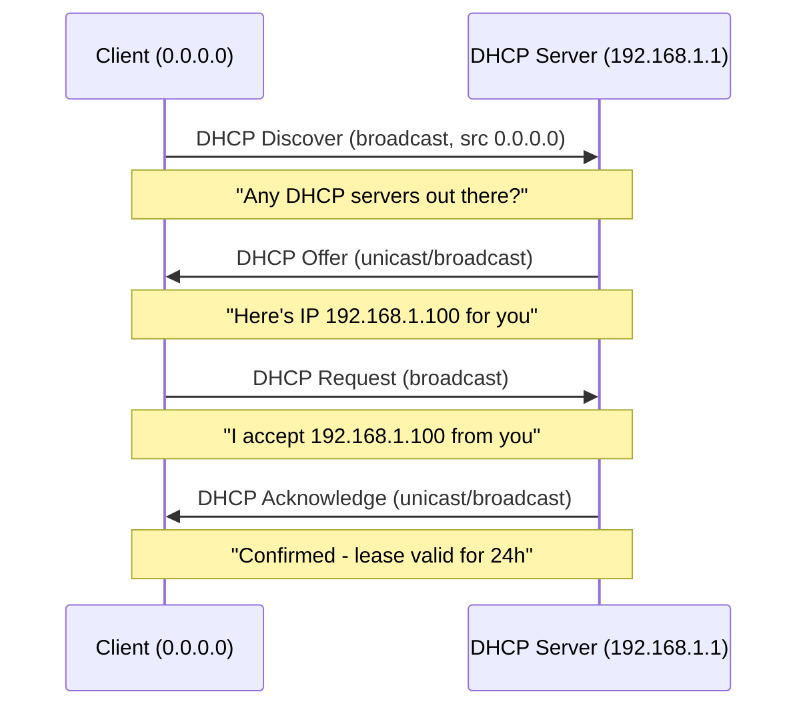

# How to Analyze DHCP Discover/Offer/Request/Acknowledge in Wireshark

Author: [nawazdhandala](https://www.github.com/nawazdhandala)

Tags: Wireshark, DHCP, DORA, Packet Analysis, Network Troubleshooting

Description: Learn how to capture and analyze the DHCP four-way handshake (Discover, Offer, Request, Acknowledge) in Wireshark to diagnose DHCP failures, slow IP assignment, and configuration problems.

## The DHCP DORA Process



## Step 1: Capture DHCP Traffic

```bash
# Using tcpdump to capture DHCP

sudo tcpdump -i eth0 -n port 67 or port 68 -v -w /tmp/dhcp-capture.pcap

# Trigger DHCP renewal to capture
sudo dhclient -r eth0 && sudo dhclient eth0    # Linux
# ipconfig /release && ipconfig /renew          # Windows
```

```text
Wireshark - capture filter to see only DHCP:
Capture → Capture Filters → New
Name: DHCP
Filter: port 67 or port 68
```

## Step 2: Apply Display Filter in Wireshark

```text
In Wireshark display filter bar, type:
bootp

This shows all DHCP/BOOTP packets.

More specific filters:
bootp.type == 1          → Only DHCP messages
bootp.option.dhcp == 1   → DHCP Discover
bootp.option.dhcp == 2   → DHCP Offer
bootp.option.dhcp == 3   → DHCP Request
bootp.option.dhcp == 5   → DHCP Acknowledge (ACK)
bootp.option.dhcp == 6   → DHCP NAck

Filter by client MAC:
bootp.hw.mac_addr == aa:bb:cc:dd:ee:ff
```

## Step 3: Analyze a Successful DORA Exchange

```text
In Wireshark, with 'bootp' filter applied:

Packet 1: DHCP Discover
  Source IP: 0.0.0.0 (client has no IP yet)
  Destination IP: 255.255.255.255 (broadcast)
  Details pane → DHCP:
    Message type: Discover (1)
    Client MAC: [client's MAC]
    Requested IP: 192.168.1.100 (optional - previous IP)
    Hostname: [client hostname]
    Parameter Request List: Subnet Mask, Router, DNS, Lease Time

Packet 2: DHCP Offer
  Source IP: 192.168.1.1 (DHCP server)
  Destination: 255.255.255.255 (broadcast) or client IP
  Details:
    Message type: Offer (2)
    Your IP: 192.168.1.100 (offered IP)
    Server IP: 192.168.1.1
    Lease time: 86400 (24 hours)
    Options: Router = 192.168.1.1, DNS = 8.8.8.8

Packet 3: DHCP Request
  Source: 0.0.0.0 (still no IP)
  Destination: 255.255.255.255 (broadcast - tells other DHCP servers too)
  Details:
    Requested IP: 192.168.1.100 (accepting the offer)
    Server ID: 192.168.1.1 (which server's offer we're accepting)

Packet 4: DHCP Acknowledge (ACK)
  Source: 192.168.1.1
  Details:
    Message type: ACK (5)
    Your IP: 192.168.1.100 (confirmed)
    Lease time: 86400
```

## Step 4: Diagnose DHCP Failures

```bash
Problem: No DHCP Offer received

What you see in Wireshark:
- Discover packet repeated 3-4 times
- No Offer follows
- Client eventually gets APIPA (169.254.x.x)

Causes:
1. DHCP server is down (check systemctl status isc-dhcp-server)
2. No subnet scope for the client's VLAN
3. DHCP pool exhausted (all IPs in range already leased)
4. Firewall blocking UDP port 67

To check if server received Discover:
sudo tcpdump -i eth0 -n port 67 (on DHCP server)
If no packets arrive: relay agent misconfigured
If packets arrive but no response: check DHCPD logs
```

```text
Problem: DHCP NAck received

What you see:
Message type: NAck (6)

Causes:
1. Client requesting IP from wrong subnet (after network change)
2. Server's lease file is corrupted
3. IP pool is full

Fix: ipconfig /release then /renew (forces fresh Discover)
```

## Step 5: Check DHCP Options in Wireshark

```text
In Wireshark, expand a DHCP Offer packet:
Bootstrap Protocol (Offer)
  ├─ Hardware type: Ethernet
  ├─ Client MAC: aa:bb:cc:dd:ee:ff
  ├─ Your (client) IP: 192.168.1.100
  └─ Options:
      ├─ DHCP Message Type: Offer (2)
      ├─ Subnet Mask: 255.255.255.0  ← Option 1
      ├─ Router: 192.168.1.1         ← Option 3
      ├─ Domain Name Server: 8.8.8.8 ← Option 6
      ├─ Domain Name: example.com    ← Option 15
      ├─ IP Address Lease Time: 86400← Option 51
      ├─ DHCP Server IP: 192.168.1.1 ← Option 54
      └─ Renewal Time: 43200         ← Option 58
```

## Step 6: Measure DHCP Response Time

```text
In Wireshark: Statistics → Expert Information
Look for DHCP timing anomalies

Or measure manually:
1. Note timestamp of Discover packet
2. Note timestamp of Offer packet
3. Difference = DHCP server response time

Good: < 100ms
Slow: > 500ms (overloaded server or network congestion)
Timeout: No Offer after 10s (server down or unreachable)

Filter for timing: frame.time_delta > 0.5 and bootp
Shows packets with >500ms delay after previous packet
```

## Conclusion

Use `bootp` as the Wireshark display filter to see all DHCP traffic, then `bootp.option.dhcp` values to filter specific message types (1=Discover, 2=Offer, 3=Request, 5=ACK, 6=NAck). A successful DORA exchange shows four packets: client broadcasts Discover → server unicasts/broadcasts Offer → client broadcasts Request → server broadcasts ACK. When ACK is missing or followed by NAck, check DHCP server logs for pool exhaustion, subnet scope misconfiguration, or lease file corruption.
