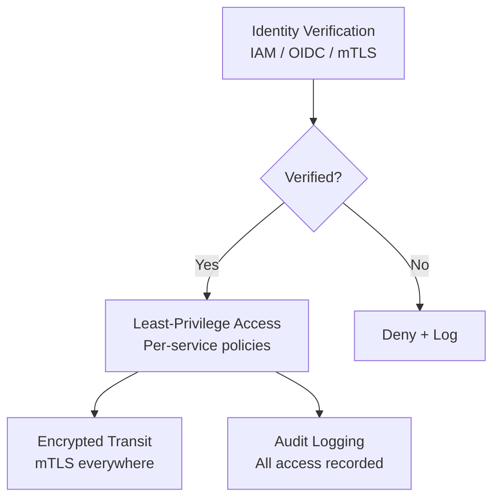

# How to Implement Zero Trust Networking with OpenTofu

Author: [nawazdhandala](https://www.github.com/nawazdhandala)

Tags: OpenTofu, Zero Trust, Security, VPC, IAM, mTLS, Network Policy, Infrastructure as Code

Description: Learn how to implement zero trust networking principles using OpenTofu with micro-segmentation, identity-based access, mTLS enforcement, and continuous verification across AWS, Azure, and Kubernetes.

---

Zero trust networking eliminates implicit trust based on network location. Every request is verified regardless of whether it originates inside or outside the network perimeter. OpenTofu implements zero trust by combining micro-segmented networks, identity-based policies, and cryptographic verification.

## Zero Trust Architecture



## Network Micro-Segmentation

```hcl
# micro_segmentation.tf — one security group per service, not per tier

# API service — only accepts from load balancer and other internal services
resource "aws_security_group" "api" {
  name        = "${var.prefix}-api"
  description = "API service — explicit allowlist only"
  vpc_id      = var.vpc_id
}

resource "aws_security_group_rule" "api_from_alb" {
  type                     = "ingress"
  from_port                = 8080
  to_port                  = 8080
  protocol                 = "tcp"
  source_security_group_id = aws_security_group.alb.id
  security_group_id        = aws_security_group.api.id
  description              = "From load balancer only"
}

# Database — only accepts from API service
resource "aws_security_group" "database" {
  name        = "${var.prefix}-database"
  description = "Database — API service only"
  vpc_id      = var.vpc_id
}

resource "aws_security_group_rule" "db_from_api" {
  type                     = "ingress"
  from_port                = 5432
  to_port                  = 5432
  protocol                 = "tcp"
  source_security_group_id = aws_security_group.api.id
  security_group_id        = aws_security_group.database.id
  description              = "From API service only"
}

# Deny all outbound except what's explicitly needed
resource "aws_security_group_rule" "api_egress_db" {
  type                     = "egress"
  from_port                = 5432
  to_port                  = 5432
  protocol                 = "tcp"
  source_security_group_id = aws_security_group.database.id
  security_group_id        = aws_security_group.api.id
}

resource "aws_security_group_rule" "api_egress_https" {
  type        = "egress"
  from_port   = 443
  to_port     = 443
  protocol    = "tcp"
  cidr_blocks = ["0.0.0.0/0"]  # AWS API calls
  security_group_id = aws_security_group.api.id
}
```

## Kubernetes Network Policies

```hcl
# network_policies.tf — zero trust at the pod level
resource "kubernetes_network_policy" "api" {
  metadata {
    name      = "api-network-policy"
    namespace = var.namespace
  }

  spec {
    pod_selector {
      match_labels = {
        app = "api"
      }
    }

    # Only accept traffic from the ingress controller
    ingress {
      from {
        namespace_selector {
          match_labels = {
            "kubernetes.io/metadata.name" = "ingress-nginx"
          }
        }
      }
      ports {
        protocol = "TCP"
        port     = "8080"
      }
    }

    # Allow outbound to database and cache only
    egress {
      to {
        pod_selector {
          match_labels = {
            app = "postgres"
          }
        }
      }
      ports {
        protocol = "TCP"
        port     = "5432"
      }
    }

    egress {
      to {
        pod_selector {
          match_labels = {
            app = "redis"
          }
        }
      }
      ports {
        protocol = "TCP"
        port     = "6379"
      }
    }

    # Allow DNS
    egress {
      to {
        namespace_selector {
          match_labels = {
            "kubernetes.io/metadata.name" = "kube-system"
          }
        }
      }
      ports {
        protocol = "UDP"
        port     = "53"
      }
    }

    policy_types = ["Ingress", "Egress"]
  }
}
```

## IAM Identity-Based Access

```hcl
# identity_access.tf — IAM conditions enforce identity-based access

resource "aws_iam_policy" "zero_trust_s3" {
  name = "${var.prefix}-zero-trust-s3"
  policy = jsonencode({
    Version = "2012-10-17"
    Statement = [
      {
        Effect   = "Allow"
        Action   = ["s3:GetObject", "s3:PutObject"]
        Resource = "${aws_s3_bucket.data.arn}/*"
        Condition = {
          # Require requests from within VPC only
          StringEquals = {
            "aws:sourceVpc" = var.vpc_id
          }
          # Require encryption in transit
          Bool = {
            "aws:SecureTransport" = "true"
          }
        }
      }
    ]
  })
}
```

## mTLS Enforcement with Istio

```hcl
# mtls.tf — enforce mutual TLS for all service communication
resource "kubernetes_manifest" "strict_mtls" {
  manifest = {
    apiVersion = "security.istio.io/v1beta1"
    kind       = "PeerAuthentication"
    metadata = {
      name      = "default"
      namespace = var.namespace
    }
    spec = {
      mtls = {
        mode = "STRICT"  # Reject all non-mTLS traffic
      }
    }
  }
}

resource "kubernetes_manifest" "authz_policy" {
  manifest = {
    apiVersion = "security.istio.io/v1beta1"
    kind       = "AuthorizationPolicy"
    metadata = {
      name      = "api-allow"
      namespace = var.namespace
    }
    spec = {
      selector = {
        matchLabels = {
          app = "api"
        }
      }
      rules = [{
        from = [{
          source = {
            principals = [
              "cluster.local/ns/${var.namespace}/sa/frontend",
              "cluster.local/ns/monitoring/sa/prometheus",
            ]
          }
        }]
      }]
    }
  }
}
```

## Audit Logging

```hcl
# audit_logging.tf
resource "aws_cloudtrail" "zero_trust" {
  name                          = "${var.prefix}-zero-trust-audit"
  s3_bucket_name                = aws_s3_bucket.audit_logs.id
  include_global_service_events = true
  is_multi_region_trail         = true
  enable_log_file_validation    = true

  event_selector {
    read_write_type           = "All"
    include_management_events = true

    data_resource {
      type   = "AWS::S3::Object"
      values = ["arn:aws:s3:::"]  # All S3 objects
    }
  }
}
```

## Best Practices

- Start with `default-deny` network policies and explicitly allowlist required connections — this is the foundational principle of zero trust networking.
- Use service identities (SPIFFE/SPIRE, IRSA, Workload Identity) rather than network location for access control — a pod's IP address is not a reliable identity, but its cryptographic identity is.
- Enforce mTLS in STRICT mode for all service-to-service communication — PERMISSIVE mode allows unencrypted connections and should only be used during migration.
- Log all access decisions, including allowed requests — zero trust requires continuous verification and anomaly detection, which depends on comprehensive audit logs.
- Implement defense in depth — zero trust is not a single control but a combination of network micro-segmentation, identity verification, encryption, and continuous monitoring working together.
