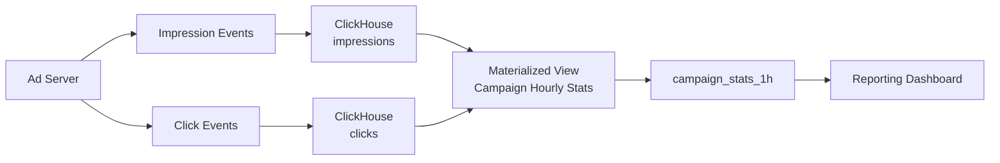

# How to Use ClickHouse for Ad Impression and Click Tracking

Author: [nawazdhandala](https://www.github.com/nawazdhandala)

Tags: ClickHouse, Advertising, Analytics, Impression, Click, Attribution

Description: Learn how to build an ad impression and click tracking system in ClickHouse with schemas for high-volume event ingestion, CTR calculation, attribution, and campaign reporting.

---

Digital advertising infrastructure needs to record billions of impressions and clicks per day, calculate click-through rates (CTR) in real time, and attribute conversions back to the originating ad interaction. ClickHouse's high-ingest throughput, fast aggregations, and `uniqExact` / `uniqCombined` functions make it an ideal engine for ad tracking at scale.

## Architecture



## Impressions Table

```sql
CREATE TABLE impressions
(
    impression_id   UUID                           CODEC(LZ4),
    campaign_id     UInt32                         CODEC(LZ4),
    ad_id           UInt32                         CODEC(LZ4),
    user_id         UInt64                         CODEC(LZ4),
    placement       LowCardinality(String)         CODEC(LZ4),
    device          LowCardinality(String)         CODEC(LZ4),
    country         LowCardinality(FixedString(2)) CODEC(LZ4),
    cost_usd        Decimal(10, 6)                 CODEC(ZSTD(3)),
    ts              DateTime64(3)                  CODEC(DoubleDelta, LZ4)
)
ENGINE = MergeTree()
PARTITION BY toYYYYMMDD(ts)
ORDER BY (campaign_id, ad_id, ts)
TTL toDateTime(ts) + INTERVAL 2 YEAR
SETTINGS index_granularity = 8192;
```

## Clicks Table

```sql
CREATE TABLE clicks
(
    click_id      UUID                           CODEC(LZ4),
    impression_id UUID                           CODEC(LZ4),
    campaign_id   UInt32                         CODEC(LZ4),
    ad_id         UInt32                         CODEC(LZ4),
    user_id       UInt64                         CODEC(LZ4),
    placement     LowCardinality(String)         CODEC(LZ4),
    device        LowCardinality(String)         CODEC(LZ4),
    country       LowCardinality(FixedString(2)) CODEC(LZ4),
    ts            DateTime64(3)                  CODEC(DoubleDelta, LZ4)
)
ENGINE = MergeTree()
PARTITION BY toYYYYMMDD(ts)
ORDER BY (campaign_id, ad_id, ts)
TTL toDateTime(ts) + INTERVAL 2 YEAR
SETTINGS index_granularity = 8192;
```

## Conversions Table

```sql
CREATE TABLE conversions
(
    conversion_id  UUID                     CODEC(LZ4),
    click_id       UUID                     CODEC(LZ4),
    campaign_id    UInt32                   CODEC(LZ4),
    user_id        UInt64                   CODEC(LZ4),
    conversion_type LowCardinality(String)  CODEC(LZ4),
    revenue_usd    Decimal(10, 2)           CODEC(ZSTD(3)),
    ts             DateTime64(3)            CODEC(DoubleDelta, LZ4)
)
ENGINE = MergeTree()
PARTITION BY toYYYYMMDD(ts)
ORDER BY (campaign_id, ts)
TTL toDateTime(ts) + INTERVAL 2 YEAR;
```

## CTR by Campaign (Last 24 Hours)

```sql
SELECT
    i.campaign_id,
    count()                              AS impressions,
    countIf(c.click_id != toUUID('00000000-0000-0000-0000-000000000000')) AS clicks,
    round(100.0 * clicks / impressions, 4) AS ctr_pct
FROM impressions i
LEFT JOIN clicks c
    ON i.impression_id = c.impression_id
WHERE i.ts >= now() - INTERVAL 24 HOUR
GROUP BY i.campaign_id
ORDER BY impressions DESC;
```

## CTR from Pre-Aggregated Stats

For high-volume reporting, maintain aggregated stats:

```sql
CREATE TABLE campaign_stats_1h
(
    campaign_id  UInt32,
    ad_id        UInt32,
    hour         DateTime,
    impressions  SimpleAggregateFunction(sum, UInt64),
    clicks       SimpleAggregateFunction(sum, UInt64),
    spend_usd    SimpleAggregateFunction(sum, Decimal(18, 6))
)
ENGINE = AggregatingMergeTree()
PARTITION BY toYYYYMM(hour)
ORDER BY (campaign_id, ad_id, hour);

CREATE MATERIALIZED VIEW impression_stats_mv
TO campaign_stats_1h
AS
SELECT
    campaign_id,
    ad_id,
    toStartOfHour(ts) AS hour,
    count()           AS impressions,
    0                 AS clicks,
    sum(cost_usd)     AS spend_usd
FROM impressions
GROUP BY campaign_id, ad_id, hour;

CREATE MATERIALIZED VIEW click_stats_mv
TO campaign_stats_1h
AS
SELECT
    campaign_id,
    ad_id,
    toStartOfHour(ts) AS hour,
    0                 AS impressions,
    count()           AS clicks,
    toDecimal64(0, 6) AS spend_usd
FROM clicks
GROUP BY campaign_id, ad_id, hour;
```

Query aggregated CTR:

```sql
SELECT
    campaign_id,
    sum(impressions) AS total_impressions,
    sum(clicks)      AS total_clicks,
    round(sum(spend_usd), 2) AS total_spend,
    round(100.0 * sum(clicks) / sum(impressions), 4) AS ctr_pct,
    round(sum(spend_usd) / nullIf(sum(clicks), 0), 4) AS cpc_usd
FROM campaign_stats_1h
WHERE hour >= now() - INTERVAL 7 DAY
GROUP BY campaign_id
ORDER BY total_spend DESC;
```

## Attribution: Revenue per Campaign

Join conversions back through clicks to campaigns:

```sql
SELECT
    c.campaign_id,
    count()                     AS conversions,
    round(sum(cv.revenue_usd), 2) AS total_revenue
FROM conversions cv
JOIN clicks c ON cv.click_id = c.click_id
WHERE cv.ts >= now() - INTERVAL 30 DAY
GROUP BY c.campaign_id
ORDER BY total_revenue DESC;
```

## Unique Reach (Distinct Users Seen)

```sql
SELECT
    campaign_id,
    uniqExact(user_id)   AS exact_reach,
    uniqCombined(user_id) AS approx_reach  -- faster for large data sets
FROM impressions
WHERE ts >= now() - INTERVAL 7 DAY
GROUP BY campaign_id
ORDER BY exact_reach DESC;
```

## Frequency Distribution (Impressions per User per Campaign)

```sql
SELECT
    campaign_id,
    impressions_per_user,
    count() AS users
FROM (
    SELECT
        campaign_id,
        user_id,
        count() AS impressions_per_user
    FROM impressions
    WHERE ts >= now() - INTERVAL 7 DAY
    GROUP BY campaign_id, user_id
)
GROUP BY campaign_id, impressions_per_user
ORDER BY campaign_id, impressions_per_user
LIMIT 50;
```

## Top-Performing Ads by CTR

```sql
SELECT
    campaign_id,
    ad_id,
    sum(impressions) AS impressions,
    sum(clicks)      AS clicks,
    round(100.0 * clicks / impressions, 3) AS ctr_pct
FROM campaign_stats_1h
WHERE hour >= now() - INTERVAL 7 DAY
GROUP BY campaign_id, ad_id
HAVING impressions > 10000
ORDER BY ctr_pct DESC
LIMIT 20;
```

## Summary

A ClickHouse ad tracking system stores impressions and clicks in separate MergeTree tables partitioned by day, with materialized views feeding an AggregatingMergeTree for campaign hourly stats. CTR, CPC, reach, and attribution queries run in under a second against the pre-aggregated stats table. For exact unique user counts use `uniqExact`; for billion-impression scale use `uniqCombined` with a small accuracy trade-off.
