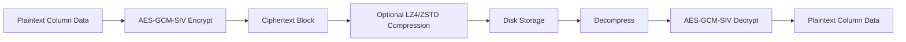

# How to Use AES Encryption Codec in ClickHouse

Author: [nawazdhandala](https://www.github.com/nawazdhandala)

Tags: ClickHouse, Encryption, Security, Codec, Compliance

Description: Learn how to use the AES_128_GCM_SIV and AES_256_GCM_SIV encryption codecs in ClickHouse to encrypt column data at rest with authenticated encryption.

---

ClickHouse supports column-level encryption through the `AES_128_GCM_SIV` and `AES_256_GCM_SIV` codecs. These codecs apply AES encryption using GCM-SIV (Galois/Counter Mode with Synthetic Initialization Vector) directly to column data during storage. The result is that even if someone gains raw access to disk files, the column values are unreadable without the encryption key.

This is distinct from full-disk encryption. AES codecs encrypt specific columns, leaving the rest of the table schema and metadata visible, which is useful for HIPAA, PCI-DSS, and GDPR compliance scenarios where only specific fields are sensitive.

## How AES_GCM_SIV Works



GCM-SIV provides authenticated encryption: the decryption step verifies both confidentiality and data integrity. If a block is tampered with on disk, the query returns an error rather than silently returning garbage data.

## Prerequisites: Setting the Encryption Key

Encryption keys must be provided via server configuration, not embedded in SQL. Add the following to your ClickHouse server configuration:

```xml
<!-- /etc/clickhouse-server/config.d/encryption.xml -->
<clickhouse>
    <encryption_codecs>
        <aes_128_gcm_siv>
            <key_hex>00112233445566778899aabbccddeeff</key_hex>
        </aes_128_gcm_siv>
        <aes_256_gcm_siv>
            <key_hex>00112233445566778899aabbccddeeff00112233445566778899aabbccddeeff</key_hex>
        </aes_256_gcm_siv>
    </encryption_codecs>
</clickhouse>
```

Alternatively, supply the key as a string using `<key>` instead of `<key_hex>`. Keys must be exactly 16 bytes (128-bit) or 32 bytes (256-bit).

Restart the server after changing key configuration:

```bash
sudo systemctl restart clickhouse-server
```

## Basic Usage

```sql
CREATE TABLE user_pii
(
    user_id     UInt64,
    email       String  CODEC(AES_128_GCM_SIV),
    ssn         String  CODEC(AES_256_GCM_SIV),
    created_at  DateTime
)
ENGINE = MergeTree()
ORDER BY (user_id, created_at);
```

Insert and query work transparently:

```sql
INSERT INTO user_pii VALUES
    (1, 'alice@example.com', '123-45-6789', now()),
    (2, 'bob@example.com',   '987-65-4321', now());

SELECT user_id, email, ssn FROM user_pii;
```

The decryption happens automatically on read. The raw `.bin` data files on disk contain ciphertext.

## Combining Encryption with Compression

AES codecs are transform codecs and can be chained. For encrypted columns that also benefit from compression, place the compressor after the encryption codec:

```sql
CREATE TABLE health_records
(
    patient_id  UInt64,
    diagnosis   String  CODEC(AES_256_GCM_SIV, LZ4),
    notes       String  CODEC(AES_256_GCM_SIV, ZSTD(3)),
    visit_date  Date
)
ENGINE = MergeTree()
ORDER BY (patient_id, visit_date);
```

Note that encrypted data has high entropy and does not compress well. The compression step after encryption typically yields little benefit. Consider compressing before encrypting by chaining in reverse -- however, ClickHouse codec ordering applies left to right on write, so this means placing ZSTD before AES_256_GCM_SIV is not currently supported (encryption must be the innermost transform). Accept the marginal disk overhead for compliant columns.

## AES_128_GCM_SIV vs AES_256_GCM_SIV

```sql
-- 128-bit: faster, sufficient for most use cases
-- 256-bit: required for high-security regulatory environments

CREATE TABLE payment_data
(
    txn_id      UInt64,
    card_number String CODEC(AES_256_GCM_SIV), -- PCI-DSS requires 256-bit
    amount      Decimal(18, 4),
    merchant_id UInt32
)
ENGINE = MergeTree()
ORDER BY txn_id;
```

Both variants use GCM-SIV, so both provide authenticated encryption and nonce misuse resistance.

## Key Rotation

ClickHouse supports key rotation using the `id` attribute. Old data can be re-encrypted incrementally:

```xml
<clickhouse>
    <encryption_codecs>
        <aes_256_gcm_siv>
            <key_hex id="0">OLD_KEY_HEX_HERE</key_hex>
            <key_hex id="1">NEW_KEY_HEX_HERE</key_hex>
            <current_key_id>1</current_key_id>
        </aes_256_gcm_siv>
    </encryption_codecs>
</clickhouse>
```

New writes use key ID 1. Old parts still decrypt using key ID 0 until they are merged and rewritten. Force a merge to re-encrypt:

```sql
OPTIMIZE TABLE health_records FINAL;
```

## Verifying Encryption on Disk

Confirm that raw data files are encrypted by inspecting column binary files directly. Encrypted columns produce high-entropy unreadable output:

```bash
# View compressed column file (should be unreadable ciphertext)
xxd /var/lib/clickhouse/data/default/health_records/all_1_1_0/diagnosis.bin | head -5
```

## Checking Column Codec in System Tables

```sql
SELECT
    name,
    type,
    compression_codec
FROM system.columns
WHERE table = 'health_records'
  AND database = currentDatabase();
```

## Altering an Existing Column to Add Encryption

```sql
ALTER TABLE user_pii
    MODIFY COLUMN email String CODEC(AES_256_GCM_SIV);

OPTIMIZE TABLE user_pii FINAL;
```

The `OPTIMIZE FINAL` forces all parts to be rewritten with the new codec, ensuring existing plaintext data is encrypted on disk.

## Performance Considerations

AES-GCM-SIV adds CPU overhead on every read and write. On modern hardware with AES-NI instructions, the overhead is typically under 5% for most workloads. If a column is encrypted and queried frequently in `WHERE` clauses, ClickHouse must decrypt the entire column block before evaluating the predicate, bypassing any compression-level skipping. For high-frequency filter columns, weigh encryption cost against query performance.

## Summary

The AES_128_GCM_SIV and AES_256_GCM_SIV codecs provide column-level authenticated encryption for sensitive fields in ClickHouse. Configure the key in server XML, declare the codec on individual columns, and the encryption and decryption are transparent to queries. Use AES_256_GCM_SIV for regulatory requirements (PCI-DSS, HIPAA), combine with OPTIMIZE FINAL after adding encryption to existing data, and implement key rotation via key IDs to maintain long-term security posture.
