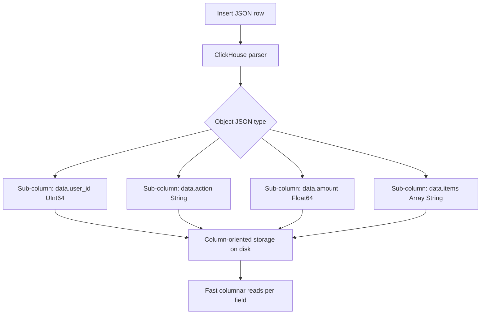

# How to Set allow_experimental_object_type in ClickHouse

Author: [nawazdhandala](https://www.github.com/nawazdhandala)

Tags: ClickHouse, Json, Configuration, Schema, Experimental

Description: Learn how to enable allow_experimental_object_type in ClickHouse to use the Object('json') type for semi-structured JSON data with dynamic schema support.

---

ClickHouse introduced the `Object('json')` type (also referred to as the JSON type) as an experimental feature for storing and querying semi-structured JSON data without a fixed schema. Unlike storing JSON in a `String` column and parsing at query time, the `Object('json')` type stores JSON fields as typed sub-columns, allowing efficient column-oriented access. To use it, you must first enable `allow_experimental_object_type`.

## Enabling the Setting

```sql
SET allow_experimental_object_type = 1;
```

Or per-session in your client:

```sql
SET allow_experimental_object_type = 1;

CREATE TABLE events
(
    id         UInt64,
    ts         DateTime,
    data       Object('json')
)
ENGINE = MergeTree()
ORDER BY (ts, id);
```

Without enabling the setting, attempting to create a table with `Object('json')` raises:

```
Code: 451. DB::Exception: Experimental Object type is not allowed.
Set allow_experimental_object_type = 1 to use it.
```

## Inserting JSON Data

```sql
SET allow_experimental_object_type = 1;

INSERT INTO events FORMAT JSONEachRow
{"id": 1, "ts": "2024-01-01 10:00:00", "data": {"user_id": 42, "action": "click", "page": "/home"}}
{"id": 2, "ts": "2024-01-01 10:01:00", "data": {"user_id": 43, "action": "purchase", "amount": 99.99, "items": ["book", "pen"]}}
{"id": 3, "ts": "2024-01-01 10:02:00", "data": {"user_id": 42, "action": "logout"}}
```

ClickHouse infers types for each JSON key and stores them as typed sub-columns.

## Querying Sub-Columns

Access JSON fields using dot notation:

```sql
SET allow_experimental_object_type = 1;

SELECT
    id,
    data.user_id,
    data.action,
    data.amount
FROM events
ORDER BY id;
```

Fields that do not exist in a row return the type default (`0` for numbers, empty string for strings).

## Inspecting Inferred Schema

```sql
SET allow_experimental_object_type = 1;

DESCRIBE TABLE events;
```

The `data` column appears as a single `Object('json')` column in `DESCRIBE`, but internally ClickHouse stores each discovered key as its own sub-column.

To see actual sub-columns:

```sql
SELECT name, type
FROM system.columns
WHERE table = 'events' AND database = currentDatabase()
ORDER BY name;
```

## Architecture Overview



## Filtering on JSON Fields

```sql
SET allow_experimental_object_type = 1;

SELECT id, data.user_id, data.amount
FROM events
WHERE data.action = 'purchase'
  AND data.amount > 50;
```

## Limitations and Caveats

The `Object('json')` type is experimental and has several constraints:

- Schema changes (adding new JSON keys) require rewriting data parts
- Deeply nested or highly variable schemas can create thousands of sub-columns, impacting metadata overhead
- The type is not suitable for arbitrary blob storage - use `String` for that
- Not all ClickHouse features (e.g., some mutations) work seamlessly with `Object('json')`
- As of ClickHouse 23.x, the `JSON` type (a newer iteration) is the recommended path forward

## Enabling in Server Config

To allow all users to create `Object('json')` columns without setting it per session:

```xml
<profiles>
  <default>
    <allow_experimental_object_type>1</allow_experimental_object_type>
  </default>
</profiles>
```

## When to Use Object('json') vs String

| Approach | When to Use |
|----------|-------------|
| `String` + `JSONExtract*` | One-off queries, rare access to JSON fields |
| `Object('json')` | Repeated queries on known sub-fields, semi-structured logs |
| Fixed columns | Known schema, maximum query performance |

## Summary

`allow_experimental_object_type = 1` unlocks the `Object('json')` column type, which stores JSON as typed sub-columns for efficient columnar access. It is ideal for semi-structured data where field sets vary across rows but common fields are queried frequently. Be aware of its experimental status, schema evolution limitations, and the growing `JSON` type introduced in newer ClickHouse versions as its successor.
