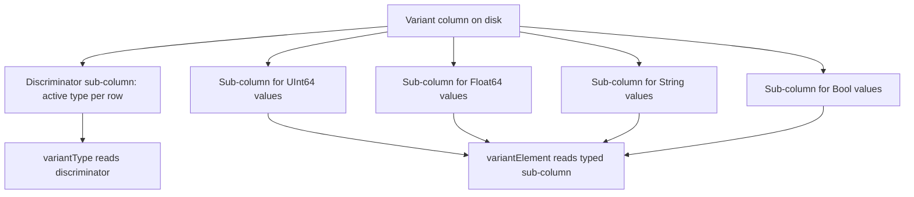

# How to Set allow_experimental_variant_type in ClickHouse

Author: [nawazdhandala](https://www.github.com/nawazdhandala)

Tags: ClickHouse, Schema, Configuration, Experimental, Type

Description: Learn how to enable allow_experimental_variant_type in ClickHouse to use the Variant type for columns that can store multiple distinct data types in a single column.

---

The `Variant` type in ClickHouse allows a single column to hold values of multiple distinct types, such as `UInt64`, `String`, and `Float64`, in different rows. This is useful for event streams, configuration tables, and schema-free pipelines where the value type varies per row. To use it, you must enable `allow_experimental_variant_type`.

## Enabling the Setting

```sql
SET allow_experimental_variant_type = 1;
```

Without it, creating a `Variant` column raises:

```yaml
Code: 451. DB::Exception: Variant type is not allowed.
Set allow_experimental_variant_type = 1 to use it.
```

## Creating a Table with Variant

```sql
SET allow_experimental_variant_type = 1;

CREATE TABLE config_values
(
    key    String,
    value  Variant(UInt64, Float64, String, Bool)
)
ENGINE = MergeTree()
ORDER BY key;
```

The `Variant` declaration lists all types that can appear in the column.

## Inserting Mixed-Type Data

```sql
SET allow_experimental_variant_type = 1;

INSERT INTO config_values VALUES
    ('max_connections', 100::UInt64),
    ('timeout_seconds', 30.5::Float64),
    ('debug_mode',      true::Bool),
    ('log_level',       'warn'::String);
```

## Querying Variant Columns

Use `variantType()` to inspect the active type per row, and `variantElement()` to extract a typed value:

```sql
SET allow_experimental_variant_type = 1;

SELECT
    key,
    variantType(value)                        AS val_type,
    variantElement(value, 'UInt64')            AS uint_val,
    variantElement(value, 'String')            AS str_val,
    variantElement(value, 'Float64')           AS float_val,
    variantElement(value, 'Bool')              AS bool_val
FROM config_values;
```

Rows where the active type does not match the requested type return `NULL` (when `join_use_nulls = 1`) or the type default.

## Using multiIf for Safe Access

```sql
SET allow_experimental_variant_type = 1;

SELECT
    key,
    multiIf(
        variantType(value) = 'UInt64',  toString(variantElement(value, 'UInt64')),
        variantType(value) = 'Float64', toString(variantElement(value, 'Float64')),
        variantType(value) = 'String',  variantElement(value, 'String'),
        variantType(value) = 'Bool',    if(variantElement(value, 'Bool'), 'true', 'false'),
        'unknown'
    ) AS display_value
FROM config_values;
```

## Architecture



## Variant vs Nullable vs Dynamic

| Type | Use Case |
|------|----------|
| `Nullable(T)` | One known type that may be absent |
| `Variant(T1, T2, ...)` | Fixed set of known types, one active per row |
| `Dynamic` | Arbitrary types discovered at insert time (requires `allow_experimental_dynamic_type`) |
| `Object('json')` | Semi-structured JSON with dot-notation access |

## Filtering by Variant Type

```sql
SET allow_experimental_variant_type = 1;

-- Get only string config values
SELECT key, variantElement(value, 'String') AS str_val
FROM config_values
WHERE variantType(value) = 'String';
```

## Enabling in Server Configuration

```xml
<profiles>
  <default>
    <allow_experimental_variant_type>1</allow_experimental_variant_type>
  </default>
</profiles>
```

## Limitations

- Not all aggregate functions and operators handle `Variant` natively; extract the typed sub-column first
- Sorting and indexing directly on `Variant` columns is limited
- Schema changes (adding new variant types) require `ALTER TABLE MODIFY COLUMN`, which rewrites data
- The feature is experimental; behavior may change in future ClickHouse versions

## Summary

`allow_experimental_variant_type = 1` enables the `Variant(T1, T2, ...)` column type, which stores multiple distinct types in a single column with a type discriminator per row. It is well suited for event pipelines, configuration tables, and any dataset where a value field's type varies by row. Use `variantType()` to inspect the active type and `variantElement()` to safely extract typed values. Be mindful of its experimental status and extraction overhead compared to fixed-type columns.
