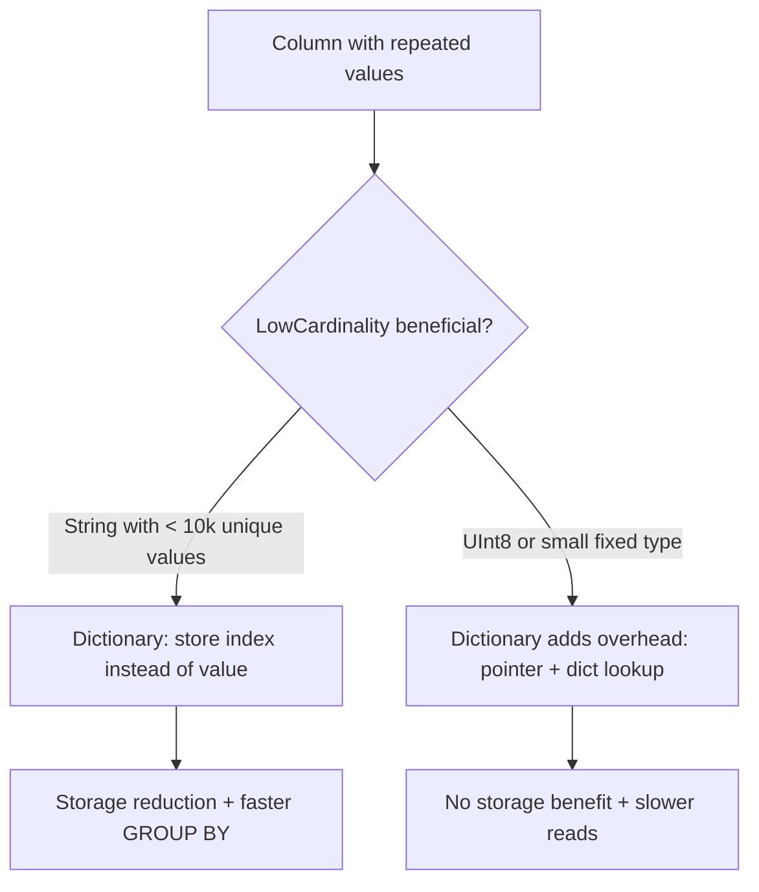

# How to Set allow_suspicious_low_cardinality_types in ClickHouse

Author: [nawazdhandala](https://www.github.com/nawazdhandala)

Tags: ClickHouse, Schema, Configuration, LowCardinality, Type

Description: Learn when and why to enable allow_suspicious_low_cardinality_types in ClickHouse to use LowCardinality with fixed-size types like UInt8 or Float32.

---

`LowCardinality(T)` is a ClickHouse optimization that stores column values as a dictionary-encoded representation. It reduces storage and improves query performance when the column has few unique values (typically fewer than 10 000). However, applying `LowCardinality` to types that are already small or fixed-size (like `UInt8`, `Int8`, `Float32`, `Float64`) can actually hurt performance because the dictionary overhead outweighs the benefit. ClickHouse guards against this with the `allow_suspicious_low_cardinality_types` setting.

## What Gets Blocked

By default (`allow_suspicious_low_cardinality_types = 0`), ClickHouse throws an error when you try to use `LowCardinality` with fixed-size numeric types:

```sql
CREATE TABLE metrics
(
    ts       DateTime,
    value    LowCardinality(Float64)   -- Blocked by default
)
ENGINE = MergeTree()
ORDER BY ts;
```

Error:

```yaml
Code: 603. DB::Exception: Creating columns of type LowCardinality(Float64) is not allowed
by default due to expected negative impact on performance.
Set allow_suspicious_low_cardinality_types = 1 to allow it.
```

## Types Blocked Without the Setting

| Type | Suspicious? |
|------|-------------|
| `LowCardinality(UInt8)` | Yes - already 1 byte, no benefit |
| `LowCardinality(Int8)` | Yes |
| `LowCardinality(Float32)` | Yes - fixed 4 bytes |
| `LowCardinality(Float64)` | Yes - fixed 8 bytes |
| `LowCardinality(String)` | No - variable length, typically beneficial |
| `LowCardinality(FixedString(N))` | No - variable N, may be beneficial |
| `LowCardinality(DateTime)` | No - 4 bytes, but ClickHouse allows it |

## Enabling the Setting

```sql
SET allow_suspicious_low_cardinality_types = 1;

CREATE TABLE metrics
(
    ts      DateTime,
    sensor  LowCardinality(String),
    value   LowCardinality(Float64)
)
ENGINE = MergeTree()
ORDER BY (sensor, ts);
```

## When It Actually Makes Sense

Despite the warning, there are legitimate use cases for `LowCardinality(Float64)`:

- A `Float64` column with very few unique values (e.g., a rate column that is always 0.1, 0.5, or 1.0)
- A column used in `GROUP BY` where dictionary sharing speeds up grouping
- Legacy schema compatibility where removing `LowCardinality` requires a full table rewrite

```sql
SET allow_suspicious_low_cardinality_types = 1;

-- Legitimate: discount_rate only takes 4 values
CREATE TABLE orders
(
    order_id      UInt64,
    discount_rate LowCardinality(Float64),  -- Only: 0.0, 0.05, 0.10, 0.20
    amount        Float64
)
ENGINE = MergeTree()
ORDER BY order_id;
```

## LowCardinality Performance Model



## Comparing Storage With and Without LowCardinality

```sql
SET allow_suspicious_low_cardinality_types = 1;

CREATE TABLE test_lc (v LowCardinality(Float64)) ENGINE = MergeTree() ORDER BY v;
CREATE TABLE test_plain (v Float64) ENGINE = MergeTree() ORDER BY v;

-- Insert data with only 4 unique float values
INSERT INTO test_lc    SELECT [0.1, 0.5, 1.0, 2.0][rand() % 4 + 1] FROM numbers(1000000);
INSERT INTO test_plain SELECT [0.1, 0.5, 1.0, 2.0][rand() % 4 + 1] FROM numbers(1000000);

SELECT
    table,
    formatReadableSize(sum(data_compressed_bytes))   AS compressed,
    formatReadableSize(sum(data_uncompressed_bytes)) AS uncompressed
FROM system.parts
WHERE table IN ('test_lc', 'test_plain') AND active = 1
  AND database = currentDatabase()
GROUP BY table;
```

## Enabling in Configuration

```xml
<profiles>
  <default>
    <allow_suspicious_low_cardinality_types>0</allow_suspicious_low_cardinality_types>
  </default>
  <schema_migration>
    <allow_suspicious_low_cardinality_types>1</allow_suspicious_low_cardinality_types>
  </schema_migration>
</profiles>
```

## Summary

`allow_suspicious_low_cardinality_types` protects you from accidentally applying `LowCardinality` to fixed-size numeric types like `UInt8` or `Float64`, where the dictionary overhead typically exceeds any storage benefit. Enable it only when you have verified that the column has very few unique values and profiling confirms a benefit, or when schema compatibility requires it. For `String` and `FixedString` columns, `LowCardinality` is almost always beneficial and does not require this setting.
