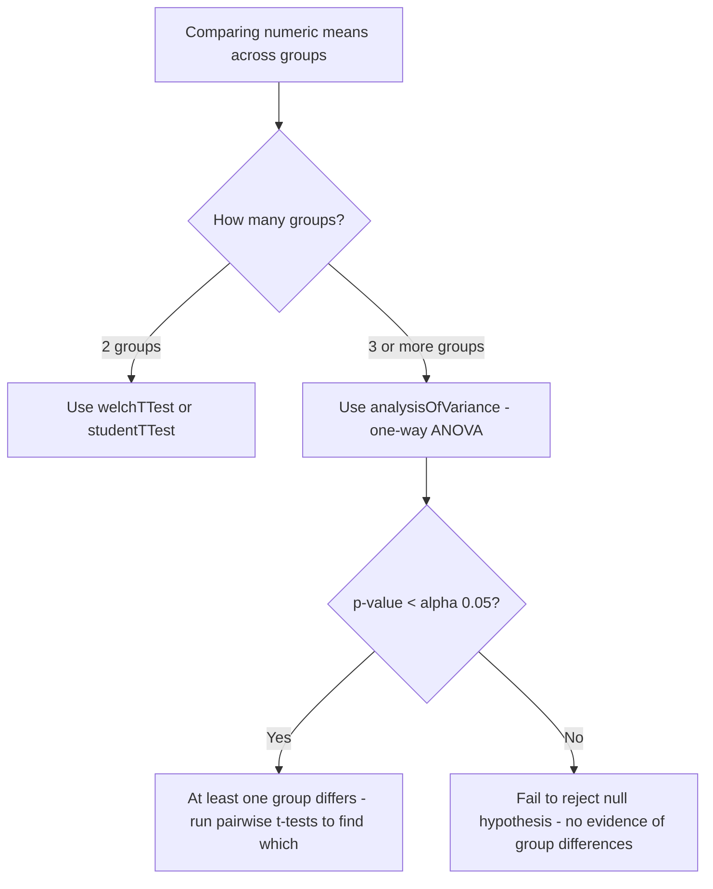

# How to Use analysisOfVariance() in ClickHouse

Author: [OneUptime](https://www.github.com/OneUptime)

Tags: ClickHouse, SQL, Aggregate Function, Statistics, ANOVA

Description: Learn how to use analysisOfVariance() in ClickHouse to perform a one-way ANOVA test and determine whether group means differ significantly across multiple categories.

---

`analysisOfVariance(value, group)` performs a one-way ANOVA (Analysis of Variance) test in ClickHouse. It tests the null hypothesis that all group means are equal. The function returns an F-statistic and a p-value. A small p-value (typically < 0.05) indicates that at least one group mean is significantly different from the others. This is useful for comparing metrics across multiple services, regions, or experiment variants simultaneously.

## Syntax

```sql
-- Returns a Tuple(Float64, Float64) of (F-statistic, p-value)
SELECT analysisOfVariance(value_column, group_column) FROM table_name;

-- Access tuple fields
SELECT
    (analysisOfVariance(value_column, group_column)).1 AS f_statistic,
    (analysisOfVariance(value_column, group_column)).2 AS p_value
FROM table_name;
```

## Basic Example

```sql
-- Are mean response times significantly different across services?
SELECT
    (analysisOfVariance(response_time_ms, service_name)).1 AS f_statistic,
    (analysisOfVariance(response_time_ms, service_name)).2 AS p_value
FROM request_logs
WHERE log_date = today();
```

A p-value near 0 tells you that the groups do not all have the same mean latency. It does not tell you which specific services differ - for that, use pairwise t-tests after ANOVA.

## Multi-Region Performance Comparison

```sql
-- Does latency differ significantly across deployment regions?
SELECT
    f_stat,
    p_value,
    if(p_value < 0.05, 'Significant - regions differ', 'Not significant - regions similar') AS interpretation
FROM (
    SELECT
        (analysisOfVariance(response_time_ms, region)).1 AS f_stat,
        (analysisOfVariance(response_time_ms, region)).2 AS p_value
    FROM request_logs
    WHERE log_date >= today() - 7
);
```

## ANOVA for A/B/n Testing

```sql
-- Is error rate significantly different across experiment variants?
SELECT
    experiment_id,
    (analysisOfVariance(toFloat64(toUInt8(status_code >= 500)), variant)).1 AS f_stat,
    (analysisOfVariance(toFloat64(toUInt8(status_code >= 500)), variant)).2 AS p_value
FROM request_logs
WHERE log_date >= today() - 14
  AND experiment_id IS NOT NULL
GROUP BY experiment_id
ORDER BY p_value ASC;
```

## Context: When to Use ANOVA vs t-Test



## Tracking Daily Significance of Regional Differences

```sql
-- Is regional latency variation significant, and is it worsening?
SELECT
    log_date,
    round((analysisOfVariance(response_time_ms, region)).1, 2) AS f_stat,
    round((analysisOfVariance(response_time_ms, region)).2, 6) AS p_value
FROM request_logs
WHERE log_date >= today() - 30
GROUP BY log_date
ORDER BY log_date DESC;
```

## ANOVA with Group Summary for Context

```sql
-- Run ANOVA and include per-group means for interpretation
WITH
    anova AS (
        SELECT
            (analysisOfVariance(response_time_ms, service_name)).1 AS f_stat,
            (analysisOfVariance(response_time_ms, service_name)).2 AS p_value
        FROM request_logs
        WHERE log_date = today()
    ),
    group_stats AS (
        SELECT
            service_name,
            round(avg(response_time_ms), 1)        AS group_mean_ms,
            round(stddevSamp(response_time_ms), 1) AS group_std_ms,
            count()                                AS group_n
        FROM request_logs
        WHERE log_date = today()
        GROUP BY service_name
    )
SELECT
    g.service_name,
    g.group_mean_ms,
    g.group_std_ms,
    g.group_n,
    a.f_stat,
    a.p_value,
    if(a.p_value < 0.05, 'Groups differ significantly', 'No significant difference') AS anova_result
FROM group_stats g, anova a
ORDER BY g.group_mean_ms DESC;
```

## Interpreting the F-Statistic

The F-statistic is the ratio of between-group variance to within-group variance. A large F (and correspondingly small p-value) means the groups vary more relative to within-group noise, providing evidence that the groups have different population means.

```sql
-- F-statistic anatomy
-- F = (between-group variance / df_between) / (within-group variance / df_within)
-- ClickHouse computes this and returns the p-value from the F-distribution
SELECT
    service_name,
    round(avg(response_time_ms), 1) AS mean_ms,
    round(varSamp(response_time_ms), 1) AS variance_ms
FROM request_logs
WHERE log_date = today()
GROUP BY service_name
ORDER BY mean_ms DESC;
```

## Summary

`analysisOfVariance(value, group)` runs a one-way ANOVA F-test in ClickHouse, returning a `(F-statistic, p-value)` tuple. Use it to test whether three or more groups have equal population means. A p-value below your significance threshold (commonly 0.05) indicates that at least one group mean differs; follow up with pairwise `welchTTest` calls to identify which specific groups differ. Common use cases include comparing latency across services or regions, evaluating experiment variants in A/B/n tests, and detecting performance regressions across deployment cohorts.
