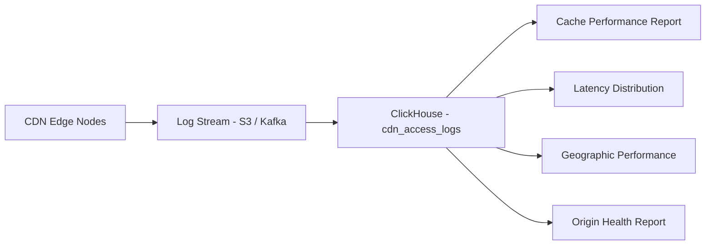
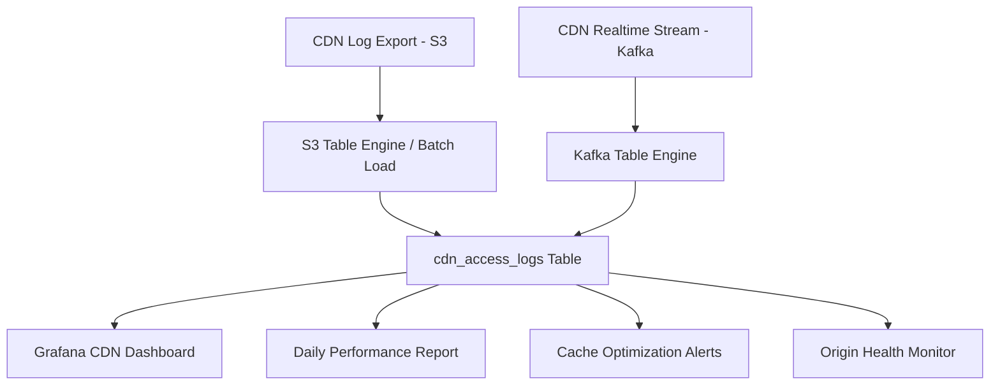

# How to Analyze CDN Performance with ClickHouse

Author: [oneuptime](https://github.com/oneuptime)

Tags: ClickHouse, CDN, Performance, Analytics, Tutorial, Database

Description: Build a CDN performance analytics system with ClickHouse - covering access log ingestion, cache hit rate analysis, origin offload, latency distribution, and geographic performance reporting.

## Overview

CDN performance analytics requires ingesting hundreds of millions of access log entries per day and answering questions about cache hit rates, origin offload efficiency, edge latency by geography, error rates, and bandwidth costs. ClickHouse is a natural fit: it ingests high-volume logs efficiently, compresses them aggressively, and returns aggregated results in milliseconds.



## Schema Design

```sql
CREATE TABLE cdn_access_logs (
    -- Request identifiers
    request_id      String,
    edge_node       LowCardinality(String),
    edge_region     LowCardinality(String),
    edge_country    LowCardinality(String),
    pop             LowCardinality(String),

    -- Request details
    method          LowCardinality(String),
    scheme          LowCardinality(String),
    host            LowCardinality(String),
    uri             String,
    query_string    String,
    content_type    LowCardinality(String),

    -- Client info
    client_ip       IPv4,
    client_country  LowCardinality(String),
    client_region   LowCardinality(String),
    user_agent      String,

    -- Response
    status_code     UInt16,
    bytes_sent      UInt64,
    response_time_ms UInt32,
    ttfb_ms         UInt32,

    -- Cache
    cache_status    LowCardinality(String),
    cache_age_seconds Int32,
    etag            String,

    -- Origin
    origin_host     LowCardinality(String),
    origin_time_ms  Nullable(UInt32),
    origin_status   Nullable(UInt16),

    requested_at    DateTime64(3)
) ENGINE = MergeTree()
PARTITION BY toYYYYMMDD(requested_at)
ORDER BY (host, requested_at)
TTL toDate(requested_at) + INTERVAL 90 DAY DELETE
SETTINGS index_granularity = 8192;

-- Index for URI filtering
ALTER TABLE cdn_access_logs ADD INDEX idx_uri uri
    TYPE tokenbf_v1(32768, 3, 0) GRANULARITY 4;
```

## Cache Performance

### Overall Cache Hit Rate

```sql
-- Cache hit rate by host and edge region
SELECT
    host,
    edge_region,
    count()                                         AS total_requests,
    countIf(cache_status = 'HIT')                   AS cache_hits,
    countIf(cache_status = 'MISS')                  AS cache_misses,
    countIf(cache_status = 'STALE')                 AS stale_hits,
    round(countIf(cache_status = 'HIT') * 100.0
        / count(), 2)                               AS cache_hit_rate_pct,
    round(countIf(cache_status IN ('HIT', 'STALE'))
        * 100.0 / count(), 2)                       AS effective_hit_rate_pct
FROM cdn_access_logs
WHERE requested_at >= today() - 7
GROUP BY host, edge_region
ORDER BY total_requests DESC;
```

### Origin Offload Analysis

```sql
-- How much traffic is being served from cache vs hitting origin
SELECT
    toDate(requested_at)                            AS day,
    host,
    formatReadableSize(sum(bytes_sent))             AS total_bytes,
    formatReadableSize(sumIf(bytes_sent, cache_status = 'MISS')) AS origin_bytes,
    formatReadableSize(sumIf(bytes_sent, cache_status = 'HIT'))  AS cache_bytes,
    round(sumIf(bytes_sent, cache_status = 'HIT') * 100.0
        / sum(bytes_sent), 2)                       AS bytes_from_cache_pct
FROM cdn_access_logs
WHERE requested_at >= today() - 30
GROUP BY day, host
ORDER BY day DESC, total_bytes DESC;
```

## Latency Analysis

### Response Time Distribution

```sql
-- Latency percentiles by edge region and cache status
SELECT
    edge_region,
    cache_status,
    count()                                         AS requests,
    quantile(0.50)(response_time_ms)                AS p50_ms,
    quantile(0.90)(response_time_ms)                AS p90_ms,
    quantile(0.95)(response_time_ms)                AS p95_ms,
    quantile(0.99)(response_time_ms)                AS p99_ms
FROM cdn_access_logs
WHERE requested_at >= today() - 7
  AND status_code < 500
GROUP BY edge_region, cache_status
ORDER BY edge_region, cache_status;
```

### Time to First Byte Analysis

```sql
-- TTFB distribution over time
SELECT
    toStartOfHour(requested_at)                     AS hour,
    edge_region,
    avg(ttfb_ms)                                    AS avg_ttfb_ms,
    quantile(0.95)(ttfb_ms)                         AS p95_ttfb_ms,
    quantile(0.99)(ttfb_ms)                         AS p99_ttfb_ms
FROM cdn_access_logs
WHERE requested_at >= today() - 3
  AND cache_status = 'HIT'
GROUP BY hour, edge_region
ORDER BY hour, edge_region;
```

## Geographic Performance

```sql
-- Performance by client country
SELECT
    client_country,
    count()                                         AS requests,
    formatReadableSize(sum(bytes_sent))             AS bytes_delivered,
    round(avg(response_time_ms), 0)                 AS avg_response_ms,
    round(countIf(cache_status = 'HIT') * 100.0
        / count(), 2)                               AS cache_hit_rate_pct,
    round(countIf(status_code >= 400) * 100.0
        / count(), 2)                               AS error_rate_pct
FROM cdn_access_logs
WHERE requested_at >= today() - 7
GROUP BY client_country
ORDER BY requests DESC
LIMIT 30;
```

## Error Rate Monitoring

```sql
-- Error rate by host and edge region (5-minute buckets)
SELECT
    toStartOfFiveMinutes(requested_at)              AS period,
    host,
    edge_region,
    count()                                         AS total_requests,
    countIf(status_code >= 500)                     AS server_errors,
    countIf(status_code >= 400 AND status_code < 500) AS client_errors,
    round(countIf(status_code >= 500) * 100.0
        / count(), 3)                               AS error_5xx_rate_pct
FROM cdn_access_logs
WHERE requested_at >= now() - INTERVAL 1 HOUR
GROUP BY period, host, edge_region
HAVING error_5xx_rate_pct > 0.1
ORDER BY period DESC, error_5xx_rate_pct DESC;
```

## Content Analysis

### Most Requested URLs

```sql
-- Top requested content by traffic volume
SELECT
    host,
    uri,
    content_type,
    count()                                         AS requests,
    formatReadableSize(sum(bytes_sent))             AS bytes,
    round(countIf(cache_status = 'HIT') * 100.0
        / count(), 2)                               AS cache_hit_rate_pct
FROM cdn_access_logs
WHERE requested_at >= today() - 1
GROUP BY host, uri, content_type
ORDER BY sum(bytes_sent) DESC
LIMIT 50;
```

### Cache Inefficiency Detection

```sql
-- High-traffic URLs with low cache hit rates (optimization opportunities)
SELECT
    host,
    uri,
    count()                                         AS requests,
    round(countIf(cache_status = 'HIT') * 100.0
        / count(), 2)                               AS cache_hit_rate_pct,
    avg(cache_age_seconds)                          AS avg_cache_age_s
FROM cdn_access_logs
WHERE requested_at >= today() - 7
GROUP BY host, uri
HAVING requests > 10000
   AND cache_hit_rate_pct < 50
ORDER BY requests DESC
LIMIT 30;
```

## Origin Health

```sql
-- Origin response time and error rate by origin host
SELECT
    origin_host,
    count()                                         AS origin_requests,
    avg(origin_time_ms)                             AS avg_origin_ms,
    quantile(0.95)(origin_time_ms)                  AS p95_origin_ms,
    countIf(origin_status >= 500)                   AS origin_errors,
    round(countIf(origin_status >= 500) * 100.0
        / count(), 2)                               AS origin_error_rate_pct
FROM cdn_access_logs
WHERE requested_at >= today() - 1
  AND cache_status = 'MISS'
  AND origin_host != ''
GROUP BY origin_host
ORDER BY origin_requests DESC;
```

## Bandwidth and Cost Reporting

```sql
-- Daily bandwidth by region (for cost allocation)
SELECT
    toDate(requested_at)                            AS day,
    edge_region,
    host,
    formatReadableSize(sum(bytes_sent))             AS bytes_delivered,
    round(sum(bytes_sent) / 1e12, 4)               AS tb_delivered,
    count()                                         AS request_count
FROM cdn_access_logs
WHERE requested_at >= today() - 30
GROUP BY day, edge_region, host
ORDER BY day DESC, sum(bytes_sent) DESC;
```

## Architecture



## Conclusion

ClickHouse gives CDN operators a fast, cost-effective analytics platform for understanding cache performance, geographic latency, origin health, and bandwidth costs. The combination of LowCardinality types for repeated string fields (edge region, country, host), bloom filter indexes for URI lookup, and time-based partitioning makes it possible to answer any CDN performance question over months of data in seconds.

**Related Reading:**

- [How to Build Network Capacity Planning with ClickHouse](https://oneuptime.com/blog/post/2026-03-31-clickhouse-build-network-capacity-planning/view)
- [How to Build a Log Analytics Platform with ClickHouse](https://oneuptime.com/blog/post/2026-03-31-clickhouse-build-log-analytics-platform/view)
- [How to Build a Real-Time Metrics Dashboard with ClickHouse](https://oneuptime.com/blog/post/2026-03-31-clickhouse-build-real-time-metrics-dashboard/view)
