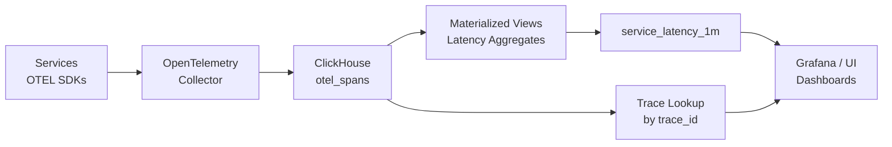

# How to Use ClickHouse for Application Performance Monitoring (APM)

Author: [nawazdhandala](https://www.github.com/nawazdhandala)

Tags: ClickHouse, APM, Tracing, Observability, OpenTelemetry, Performance

Description: Learn how to use ClickHouse as the storage backend for APM data including spans, traces, service latency metrics, error rates, and dependency graphs with OpenTelemetry.

---

Application Performance Monitoring (APM) requires storing and querying distributed traces, service latency distributions, and error rates at high volume. ClickHouse stores OpenTelemetry spans efficiently and enables queries that would take minutes in traditional databases to complete in under a second -- critical for real-time incident triage.

## Architecture



## Spans Table

```sql
CREATE TABLE otel_spans
(
    trace_id          FixedString(32)        CODEC(LZ4),
    span_id           FixedString(16)        CODEC(LZ4),
    parent_span_id    FixedString(16)        CODEC(LZ4),
    service_name      LowCardinality(String) CODEC(LZ4),
    operation_name    LowCardinality(String) CODEC(LZ4),
    span_kind         LowCardinality(String) CODEC(LZ4),
    status_code       LowCardinality(String) CODEC(LZ4),
    duration_ns       UInt64                 CODEC(Delta(8), LZ4),
    start_time        DateTime64(9)          CODEC(DoubleDelta, LZ4),
    attributes        Map(String, String)    CODEC(ZSTD(3)),
    resource          Map(String, String)    CODEC(ZSTD(3))
)
ENGINE = MergeTree()
PARTITION BY toYYYYMMDD(start_time)
ORDER BY (service_name, start_time, trace_id)
TTL toDateTime(start_time) + INTERVAL 30 DAY
SETTINGS index_granularity = 8192;
```

Using `FixedString(32)` for trace IDs (hex-encoded 128-bit) reduces storage compared to String. `duration_ns` in nanoseconds with Delta codec compresses monotonically similar durations well.

## Latency Aggregation Table

```sql
CREATE TABLE service_latency_1m
(
    service_name   LowCardinality(String),
    operation_name LowCardinality(String),
    minute         DateTime,
    p50            AggregateFunction(quantile(0.50), UInt64),
    p95            AggregateFunction(quantile(0.95), UInt64),
    p99            AggregateFunction(quantile(0.99), UInt64),
    error_count    SimpleAggregateFunction(sum, UInt64),
    total_count    SimpleAggregateFunction(sum, UInt64)
)
ENGINE = AggregatingMergeTree()
PARTITION BY toYYYYMMDD(minute)
ORDER BY (service_name, operation_name, minute);

CREATE MATERIALIZED VIEW service_latency_mv
TO service_latency_1m
AS
SELECT
    service_name,
    operation_name,
    toStartOfMinute(start_time)                  AS minute,
    quantileState(0.50)(duration_ns)             AS p50,
    quantileState(0.95)(duration_ns)             AS p95,
    quantileState(0.99)(duration_ns)             AS p99,
    countIf(status_code = 'STATUS_CODE_ERROR')   AS error_count,
    count()                                      AS total_count
FROM otel_spans
GROUP BY service_name, operation_name, minute;
```

## Querying P50/P95/P99 Latency

```sql
SELECT
    minute,
    round(quantileMerge(0.50)(p50) / 1e6, 2)   AS p50_ms,
    round(quantileMerge(0.95)(p95) / 1e6, 2)   AS p95_ms,
    round(quantileMerge(0.99)(p99) / 1e6, 2)   AS p99_ms,
    sum(error_count)                             AS errors,
    sum(total_count)                             AS total,
    round(100.0 * sum(error_count) / sum(total_count), 2) AS error_rate_pct
FROM service_latency_1m
WHERE service_name = 'checkout-service'
  AND operation_name = 'POST /order'
  AND minute >= now() - INTERVAL 1 HOUR
GROUP BY minute
ORDER BY minute;
```

## Trace Lookup by trace_id

```sql
SELECT
    trace_id,
    span_id,
    parent_span_id,
    service_name,
    operation_name,
    round(duration_ns / 1e6, 2) AS duration_ms,
    start_time,
    status_code
FROM otel_spans
WHERE trace_id = '4bf92f3577b34da6a3ce929d0e0e4736'
ORDER BY start_time;
```

## Service Dependency Map

Identify which services call which by analyzing parent-child span relationships:

```sql
SELECT
    parent.service_name AS caller,
    child.service_name  AS callee,
    count()             AS call_count
FROM otel_spans child
JOIN otel_spans parent ON child.parent_span_id = parent.span_id
WHERE child.start_time >= now() - INTERVAL 1 HOUR
GROUP BY caller, callee
ORDER BY call_count DESC;
```

## Slowest Operations in the Last 15 Minutes

```sql
SELECT
    service_name,
    operation_name,
    round(avg(duration_ns) / 1e6, 2)  AS avg_ms,
    round(max(duration_ns) / 1e6, 2)  AS max_ms,
    count()                            AS span_count
FROM otel_spans
WHERE start_time >= now() - INTERVAL 15 MINUTE
  AND status_code != 'STATUS_CODE_ERROR'
GROUP BY service_name, operation_name
ORDER BY avg_ms DESC
LIMIT 20;
```

## Error Hotspots

```sql
SELECT
    service_name,
    operation_name,
    attributes['http.status_code'] AS status,
    count()                        AS errors
FROM otel_spans
WHERE status_code = 'STATUS_CODE_ERROR'
  AND start_time >= now() - INTERVAL 1 HOUR
GROUP BY service_name, operation_name, status
ORDER BY errors DESC
LIMIT 20;
```

## Apdex Score

Apdex measures user satisfaction: satisfied (T), tolerating (4T), frustrated (>4T):

```sql
WITH T AS (SELECT 500 * 1e6 AS threshold)  -- 500ms threshold in ns
SELECT
    service_name,
    operation_name,
    countIf(duration_ns <= threshold)                    AS satisfied,
    countIf(duration_ns > threshold AND duration_ns <= 4*threshold) AS tolerating,
    countIf(duration_ns > 4*threshold)                   AS frustrated,
    count()                                              AS total,
    round((satisfied + tolerating / 2.0) / total, 3)    AS apdex
FROM otel_spans
CROSS JOIN T
WHERE start_time >= now() - INTERVAL 1 HOUR
GROUP BY service_name, operation_name
ORDER BY apdex ASC
LIMIT 20;
```

## Bloom Filter Index on trace_id

For fast single-trace lookups, add a bloom filter index:

```sql
ALTER TABLE otel_spans
    ADD INDEX idx_trace_id trace_id TYPE bloom_filter(0.01) GRANULARITY 1;

ALTER TABLE otel_spans MATERIALIZE INDEX idx_trace_id;
```

## Summary

ClickHouse serves as a high-performance APM backend by storing OpenTelemetry spans with efficient codecs (DoubleDelta on timestamps, Delta on durations, LZ4 on IDs), materialized views for pre-aggregated latency percentiles using AggregatingMergeTree, and bloom filter indexes for trace ID lookups. The result is a system that handles millions of spans per minute with 30-second query latency for P99 percentile queries over the last 24 hours.
