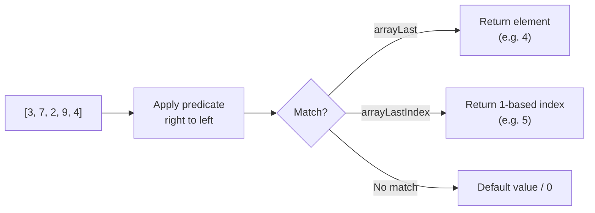

# How to Use arrayLast() and arrayLastIndex() in ClickHouse

Author: [nawazdhandala](https://www.github.com/nawazdhandala)

Tags: ClickHouse, Array Function, arrayLast, arrayLastIndex, Lambda, Higher-Order Function

Description: Learn how arrayLast() retrieves the last element satisfying a lambda and arrayLastIndex() returns its 1-based position, with practical SQL examples.

---

ClickHouse provides `arrayLast()` and `arrayLastIndex()` as counterparts to `arrayFirst()` and `arrayFirstIndex()`. Both accept a lambda predicate and scan the array from right to left, returning the last element (or its position) that satisfies the condition. When no element matches, `arrayLast()` returns the default value for the element type and `arrayLastIndex()` returns `0`.

## Function Signatures

```text
arrayLast(func, arr)        -- returns last element where func returns non-zero
arrayLastIndex(func, arr)   -- returns 1-based index of last matching element
```

The lambda `func` receives one argument (the current element) and must return a non-zero integer to indicate a match. Both functions are available from ClickHouse 21.9+.

## Data Flow



## Basic Usage

```sql
SELECT
    arrayLast(x -> x > 5, [3, 7, 2, 9, 4])      AS last_above_5,
    arrayLastIndex(x -> x > 5, [3, 7, 2, 9, 4])  AS last_above_5_idx,
    arrayLast(x -> x > 100, [3, 7, 2, 9, 4])     AS no_match_value,
    arrayLastIndex(x -> x > 100, [3, 7, 2, 9, 4]) AS no_match_idx;
```

```text
┌─last_above_5─┬─last_above_5_idx─┬─no_match_value─┬─no_match_idx─┐
│            9 │                4 │              0 │            0 │
└──────────────┴──────────────────┴────────────────┴──────────────┘
```

Note that `last_above_5` is `9` (the last element greater than 5, at index 4), not `4` (the last element of the array).

## Finding the Last Error in a Status Array

Given a column that stores a per-step status array, find the last step that failed.

```sql
SELECT
    job_id,
    step_statuses,
    arrayLastIndex(s -> s = 'error', step_statuses) AS last_error_step,
    arrayLast(s -> s = 'error', step_statuses)       AS last_error_status
FROM pipeline_runs
WHERE has(step_statuses, 'error');
```

## Locating the Most Recent Price Drop

For a product whose daily prices are stored as an array ordered oldest to newest, find the last day where the price was below a threshold.

```sql
SELECT
    product_id,
    daily_prices,
    arrayLastIndex(p -> p < 100.0, daily_prices) AS last_cheap_day_idx,
    arrayLast(p -> p < 100.0, daily_prices)       AS last_cheap_price
FROM product_price_history
WHERE length(daily_prices) > 0;
```

## Combining arrayLastIndex with arraySlice

Use `arrayLastIndex` to extract the suffix of an array starting from the last match.

```sql
SELECT
    session_id,
    events,
    arrayLastIndex(e -> e = 'checkout', events) AS last_checkout_idx,
    arraySlice(events, arrayLastIndex(e -> e = 'checkout', events)) AS events_after_last_checkout
FROM user_sessions
WHERE has(events, 'checkout');
```

## Null-Safe Pattern

When elements can be `NULL` and you want to find the last non-null value, use an explicit null check in the lambda.

```sql
SELECT
    sensor_id,
    readings,
    arrayLast(r -> r IS NOT NULL, readings)       AS last_valid_reading,
    arrayLastIndex(r -> r IS NOT NULL, readings)  AS last_valid_idx
FROM sensor_data;
```

## Difference Between arrayFirst and arrayLast

```sql
SELECT
    [1, 5, 2, 8, 3]          AS arr,
    arrayFirst(x -> x > 4, arr)       AS first_above_4,
    arrayFirstIndex(x -> x > 4, arr)  AS first_above_4_idx,
    arrayLast(x -> x > 4, arr)        AS last_above_4,
    arrayLastIndex(x -> x > 4, arr)   AS last_above_4_idx;
```

```text
┌─arr─────────────┬─first_above_4─┬─first_above_4_idx─┬─last_above_4─┬─last_above_4_idx─┐
│ [1,5,2,8,3]     │             5 │                 2 │            8 │                4 │
└─────────────────┴───────────────┴───────────────────┴──────────────┴──────────────────┘
```

## Performance Note

Both `arrayLast` and `arrayLastIndex` perform a linear scan from right to left. For very large arrays, consider whether a sorted structure or a different data model would be more efficient. For typical event arrays with tens to hundreds of elements, performance is excellent.

## Summary

`arrayLast()` and `arrayLastIndex()` are the right-to-left counterparts to `arrayFirst()` and `arrayFirstIndex()`. They are useful whenever you need to find the most recent element satisfying a condition in a time-ordered array column, such as the last error, the last price drop, or the last status transition. When no element matches, they return safe defaults (zero for the index, the type default for the element) rather than throwing errors.
