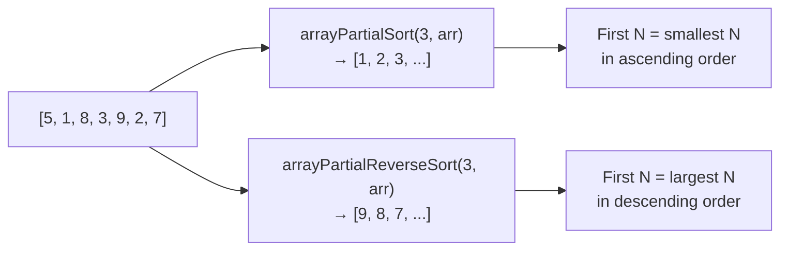

# How to Use arrayPartialReverseSort() in ClickHouse

Author: [nawazdhandala](https://www.github.com/nawazdhandala)

Tags: ClickHouse, Array Function, arrayPartialReverseSort, Sorting, Top-N, Performance

Description: Learn how arrayPartialReverseSort() efficiently extracts the largest N elements from a ClickHouse array without sorting the entire array.

---

`arrayPartialReverseSort()` is the descending counterpart to `arrayPartialSort()`. It guarantees that the first `N` elements of the result are the largest `N` values in descending order. Elements beyond position `N` are in an unspecified order. This is significantly more efficient than a full reverse sort when only the top-N largest values are needed.

## Function Signatures

```text
arrayPartialReverseSort(N, arr)              -- sort descending, guarantee first N elements
arrayPartialReverseSort(func, N, arr)        -- sort by func(element) descending
```

`N` must be a positive integer no greater than the array length. The optional lambda maps each element to a comparable sort key.

## Ascending vs Descending Partial Sort



## Basic Usage

```sql
SELECT
    arrayPartialReverseSort(3, [5, 1, 8, 3, 9, 2, 7]) AS top_3_desc,
    arrayReverseSort([5, 1, 8, 3, 9, 2, 7])           AS full_reverse_sort;
```

```text
┌─top_3_desc──────────────┬─full_reverse_sort───┐
│ [9,8,7,1,2,3,5]         │ [9,8,7,5,3,2,1]     │
└─────────────────────────┴─────────────────────┘
```

The first 3 elements are guaranteed to be the 3 largest in descending order.

## Extracting the Top-N Largest Values

Combine with `arraySlice` to retrieve only the sorted prefix.

```sql
SELECT
    product_id,
    daily_revenue,
    arraySlice(
        arrayPartialReverseSort(5, daily_revenue),
        1, 5
    ) AS top_5_revenue_days
FROM product_daily_stats
WHERE length(daily_revenue) >= 5;
```

## Finding the Highest-Scoring Sessions

```sql
SELECT
    user_id,
    session_scores,
    arraySlice(
        arrayPartialReverseSort(3, session_scores),
        1, 3
    )          AS top_3_scores,
    arraySlice(
        arrayPartialReverseSort(3, session_scores),
        1, 3
    )[1]       AS best_score
FROM user_sessions;
```

## Sorting by Derived Key with Lambda

Sort an array of strings descending by their length and take the top 3 longest.

```sql
SELECT
    tags,
    arraySlice(
        arrayPartialReverseSort(t -> length(t), 3, tags),
        1, 3
    ) AS three_longest_tags
FROM articles
WHERE length(tags) >= 3;
```

## Rank-Based Filtering on Array Columns

Find all rows where the top element of a score array exceeds a threshold.

```sql
SELECT
    experiment_id,
    scores,
    arrayPartialReverseSort(1, scores)[1] AS max_score
FROM experiments
WHERE arrayPartialReverseSort(1, scores)[1] > 95.0;
```

This is equivalent to `arrayMax(scores) > 95.0` but demonstrates the pattern for extracting ranked values.

## Combining with arraySum for Top-N Share

Compute what fraction of total value the top 3 elements account for.

```sql
SELECT
    user_id,
    transaction_amounts,
    arraySum(arraySlice(arrayPartialReverseSort(3, transaction_amounts), 1, 3))
        / arraySum(transaction_amounts) AS top3_share
FROM user_transactions
WHERE arraySum(transaction_amounts) > 0;
```

## Performance Notes

`arrayPartialReverseSort(N, arr)` has time complexity O(n log N) compared to O(n log n) for a full reverse sort. The benefit grows as `N` becomes much smaller than the array length. For typical analytics arrays with hundreds to thousands of elements and small `N` (such as 5 or 10), the speedup is substantial.

## Summary

`arrayPartialReverseSort()` efficiently extracts the top-N largest values from an array in descending order without performing a complete sort. Use it with `arraySlice()` to extract the sorted prefix and discard the unordered tail. It is the natural choice for leaderboard extraction, high-watermark analysis, and any query that only needs the largest N elements from an array column. Use `arrayPartialSort()` for the smallest N values instead.
