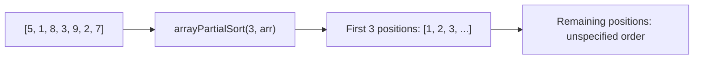

# How to Use arrayPartialSort() in ClickHouse

Author: [nawazdhandala](https://www.github.com/nawazdhandala)

Tags: ClickHouse, Array Function, arrayPartialSort, Sorting, Top-N, Performance

Description: Learn how arrayPartialSort() sorts only the first N elements of a ClickHouse array using a partial sort, making top-N extraction faster than a full array sort.

---

`arrayPartialSort()` performs a partial sort on an array, guaranteeing that the first `N` elements of the result are the smallest `N` values in sorted order. Elements beyond position `N` are in an unspecified order. This makes it significantly faster than `arraySort()` when you only need the top (or bottom) `N` values from a large array, because the full array does not need to be completely sorted.

## Function Signatures

```text
arrayPartialSort(N, arr)              -- sort ascending, guarantee first N elements are sorted
arrayPartialSort(func, N, arr)        -- sort by func(element) ascending
```

The `N` parameter must be a positive integer no greater than the array length. The optional lambda `func` maps each element to a comparable value that drives the sort order.

## How Partial Sort Works



A full sort would produce `[1, 2, 3, 5, 7, 8, 9]`. The partial sort only guarantees `[1, 2, 3, ...]`; the tail may be `[5, 7, 8, 9]`, `[9, 8, 7, 5]`, or any permutation.

## Basic Usage

```sql
SELECT
    arrayPartialSort(3, [5, 1, 8, 3, 9, 2, 7]) AS partial_sort_3,
    arraySort([5, 1, 8, 3, 9, 2, 7])           AS full_sort;
```

```text
┌─partial_sort_3──────────┬─full_sort───────────┐
│ [1,2,3,5,9,8,7]         │ [1,2,3,5,7,8,9]     │
└─────────────────────────┴─────────────────────┘
```

The first 3 elements are guaranteed to be the 3 smallest in ascending order; the rest are unordered.

## Extracting the Top-N Smallest Values

Use `arraySlice` to retrieve only the guaranteed sorted prefix.

```sql
SELECT
    product_id,
    daily_prices,
    arraySlice(arrayPartialSort(5, daily_prices), 1, 5) AS five_cheapest_days
FROM product_price_history
WHERE length(daily_prices) >= 5;
```

## Finding the Lowest Latency Samples

```sql
SELECT
    endpoint,
    latency_samples,
    arraySlice(arrayPartialSort(10, latency_samples), 1, 10) AS p10_latencies,
    arraySlice(arrayPartialSort(10, latency_samples), 1, 10)[10] AS p10_value
FROM endpoint_metrics
WHERE length(latency_samples) >= 10;
```

## Sorting by a Derived Key with Lambda

Sort an array of (value, timestamp) tuples by value to find the N smallest values.

```sql
SELECT
    arrayPartialSort(
        x -> x.1,          -- sort by the first element of each tuple
        3,
        [(15, 'c'), (3, 'a'), (9, 'b'), (1, 'd'), (20, 'e')]
    ) AS sorted_by_value;
```

## Sorting Strings by Length

```sql
SELECT
    tags,
    arraySlice(
        arrayPartialSort(t -> length(t), 3, tags),
        1, 3
    ) AS three_shortest_tags
FROM articles
WHERE length(tags) >= 3;
```

## Performance Comparison

For large arrays, partial sort avoids the overhead of sorting elements that will never be used.

```sql
-- Full sort: O(n log n)
SELECT arraySort(large_array) FROM t;

-- Partial sort: O(n log k) where k = N
-- More efficient when k << n
SELECT arraySlice(arrayPartialSort(10, large_array), 1, 10) FROM t;
```

## Edge Cases

```sql
SELECT
    -- N equal to array length: same as full sort
    arrayPartialSort(5, [3, 1, 4, 1, 5])  AS n_equals_length,
    -- N = 1: only the minimum is guaranteed at position 1
    arrayPartialSort(1, [3, 1, 4, 1, 5])  AS n_equals_1;
```

```text
┌─n_equals_length─┬─n_equals_1──────┐
│ [1,1,3,4,5]     │ [1,3,4,1,5]     │
└─────────────────┴─────────────────┘
```

## Summary

`arrayPartialSort()` is the efficient alternative to `arraySort()` when you only need the bottom `N` values from an array. It guarantees that the first `N` positions contain the smallest `N` elements in sorted order, while leaving the remainder in an arbitrary order. Combined with `arraySlice()` to extract the sorted prefix, it provides a fast and concise top-N extraction pattern for array columns. Use `arrayPartialReverseSort()` for the largest N values instead.
