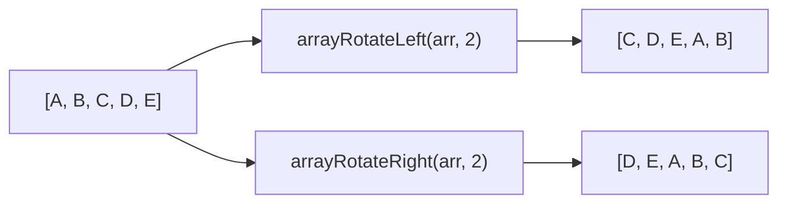

# How to Use arrayRotateLeft() and arrayRotateRight() in ClickHouse

Author: [nawazdhandala](https://www.github.com/nawazdhandala)

Tags: ClickHouse, Array, arrayRotateLeft, arrayRotateRight, Data Transformation, Circular Buffer

Description: Learn how arrayRotateLeft() and arrayRotateRight() cyclically shift array elements in ClickHouse, preserving length and enabling circular buffer operations.

---

`arrayRotateLeft()` and `arrayRotateRight()` perform a cyclic rotation of array elements. Unlike shift functions, no elements are discarded. Elements that fall off one end wrap around to the other end, preserving the array length. The second argument controls how many positions to rotate.

## Function Signatures

```text
arrayRotateLeft(arr, n)   -- rotate elements n positions to the left
arrayRotateRight(arr, n)  -- rotate elements n positions to the right
```

Both functions accept any array type and an integer `n`. Negative values reverse the direction: `arrayRotateLeft(arr, -n)` is equivalent to `arrayRotateRight(arr, n)`.

## Rotation Visualized



## Basic Usage

```sql
SELECT
    [1, 2, 3, 4, 5]                      AS arr,
    arrayRotateLeft([1, 2, 3, 4, 5], 2)  AS rotated_left_2,
    arrayRotateRight([1, 2, 3, 4, 5], 2) AS rotated_right_2,
    arrayRotateLeft([1, 2, 3, 4, 5], -1) AS rotated_left_neg1;
```

```text
┌─arr─────────┬─rotated_left_2─┬─rotated_right_2─┬─rotated_left_neg1─┐
│ [1,2,3,4,5] │ [3,4,5,1,2]    │ [4,5,1,2,3]     │ [5,1,2,3,4]       │
└─────────────┴────────────────┴─────────────────┴───────────────────┘
```

## Rotating by Array Length

Rotating by a multiple of the array length results in the original array.

```sql
SELECT
    [10, 20, 30]                         AS arr,
    arrayRotateLeft([10, 20, 30], 3)     AS full_rotation,
    arrayRotateLeft([10, 20, 30], 6)     AS double_rotation,
    arrayRotateRight([10, 20, 30], 3)    AS right_full_rotation;
```

```text
┌─arr──────────┬─full_rotation─┬─double_rotation─┬─right_full_rotation─┐
│ [10,20,30]   │ [10,20,30]    │ [10,20,30]      │ [10,20,30]          │
└──────────────┴───────────────┴─────────────────┴─────────────────────┘
```

## Circular Buffer Simulation

A circular buffer stores the last N values and replaces the oldest on each write. You can represent one step of a circular buffer update using `arrayRotateLeft` combined with `arrayResize` and direct element replacement.

```sql
-- Simulate a sliding window of the last 5 readings
-- by rotating out the oldest and inserting the newest at the end
SELECT
    arrayRotateLeft([10, 20, 30, 40, 50], 1) AS after_evict,
    arrayReplace(
        arrayRotateLeft([10, 20, 30, 40, 50], 1),
        5,
        99
    )                                         AS after_insert_99;
```

For true circular buffer maintenance in a column, use `arrayConcat` with `arraySlice` instead, but rotation is useful when working with fixed-size windows stored as arrays.

## Day-of-Week Reordering

Rotate a weekly summary array to start from a different day. If an array stores values Monday through Sunday (indices 1-7), rotating left by 1 reorders it to start from Tuesday.

```sql
SELECT
    ['Mon', 'Tue', 'Wed', 'Thu', 'Fri', 'Sat', 'Sun'] AS week,
    arrayRotateLeft(
        ['Mon', 'Tue', 'Wed', 'Thu', 'Fri', 'Sat', 'Sun'],
        toDayOfWeek(today()) - 1
    ) AS week_starting_today;
```

## Phase-Shifting Signal Data

When comparing two periodic signals stored as arrays, rotating one by a phase offset aligns them for element-wise comparison.

```sql
SELECT
    signal_a,
    signal_b,
    arrayRotateLeft(signal_b, phase_offset) AS signal_b_aligned,
    arrayMap(
        (a, b) -> a - b,
        signal_a,
        arrayRotateLeft(signal_b, phase_offset)
    ) AS difference
FROM signal_pairs;
```

## Large Rotations with Modulo

Rotating by more than the array length is valid; ClickHouse wraps automatically. You can also pre-apply modulo to document intent.

```sql
SELECT
    length(arr)                              AS arr_len,
    arrayRotateLeft(arr, 17 % length(arr))   AS explicit_modulo,
    arrayRotateLeft(arr, 17)                 AS implicit_wrap
FROM (SELECT [1, 2, 3, 4, 5] AS arr);
```

## Summary

`arrayRotateLeft()` and `arrayRotateRight()` cyclically shift array elements without discarding any values. They are the appropriate choice when you need to reorder a fixed-size array without losing information, such as reordering weekday arrays, aligning periodic signals, or simulating circular buffer eviction. For operations where elements should be discarded and filled with defaults, use `arrayShiftLeft()` and `arrayShiftRight()` instead.
