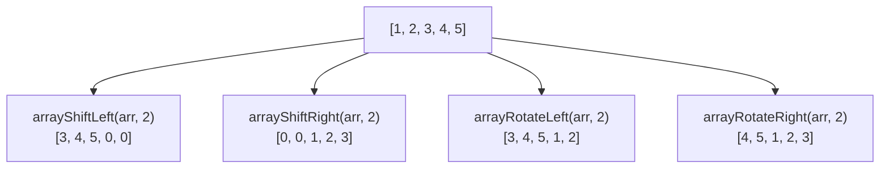

# How to Use arrayShiftLeft() and arrayShiftRight() in ClickHouse

Author: [nawazdhandala](https://www.github.com/nawazdhandala)

Tags: ClickHouse, Array, arrayShiftLeft, arrayShiftRight, Data Transformation, Sliding Window

Description: Learn how arrayShiftLeft() and arrayShiftRight() shift array elements and fill vacated positions with a default or custom value in ClickHouse.

---

`arrayShiftLeft()` and `arrayShiftRight()` move elements within an array by a given number of positions. Unlike rotation functions, elements that fall off the end are discarded and the vacated positions are filled with a default value (or a user-supplied fill value). The array length is always preserved.

## Function Signatures

```text
arrayShiftLeft(arr, n [, default])   -- shift elements left by n, fill right with default
arrayShiftRight(arr, n [, default])  -- shift elements right by n, fill left with default
```

`n` must be non-negative. If `n` is greater than or equal to the array length, all original elements are discarded and the result is an array of default values.

## Shift vs Rotate Comparison



## Basic Usage

```sql
SELECT
    [1, 2, 3, 4, 5]                                 AS arr,
    arrayShiftLeft([1, 2, 3, 4, 5], 2)              AS shift_left_2,
    arrayShiftRight([1, 2, 3, 4, 5], 2)             AS shift_right_2,
    arrayShiftLeft([1, 2, 3, 4, 5], 2, -1)          AS shift_left_fill_neg1,
    arrayShiftRight([1, 2, 3, 4, 5], 2, 99)         AS shift_right_fill_99;
```

```text
┌─arr─────────┬─shift_left_2─┬─shift_right_2─┬─shift_left_fill_neg1─┬─shift_right_fill_99─┐
│ [1,2,3,4,5] │ [3,4,5,0,0]  │ [0,0,1,2,3]   │ [3,4,5,-1,-1]        │ [99,99,1,2,3]        │
└─────────────┴──────────────┴───────────────┴──────────────────────┴─────────────────────┘
```

## Computing Lag and Lead Differences

Shifting an array by one position and subtracting gives element-wise lag differences, equivalent to `LAG()` in window functions but operating entirely on an array column.

```sql
SELECT
    sensor_id,
    readings,
    arrayShiftRight(readings, 1) AS lagged,
    arrayMap(
        (current, prev) -> current - prev,
        readings,
        arrayShiftRight(readings, 1)
    ) AS delta
FROM sensor_data;
```

The first element of `delta` will be `readings[1] - 0` (since the fill default is 0). Supply a custom fill to override.

## Padding Arrays to a Fixed Size

If you need all arrays to have the same length for comparison or export, shift with a fill value effectively left-pads or right-pads.

```sql
SELECT
    user_id,
    last_n_scores,
    arrayShiftRight(
        last_n_scores,
        10 - length(last_n_scores),
        toFloat64(NULL)
    ) AS padded_scores
FROM user_scores
WHERE length(last_n_scores) <= 10;
```

## Shifting Boolean Flags

For arrays of flags (e.g., 1/0 for daily active), shifting right by one creates a "yesterday's flag" array that can be zipped with today's.

```sql
SELECT
    user_id,
    daily_active,
    arrayShiftRight(daily_active, 1, 0) AS prev_day_active,
    arrayMap(
        (today, yesterday) -> today = 1 AND yesterday = 0,
        daily_active,
        arrayShiftRight(daily_active, 1, 0)
    ) AS reactivation_days
FROM daily_activity;
```

## Shifting Entire Array Out

When `n >= length(arr)`, all original values are replaced.

```sql
SELECT
    arrayShiftLeft([1, 2, 3], 5)      AS fully_shifted_left,
    arrayShiftRight([1, 2, 3], 5, -1) AS fully_shifted_right_filled;
```

```text
┌─fully_shifted_left─┬─fully_shifted_right_filled─┐
│ [0,0,0]            │ [-1,-1,-1]                  │
└────────────────────┴────────────────────────────┘
```

## Combining with arrayDifference

`arrayShiftRight` with shift 1 produces the same structure as `arrayDifference` but gives you more control over the fill value.

```sql
SELECT
    arr,
    arrayDifference(arr)                  AS arr_diff,
    arrayMap(
        (a, b) -> a - b,
        arr,
        arrayShiftRight(arr, 1, arr[1])   -- fill with first element so first diff is 0
    )                                      AS manual_diff
FROM (SELECT [10, 13, 11, 18, 15] AS arr);
```

## Summary

`arrayShiftLeft()` and `arrayShiftRight()` slide array elements in one direction by a fixed number of positions, discarding overflow and filling the vacated end with a configurable default value. They are ideal for computing lag or lead differences on array columns, padding arrays to a uniform length, and creating offset arrays for element-wise comparisons. Use `arrayRotateLeft()` and `arrayRotateRight()` instead when no elements should be discarded.
