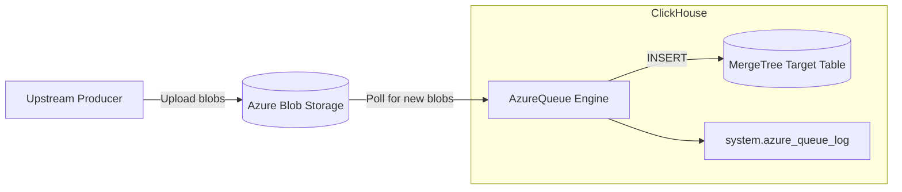

# How to Use ClickHouse Azure Queue Storage Engine

Author: [nawazdhandala](https://www.github.com/nawazdhandala)

Tags: ClickHouse, Azure, Streaming, Ingestion, Cloud

Description: Learn how to use the ClickHouse AzureQueue table engine to continuously ingest new files from Azure Blob Storage into ClickHouse as a streaming data pipeline.

---

## Introduction

The `AzureQueue` table engine is the Azure Blob Storage equivalent of the `S3Queue` engine. It monitors an Azure Blob Storage container for new files and automatically ingests them into a target ClickHouse table. ClickHouse tracks which files have already been processed, making it safe to run continuously without re-ingesting data.

This engine is ideal for organizations using Azure Data Lake Storage (ADLS Gen2), Azure Blob Storage, or any Azure-compatible object store as a landing zone for event data, logs, or batch exports.

## Architecture Overview



## Prerequisites

- ClickHouse 24.1+ (AzureQueue is generally available from this version)
- Azure Storage Account with a container
- A connection string or SAS token with read and list access
- ClickHouse server network access to `*.blob.core.windows.net`

## Azure Storage Connection Strings

You can authenticate using a connection string:

```text
DefaultEndpointsProtocol=https;AccountName=myaccount;AccountKey=base64key==;EndpointSuffix=core.windows.net
```

Or using a SAS URL:

```yaml
https://myaccount.blob.core.windows.net/mycontainer?sv=2022-11-02&ss=b&srt=o&sp=rl&se=2025-12-31T00:00:00Z&st=2024-01-01T00:00:00Z&spr=https&sig=...
```

## Creating the Target Table

```sql
CREATE TABLE events_target
(
    user_id    UInt64,
    event      String,
    properties String,
    ts         DateTime
)
ENGINE = MergeTree()
ORDER BY (user_id, ts);
```

## Creating the AzureQueue Table

```sql
CREATE TABLE events_azure_queue
(
    user_id    UInt64,
    event      String,
    properties String,
    ts         DateTime
)
ENGINE = AzureQueue(
    'DefaultEndpointsProtocol=https;AccountName=myaccount;AccountKey=base64key==;EndpointSuffix=core.windows.net',
    'mycontainer',
    'events/**.json',
    'JSONEachRow'
)
SETTINGS
    mode = 'unordered',
    azure_queue_polling_min_timeout_ms = 1000,
    azure_queue_polling_max_timeout_ms = 10000;
```

## Connecting with a Materialized View

Wire the queue to the target with a materialized view:

```sql
CREATE MATERIALIZED VIEW events_azure_mv TO events_target
AS SELECT * FROM events_azure_queue;
```

ClickHouse now polls the Azure container continuously and routes new blobs into `events_target`.

## Blob Path Patterns

| Pattern | Matches |
|---|---|
| `logs/*.csv` | All CSVs directly under `logs/` prefix |
| `events/**.json` | All JSONs under `events/` recursively |
| `dt=2024-01-*/**.parquet` | Date-partitioned Parquet |
| `**` | All blobs in the container |

## Supported Formats

The format parameter accepts any ClickHouse input format. Common choices:

```sql
-- CSV with header row
ENGINE = AzureQueue('conn_str', 'mycontainer', '**.csv', 'CSVWithNames')

-- JSONL (one JSON object per line)
ENGINE = AzureQueue('conn_str', 'mycontainer', '**.jsonl', 'JSONEachRow')

-- Parquet
ENGINE = AzureQueue('conn_str', 'mycontainer', '**.parquet', 'Parquet')

-- ORC
ENGINE = AzureQueue('conn_str', 'mycontainer', '**.orc', 'ORC')
```

## Engine Modes

| Mode | Behavior |
|---|---|
| `unordered` | Files processed in any order; recommended for most workloads |
| `ordered` | Files processed in lexicographic order by blob name; useful when names encode time |

## Key Settings Reference

| Setting | Default | Description |
|---|---|---|
| `mode` | `unordered` | Processing order |
| `azure_queue_polling_min_timeout_ms` | 1000 | Minimum poll interval in ms |
| `azure_queue_polling_max_timeout_ms` | 10000 | Maximum poll interval (exponential backoff) |
| `azure_queue_max_processed_files_before_commit` | 100 | Flush after N files |
| `azure_queue_buckets` | 1 | Parallel processing buckets for distributed clusters |

## Monitoring Ingestion

```sql
SELECT
    file_name,
    rows_processed,
    status,
    processing_start_time,
    processing_end_time,
    last_exception
FROM system.azure_queue_log
ORDER BY processing_start_time DESC
LIMIT 20;
```

Check for failed files:

```sql
SELECT file_name, last_exception
FROM system.azure_queue_log
WHERE status = 'Failed';
```

## Distributed AzureQueue

For clusters with multiple shards, distribute blob processing across nodes using `azure_queue_buckets`:

```sql
CREATE TABLE events_azure_queue ON CLUSTER my_cluster
(
    user_id    UInt64,
    event      String,
    properties String,
    ts         DateTime
)
ENGINE = AzureQueue(
    'DefaultEndpointsProtocol=https;AccountName=myaccount;AccountKey=base64key==;EndpointSuffix=core.windows.net',
    'mycontainer',
    'events/**.json',
    'JSONEachRow'
)
SETTINGS
    mode = 'unordered',
    azure_queue_buckets = 4;
```

## Using SAS Token Authentication

```sql
CREATE TABLE events_azure_queue (...)
ENGINE = AzureQueue(
    'https://myaccount.blob.core.windows.net/mycontainer?sv=2022-11-02&ss=b&srt=o&sp=rl&se=2025-12-31T00:00:00Z&spr=https&sig=yourSASsig',
    '',
    'events/**.json',
    'JSONEachRow'
);
```

When using a SAS URL, pass an empty string for the container name as it is already included in the URL.

## Comparison with AzureBlobStorage Table Function

| Feature | AzureQueue Engine | azureBlobStorage() Function |
|---|---|---|
| Continuous ingestion | Yes | No (one-shot) |
| Tracks processed blobs | Yes | No |
| Deduplication across runs | Yes | No |
| Suitable for | Streaming pipelines | Ad hoc queries / bulk loads |

## Summary

The `AzureQueue` engine provides event-driven ingestion from Azure Blob Storage into ClickHouse without requiring a separate ETL tool. Key takeaways:
- Create the target `MergeTree` table, then the `AzureQueue` table, then connect them with a materialized view.
- Use a connection string or SAS token for authentication.
- Use `mode = 'ordered'` only when blob names encode sequence or time order.
- Monitor `system.azure_queue_log` for per-blob ingestion status.
- For multi-node clusters, set `azure_queue_buckets` equal to the number of processing nodes.
