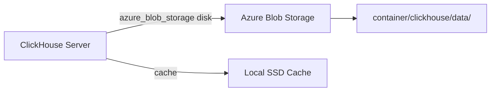

# How to Configure Azure Blob Storage as ClickHouse Backend

Author: [nawazdhandala](https://www.github.com/nawazdhandala)

Tags: ClickHouse, Azure, Blob Storage, Storage, Disk, Cloud

Description: Configure Azure Blob Storage as a ClickHouse storage backend using the azure_blob_storage disk type to store data parts in Azure at lower cost than local disks.

---

## Introduction

ClickHouse has a native `azure_blob_storage` disk type that connects directly to Azure Blob Storage without needing an S3 compatibility shim. Data parts are written to and read from Azure Blob containers, making it straightforward to build cost-efficient storage tiers in Azure-based deployments.

## Architecture



## Step 1: Create a Storage Account and Container

```bash
# Create resource group
az group create --name clickhouse-rg --location eastus

# Create storage account
az storage account create \
    --name myclickhousestorage \
    --resource-group clickhouse-rg \
    --location eastus \
    --sku Standard_LRS \
    --kind StorageV2

# Create container
az storage container create \
    --name clickhouse-data \
    --account-name myclickhousestorage

# Get connection string
az storage account show-connection-string \
    --name myclickhousestorage \
    --resource-group clickhouse-rg
```

## Step 2: Configure ClickHouse

Create `/etc/clickhouse-server/config.d/azure_storage.xml`:

```xml
<clickhouse>
  <storage_configuration>
    <disks>
      <azure_cold>
        <type>azure_blob_storage</type>
        <storage_account_url>https://myclickhousestorage.blob.core.windows.net</storage_account_url>
        <container_name>clickhouse-data</container_name>
        <account_name>myclickhousestorage</account_name>
        <account_key>BASE64ENCODEDACCOUNTKEY==</account_key>
        <metadata_path>/var/lib/clickhouse/disks/azure_cold/</metadata_path>
        <send_metadata>true</send_metadata>
        <max_single_part_upload_size>104857600</max_single_part_upload_size>
      </azure_cold>

      <azure_cache>
        <type>cache</type>
        <disk>azure_cold</disk>
        <path>/var/lib/clickhouse/azure_cache/</path>
        <max_size>50Gi</max_size>
        <cache_on_write_operations>true</cache_on_write_operations>
      </azure_cache>
    </disks>

    <policies>
      <azure_policy>
        <volumes>
          <main>
            <disk>azure_cache</disk>
          </main>
        </volumes>
      </azure_policy>
    </policies>
  </storage_configuration>
</clickhouse>
```

## Using Managed Identity (Preferred over Account Key)

```xml
<azure_cold>
  <type>azure_blob_storage</type>
  <storage_account_url>https://myclickhousestorage.blob.core.windows.net</storage_account_url>
  <container_name>clickhouse-data</container_name>
  <!-- Omit account_name and account_key to use managed identity -->
  <metadata_path>/var/lib/clickhouse/disks/azure_cold/</metadata_path>
</azure_cold>
```

Assign the `Storage Blob Data Contributor` role to the VM's managed identity on the storage account.

## Step 3: Reload Config

```sql
SYSTEM RELOAD CONFIG;
```

## Step 4: Create a Table on Azure

```sql
CREATE TABLE telemetry
(
    device_id  UInt64,
    metric     LowCardinality(String),
    value      Float64,
    ts         DateTime
)
ENGINE = MergeTree
PARTITION BY toYYYYMM(ts)
ORDER BY (ts, device_id)
SETTINGS storage_policy = 'azure_policy';
```

## Hot-Local + Cold-Azure Tiering

```xml
<policies>
  <hot_cold_azure>
    <volumes>
      <hot>
        <disk>default</disk>
        <max_data_part_size_bytes>5368709120</max_data_part_size_bytes>
      </hot>
      <cold>
        <disk>azure_cold</disk>
      </cold>
    </volumes>
    <move_factor>0.15</move_factor>
  </hot_cold_azure>
</policies>
```

```sql
ALTER TABLE telemetry
    MODIFY TTL ts + INTERVAL 90 DAY
    TO VOLUME 'cold';
```

## Verifying Storage

```sql
SELECT
    disk_name,
    count()               AS parts,
    formatReadableSize(sum(bytes_on_disk)) AS size
FROM system.parts
WHERE table = 'telemetry' AND active = 1
GROUP BY disk_name;
```

## Moving a Partition to Azure Manually

```sql
ALTER TABLE telemetry MOVE PARTITION '202401' TO DISK 'azure_cold';
```

## Checking Disk Status

```sql
SELECT name, type, free_space, total_space
FROM system.disks
WHERE name IN ('azure_cold', 'azure_cache');
```

## Summary

ClickHouse's native `azure_blob_storage` disk type connects directly to Azure Blob Storage without an S3 shim. Configure it with your storage account URL, container name, and credentials (account key or managed identity), optionally wrap with a local cache disk, then define a storage policy for your MergeTree tables. Use TTL rules or manual `ALTER TABLE MOVE PARTITION` commands to move cold data to Azure automatically.
