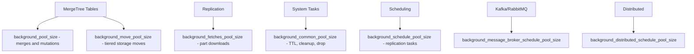

# How to Configure ClickHouse Background Pool Size

Author: [nawazdhandala](https://www.github.com/nawazdhandala)

Tags: ClickHouse, Configuration, Performance, MergeTree, BackgroundProcessing

Description: Learn how to configure background_pool_size, background_move_pool_size, and related settings to control ClickHouse merge and mutation concurrency.

---

ClickHouse performs a large number of background tasks: merging parts in MergeTree tables, moving data between storage volumes, applying mutations, fetching replicated parts, and running scheduled jobs. The background pool sizes control how many threads are allocated to each of these activities.

## Background Pool Settings

All background pool settings live in the server configuration:

```xml
<!-- /etc/clickhouse-server/config.d/background-pools.xml -->
<clickhouse>
    <!-- Threads for merges and mutations in MergeTree tables -->
    <background_pool_size>16</background_pool_size>

    <!-- Threads for moving parts between storage volumes -->
    <background_move_pool_size>8</background_move_pool_size>

    <!-- Threads for fetching replicated parts from replicas -->
    <background_fetches_pool_size>8</background_fetches_pool_size>

    <!-- Threads for common operations like TTL and cleanup -->
    <background_common_pool_size>8</background_common_pool_size>

    <!-- Threads for scheduled background tasks -->
    <background_schedule_pool_size>128</background_schedule_pool_size>

    <!-- Threads for message broker (Kafka, RabbitMQ) consumption -->
    <background_message_broker_schedule_pool_size>16</background_message_broker_schedule_pool_size>

    <!-- Threads for distributed table send operations -->
    <background_distributed_schedule_pool_size>16</background_distributed_schedule_pool_size>
</clickhouse>
```

## What Each Pool Does



## Defaults and Recommended Sizes

| Setting | Default | Recommended (high-load) |
|---|---|---|
| `background_pool_size` | 16 | 1-2x CPU core count |
| `background_move_pool_size` | 8 | 4-16 depending on volume count |
| `background_fetches_pool_size` | 8 | 4-16 for replication-heavy clusters |
| `background_common_pool_size` | 8 | 8-16 |
| `background_schedule_pool_size` | 128 | 128-256 for large clusters |
| `background_message_broker_schedule_pool_size` | 16 | 16-64 for high-throughput Kafka |
| `background_distributed_schedule_pool_size` | 16 | 16-32 |

## Per-Table Merge Settings

Some background pool parameters can be overridden per-table:

```sql
ALTER TABLE my_table
MODIFY SETTING
    number_of_free_entries_in_pool_to_execute_mutation = 20,
    number_of_free_entries_in_pool_to_lower_max_size_of_merge = 8;
```

## Monitoring Background Pool Utilization

Check how busy each pool is:

```sql
SELECT
    metric,
    value
FROM system.metrics
WHERE metric IN (
    'BackgroundPoolTask',
    'BackgroundMovePoolTask',
    'BackgroundFetchesPoolTask',
    'BackgroundCommonPoolTask',
    'BackgroundSchedulePoolTask'
);
```

Historical view from metric_log:

```sql
SELECT
    toStartOfMinute(event_time) AS minute,
    avg(value) AS avg_tasks
FROM system.metric_log
WHERE metric = 'BackgroundPoolTask'
GROUP BY minute
ORDER BY minute DESC
LIMIT 60;
```

## Signs That background_pool_size Is Too Low

Look for these symptoms in `system.query_log` and server logs:

- Parts not merging fast enough: `SELECT count() FROM system.parts WHERE active AND level < 5` returns a large number continuously.
- Merge lag increasing over time.
- Log messages: `Too many parts (N). Merges are processing slower than inserts`.

```sql
-- Check part counts per table
SELECT
    database,
    table,
    count() AS part_count,
    sum(rows) AS total_rows
FROM system.parts
WHERE active
GROUP BY database, table
HAVING part_count > 300
ORDER BY part_count DESC;
```

If you see tables consistently above 300 active parts, consider increasing `background_pool_size`.

## Interaction with max_threads

`background_pool_size` is distinct from `max_threads`. `max_threads` controls parallelism within a single merge or query operation. `background_pool_size` controls how many simultaneous merge operations can run.

A merge with 4 merge threads running in a pool of 8 means up to 32 total merge threads at peak.

## Summary

Set `background_pool_size` to 1-2x your CPU core count for write-heavy workloads. Monitor pool utilization with `system.metrics` and watch active part counts per table. If part counts are growing faster than merges consume them, increase the pool size. For tiered storage and replication-heavy deployments, also tune `background_move_pool_size` and `background_fetches_pool_size`.
