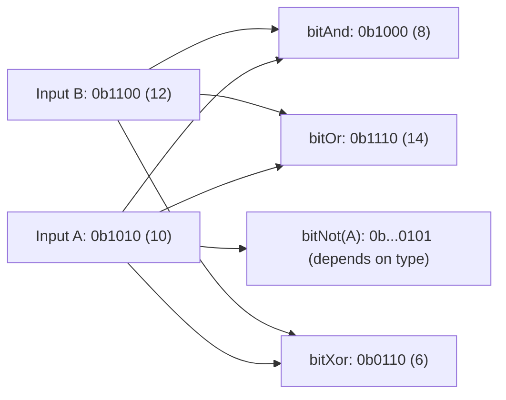

# How to Use bitAnd(), bitOr(), bitXor(), bitNot() in ClickHouse

Author: [nawazdhandala](https://www.github.com/nawazdhandala)

Tags: ClickHouse, SQL, Bitwise, Integer, Query Optimization

Description: Learn how bitAnd(), bitOr(), bitXor(), and bitNot() perform bitwise operations on integers in ClickHouse for permission flags, masking, and change detection.

---

Bitwise operations work directly on the binary representation of integers. ClickHouse provides four fundamental bitwise functions: `bitAnd()`, `bitOr()`, `bitXor()`, and `bitNot()`. These are commonly used for compact permission storage, bitmask filtering, feature flag management, and detecting which bits changed between two values.

## How Bitwise Operations Work

Each integer is represented internally as a sequence of bits. Bitwise functions apply a logical operation to each corresponding pair of bits from two operands (or to every bit of a single operand for `bitNot()`).



## Function Signatures

```text
bitAnd(a, b)  -> same type as a
bitOr(a, b)   -> same type as a
bitXor(a, b)  -> same type as a
bitNot(a)     -> same type as a
```

All four functions accept integer arguments (`UInt8`, `UInt16`, `UInt32`, `UInt64`, `Int8` ... `Int64`). Both operands for the binary functions must be of the same type.

## Basic Behavior

Verify each function on small literal values to see the bit-level results.

```sql
SELECT
    bitAnd(toUInt8(0b1010), toUInt8(0b1100)) AS bit_and,  -- 8
    bitOr(toUInt8(0b1010),  toUInt8(0b1100)) AS bit_or,   -- 14
    bitXor(toUInt8(0b1010), toUInt8(0b1100)) AS bit_xor,  -- 6
    bitNot(toUInt8(0b1010))                   AS bit_not;  -- 245 (UInt8 complement)
```

For `bitNot()` on a `UInt8` value of `10` (`0b00001010`), the result is `245` (`0b11110101`) because all 8 bits are flipped.

## Setting Up a Sample Table

Create a table that stores user permissions as a packed integer bitmask. Each bit position represents a distinct permission.

```sql
CREATE TABLE user_permissions
(
    user_id    UInt64,
    username   String,
    perms      UInt8   -- each bit = one permission
)
ENGINE = MergeTree
ORDER BY user_id;

-- Permission bit definitions:
-- Bit 0 (1):  read
-- Bit 1 (2):  write
-- Bit 2 (4):  delete
-- Bit 3 (8):  admin
-- Bit 4 (16): export

INSERT INTO user_permissions VALUES
(1, 'alice',   toUInt8(0b00010111)),  -- read+write+delete+export = 23
(2, 'bob',     toUInt8(0b00000011)),  -- read+write = 3
(3, 'carol',   toUInt8(0b00001001)),  -- read+admin = 9
(4, 'dave',    toUInt8(0b00011111)),  -- all five = 31
(5, 'eve',     toUInt8(0b00000001));  -- read only = 1
```

## bitAnd - Checking Specific Permission Bits

Use `bitAnd()` to test whether a specific permission bit is set. The result is non-zero when the bit is present.

```sql
SELECT
    username,
    perms,
    bitAnd(perms, toUInt8(4))  AS has_delete,  -- non-zero = has delete
    bitAnd(perms, toUInt8(8))  AS has_admin
FROM user_permissions;
```

Use this in a WHERE clause to filter for users who have a particular permission.

```sql
SELECT username
FROM user_permissions
WHERE bitAnd(perms, toUInt8(4)) != 0;  -- users with delete permission
```

## bitOr - Granting Additional Permissions

Use `bitOr()` to add a permission bit to an existing value without affecting other bits.

```sql
SELECT
    username,
    perms                          AS original_perms,
    bitOr(perms, toUInt8(8))      AS perms_with_admin
FROM user_permissions
WHERE bitAnd(perms, toUInt8(8)) = 0;  -- show only those who don't yet have admin
```

## bitXor - Detecting Which Bits Changed

`bitXor()` returns a `1` in every bit position where the two operands differ. This makes it useful for computing a change mask between an old and a new permissions value.

```sql
WITH
    toUInt8(0b00000011) AS old_perms,  -- read + write
    toUInt8(0b00010111) AS new_perms   -- read + write + delete + export
SELECT
    old_perms,
    new_perms,
    bitXor(old_perms, new_perms) AS changed_bits,  -- 20 = 0b00010100
    bitAnd(bitXor(old_perms, new_perms), new_perms) AS bits_added,
    bitAnd(bitXor(old_perms, new_perms), old_perms) AS bits_removed;
```

## bitNot - Inverting a Bitmask for Revocation

Use `bitNot()` with `bitAnd()` to revoke (clear) a specific permission bit.

```sql
SELECT
    username,
    perms                                          AS original_perms,
    bitAnd(perms, bitNot(toUInt8(4)))              AS perms_without_delete
FROM user_permissions;
```

`bitNot(4)` produces `0b11111011` (on a `UInt8`), and `bitAnd()` with that mask clears bit 2 while leaving all other bits intact.

## Combining Multiple Bitmask Checks

Check for multiple permissions simultaneously in a single expression. A user has all of read, write, and delete when `bitAnd(perms, mask) = mask`.

```sql
WITH toUInt8(7) AS required_mask  -- 0b00000111 = read+write+delete
SELECT
    username,
    perms,
    (bitAnd(perms, required_mask) = required_mask) AS has_all_three
FROM user_permissions;
```

## Aggregating with Bitwise Functions

Use `bitOr` across rows to compute the union of all permission bits held by any user, or `bitAnd` across rows to find permissions held by every user.

```sql
SELECT
    groupBitOr(perms)  AS any_user_permissions,
    groupBitAnd(perms) AS all_users_permissions
FROM user_permissions;
```

Note: `groupBitOr()` and `groupBitAnd()` are the aggregate-function equivalents of the scalar `bitOr()` and `bitAnd()`.

## Summary

`bitAnd()`, `bitOr()`, `bitXor()`, and `bitNot()` enable compact, efficient bitwise manipulation of integer columns in ClickHouse. Use `bitAnd()` to test or mask bits, `bitOr()` to set bits, `bitXor()` to detect differences between two integer states, and `bitNot()` (combined with `bitAnd()`) to clear specific bits. These functions are especially valuable for permission systems, feature flag storage, and change tracking where packing multiple boolean flags into a single integer column reduces storage and speeds up filtering.
