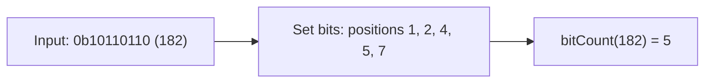

# How to Use bitCount() in ClickHouse to Count Set Bits

Author: [nawazdhandala](https://www.github.com/nawazdhandala)

Tags: ClickHouse, SQL, Bitwise, Integer, Analytics

Description: Learn how bitCount() counts the number of set bits (popcount) in an integer in ClickHouse, with examples for permission analysis and Hamming distance.

---

`bitCount()` returns the number of bits set to `1` in the binary representation of an integer. This operation is also called the population count or "popcount." It is useful for measuring the density of set flags in a bitmask, computing Hamming distances between two integers, summarizing how many permissions a user holds, and implementing fast approximate similarity checks.

## How bitCount() Works



The function counts `1` bits without caring about their position, so `bitCount(0b1111) = 4` and `bitCount(0b1001) = 2` even though the second has the same number of bits in the type but only two set.

## Function Signature

```text
bitCount(a) -> UInt8
```

- `a` can be any integer type: `UInt8`, `UInt16`, `UInt32`, `UInt64`, `Int8`, `Int16`, `Int32`, `Int64`.
- The return type is always `UInt8` since the maximum possible value is 64 (for a 64-bit integer).
- For signed types, `bitCount()` counts bits in the two's complement representation, so negative numbers typically have many bits set.

## Basic Examples

```sql
SELECT
    bitCount(toUInt8(0))    AS count_0,    -- 0
    bitCount(toUInt8(1))    AS count_1,    -- 1  (0b00000001)
    bitCount(toUInt8(255))  AS count_255,  -- 8  (0b11111111)
    bitCount(toUInt8(170))  AS count_170,  -- 4  (0b10101010)
    bitCount(toUInt32(0xDEADBEEF)) AS count_deadbeef;  -- 24
```

## Setting Up a Sample Table

Create a table with a packed permission bitmask for each user. The same pattern applies to feature flags, event type bitmasks, or any set of boolean attributes packed into a single integer.

```sql
CREATE TABLE user_roles
(
    user_id   UInt64,
    username  String,
    perms     UInt16
)
ENGINE = MergeTree
ORDER BY user_id;

-- Each bit represents one permission:
-- 0=read, 1=write, 2=delete, 3=admin, 4=export, 5=import, 6=audit, 7=superuser

INSERT INTO user_roles VALUES
(1, 'alice',   toUInt16(0b00010111)),  -- 5 permissions
(2, 'bob',     toUInt16(0b00000011)),  -- 2 permissions
(3, 'carol',   toUInt16(0b11111111)),  -- 8 permissions (all bits in low byte)
(4, 'dave',    toUInt16(0b00001001)),  -- 2 permissions
(5, 'eve',     toUInt16(0b00000001)),  -- 1 permission
(6, 'frank',   toUInt16(0b01010101)); -- 4 permissions
```

## Counting How Many Permissions Each User Has

Call `bitCount()` directly on the bitmask column to get the number of permissions per user.

```sql
SELECT
    username,
    perms,
    bitCount(perms) AS permission_count
FROM user_roles
ORDER BY permission_count DESC;
```

## Filtering Users by Permission Count

Use `bitCount()` in a WHERE clause to find users with more or fewer permissions than a threshold.

```sql
-- Users with 4 or more permissions (power users)
SELECT username, perms, bitCount(perms) AS permission_count
FROM user_roles
WHERE bitCount(perms) >= 4;

-- Users with exactly 1 permission (minimal access)
SELECT username
FROM user_roles
WHERE bitCount(perms) = 1;
```

## Aggregating Bit Counts

Summarize the permission distribution across all users with standard aggregate functions applied to `bitCount()` results.

```sql
SELECT
    min(bitCount(perms))    AS min_permissions,
    max(bitCount(perms))    AS max_permissions,
    round(avg(bitCount(perms)), 2) AS avg_permissions,
    sum(bitCount(perms))    AS total_permission_grants
FROM user_roles;
```

## Histogram of Permission Counts

Group by the number of set bits to see how users are distributed by permission density.

```sql
SELECT
    bitCount(perms) AS permission_count,
    count()         AS user_count
FROM user_roles
GROUP BY permission_count
ORDER BY permission_count;
```

## Computing Hamming Distance

The Hamming distance between two integers is the number of bit positions where they differ. Use `bitCount(bitXor(a, b))` to compute it. This is a building block for approximate matching, similarity scoring, and locality-sensitive hashing.

```sql
WITH
    toUInt16(0b10110110) AS perms_a,
    toUInt16(0b11010110) AS perms_b
SELECT
    perms_a,
    perms_b,
    bitXor(perms_a, perms_b)        AS differing_bits_mask,
    bitCount(bitXor(perms_a, perms_b)) AS hamming_distance;
```

## Finding Users with Permissions Similar to a Reference

Combine `bitCount(bitXor(...))` with a threshold to find users whose permission set differs from a reference by at most N bits.

```sql
WITH toUInt16(0b00010111) AS reference_perms
SELECT
    username,
    perms,
    bitCount(bitXor(perms, reference_perms)) AS bit_distance
FROM user_roles
WHERE bitCount(bitXor(perms, reference_perms)) <= 2
ORDER BY bit_distance;
```

## Scoring Feature Flag Coverage

If each bit of a `UInt64` column records whether a user engaged with a particular feature, `bitCount()` gives a single "engagement breadth" score per user.

```sql
CREATE TABLE user_feature_engagement
(
    user_id      UInt64,
    feature_mask UInt64   -- each bit = one feature ever clicked
)
ENGINE = MergeTree
ORDER BY user_id;

INSERT INTO user_feature_engagement VALUES
(101, toUInt64(0b1111000011001100)),
(102, toUInt64(0b0000111100110011)),
(103, toUInt64(0b1010101010101010)),
(104, toUInt64(0b1111111111111111));

SELECT
    user_id,
    bitCount(feature_mask) AS features_used
FROM user_feature_engagement
ORDER BY features_used DESC;
```

## Summary

`bitCount()` computes the population count - the number of set bits - in any integer column in ClickHouse. It is the natural tool for measuring how many flags are set in a bitmask, summarizing boolean attribute density, and computing Hamming distances between integer representations. Combine it with `bitXor()` for similarity scoring, use it in WHERE clauses for permission-tier filtering, and apply standard aggregate functions to it for distribution analysis. The function operates on all integer types and always returns a `UInt8`.
