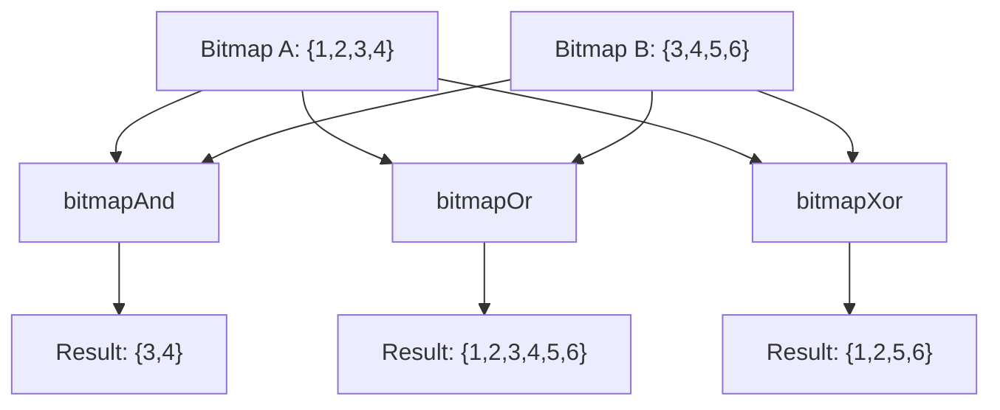

# How to Use bitmapAnd(), bitmapOr(), bitmapXor() in ClickHouse

Author: [nawazdhandala](https://www.github.com/nawazdhandala)

Tags: ClickHouse, SQL, Bitmap, Function, Set Operations, bitmapAnd, bitmapOr, bitmapXor

Description: Learn how to perform intersection, union, and symmetric difference operations on ClickHouse bitmaps using bitmapAnd(), bitmapOr(), and bitmapXor().

---

ClickHouse's `Bitmap` type is a roaring bitmap that efficiently stores sets of unsigned integers. Bitmap set operations - AND (intersection), OR (union), and XOR (symmetric difference) - are extremely fast and enable powerful cohort analysis, audience segmentation, and feature flag checks without expensive JOINs.

## How Bitmap Set Operations Work

- `bitmapAnd(bitmap1, bitmap2)` - returns a new bitmap containing only integers present in BOTH bitmaps (intersection).
- `bitmapOr(bitmap1, bitmap2)` - returns a new bitmap containing integers present in EITHER bitmap (union).
- `bitmapXor(bitmap1, bitmap2)` - returns a new bitmap containing integers present in ONE but NOT BOTH bitmaps (symmetric difference).

All three functions return a `Bitmap` type, which you can pass to `bitmapCardinality()` to count results or `bitmapToArray()` to retrieve individual IDs.

## Syntax

```sql
bitmapAnd(bitmap1, bitmap2)
bitmapOr(bitmap1, bitmap2)
bitmapXor(bitmap1, bitmap2)
```

## Set Operation Venn Diagrams



## Examples

### Building Bitmaps

First, build bitmaps from arrays using `bitmapBuild()`:

```sql
SELECT
    bitmapBuild([1, 2, 3, 4]) AS bitmap_a,
    bitmapBuild([3, 4, 5, 6]) AS bitmap_b;
```

### AND - Intersection

Find users who are in BOTH segment A and segment B:

```sql
SELECT bitmapToArray(bitmapAnd(
    bitmapBuild([1, 2, 3, 4]),
    bitmapBuild([3, 4, 5, 6])
)) AS in_both;
```

```text
in_both
[3, 4]
```

### OR - Union

Find all users who are in EITHER segment:

```sql
SELECT bitmapToArray(bitmapOr(
    bitmapBuild([1, 2, 3, 4]),
    bitmapBuild([3, 4, 5, 6])
)) AS in_either;
```

```text
in_either
[1, 2, 3, 4, 5, 6]
```

### XOR - Symmetric Difference

Find users in one segment but not the other:

```sql
SELECT bitmapToArray(bitmapXor(
    bitmapBuild([1, 2, 3, 4]),
    bitmapBuild([3, 4, 5, 6])
)) AS exclusive;
```

```text
exclusive
[1, 2, 5, 6]
```

### Counting Instead of Listing

Use `bitmapCardinality()` to count results without materializing the array:

```sql
SELECT
    bitmapCardinality(bitmapAnd(
        bitmapBuild([1, 2, 3, 4]),
        bitmapBuild([3, 4, 5, 6])
    )) AS intersection_size,
    bitmapCardinality(bitmapOr(
        bitmapBuild([1, 2, 3, 4]),
        bitmapBuild([3, 4, 5, 6])
    )) AS union_size;
```

```text
intersection_size  union_size
2                  6
```

### Complete Working Example

Audience segmentation for a marketing campaign:

```sql
CREATE TABLE user_segments
(
    segment_name String,
    user_bitmap  AggregateFunction(groupBitmap, UInt32)
) ENGINE = AggregatingMergeTree()
ORDER BY segment_name;

INSERT INTO user_segments
SELECT 'active_users',   groupBitmapState(user_id)
FROM (SELECT number + 1 AS user_id FROM numbers(100));

INSERT INTO user_segments
SELECT 'premium_users', groupBitmapState(user_id)
FROM (SELECT (number * 3 + 1) AS user_id FROM numbers(34) WHERE user_id <= 100);

SELECT
    bitmapCardinality(
        bitmapAnd(a.user_bitmap, p.user_bitmap)
    ) AS active_and_premium,
    bitmapCardinality(
        bitmapOr(a.user_bitmap, p.user_bitmap)
    ) AS active_or_premium,
    bitmapCardinality(
        bitmapXor(a.user_bitmap, p.user_bitmap)
    ) AS active_xor_premium
FROM
    (SELECT groupBitmapMergeState(user_bitmap) AS user_bitmap FROM user_segments WHERE segment_name = 'active_users') a,
    (SELECT groupBitmapMergeState(user_bitmap) AS user_bitmap FROM user_segments WHERE segment_name = 'premium_users') p;
```

## Summary

`bitmapAnd()`, `bitmapOr()`, and `bitmapXor()` perform set intersection, union, and symmetric difference on ClickHouse roaring bitmaps respectively. These operations are highly efficient for large user ID sets and enable cohort analysis and audience segmentation without JOIN operations. Pair them with `bitmapCardinality()` for counting results and `bitmapToArray()` for retrieving individual IDs from the resulting bitmap.
