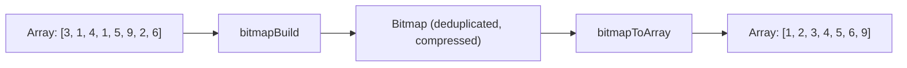

# How to Use bitmapBuild() and bitmapToArray() in ClickHouse

Author: [nawazdhandala](https://www.github.com/nawazdhandala)

Tags: ClickHouse, SQL, Bitmap, Function, bitmapBuild, bitmapToArray

Description: Learn how to create ClickHouse bitmaps from arrays using bitmapBuild() and convert them back to arrays using bitmapToArray() for set-based analytics.

---

`bitmapBuild()` and `bitmapToArray()` are the foundational functions for constructing and reading ClickHouse bitmaps. `bitmapBuild()` creates a bitmap from an array of unsigned integers, and `bitmapToArray()` converts a bitmap back to a sorted array. These are your entry and exit points for the bitmap ecosystem.

## How These Functions Work

- `bitmapBuild(array)` - takes an `Array(UInt*)` and returns a `Bitmap` containing the same integers in compressed roaring bitmap format. Duplicate values are automatically deduplicated.
- `bitmapToArray(bitmap)` - takes a `Bitmap` and returns a sorted `Array(UInt64)` containing all elements. Use this to inspect bitmap contents or join back to a user table.

## Syntax

```sql
bitmapBuild(array_of_uint)
bitmapToArray(bitmap)
```

## Data Flow



## Examples

### Building a Bitmap from an Array

```sql
SELECT bitmapBuild([5, 1, 3, 2, 4]) AS my_bitmap;
```

The internal representation is not directly readable, but you can inspect it via `bitmapToArray()`.

### Converting Bitmap Back to Array

```sql
SELECT bitmapToArray(bitmapBuild([5, 1, 3, 2, 4])) AS sorted_array;
```

```text
sorted_array
[1, 2, 3, 4, 5]
```

### Automatic Deduplication

`bitmapBuild()` deduplicates values automatically:

```sql
SELECT bitmapToArray(bitmapBuild([1, 2, 2, 3, 3, 3, 4])) AS deduped;
```

```text
deduped
[1, 2, 3, 4]
```

### Comparing Array and Bitmap for Unique Counts

```sql
SELECT
    length([1, 2, 2, 3, 3, 3])                     AS array_length,
    bitmapCardinality(bitmapBuild([1, 2, 2, 3, 3, 3])) AS unique_count;
```

```text
array_length  unique_count
6             3
```

### Reconstructing User Lists After Set Operations

Build bitmaps for two audiences and retrieve the intersection as a user list:

```sql
WITH
    bitmapBuild([100, 101, 102, 103, 104]) AS newsletter_subscribers,
    bitmapBuild([102, 103, 104, 105, 106]) AS recent_purchasers
SELECT
    bitmapToArray(bitmapAnd(newsletter_subscribers, recent_purchasers)) AS target_users;
```

```text
target_users
[102, 103, 104]
```

### Complete Working Example

Build per-page reader bitmaps and find users who read multiple pages:

```sql
CREATE TABLE page_reads
(
    page_id UInt32,
    user_id UInt32
) ENGINE = MergeTree()
ORDER BY (page_id, user_id);

INSERT INTO page_reads VALUES
    (1, 101), (1, 102), (1, 103), (1, 104),
    (2, 102), (2, 103), (2, 105),
    (3, 101), (3, 103), (3, 104), (3, 106);

-- Build a bitmap per page
WITH page_bitmaps AS (
    SELECT
        page_id,
        bitmapBuild(groupArray(user_id)) AS readers
    FROM page_reads
    GROUP BY page_id
)
SELECT
    page_id,
    bitmapCardinality(readers) AS reader_count,
    bitmapToArray(readers)     AS reader_ids
FROM page_bitmaps
ORDER BY page_id;
```

```text
page_id  reader_count  reader_ids
1        4             [101, 102, 103, 104]
2        3             [102, 103, 105]
3        4             [101, 103, 104, 106]
```

### Finding Users Who Read All Three Pages

```sql
WITH page_bitmaps AS (
    SELECT page_id, bitmapBuild(groupArray(user_id)) AS readers
    FROM page_reads
    GROUP BY page_id
),
all_pages AS (
    SELECT groupBitmapAnd(readers) AS read_all FROM page_bitmaps
)
SELECT bitmapToArray(read_all) AS users_read_all_pages
FROM all_pages;
```

```text
users_read_all_pages
[103]
```

## Summary

`bitmapBuild()` converts an array of unsigned integers into a compressed roaring bitmap, deduplicating values automatically. `bitmapToArray()` converts a bitmap back to a sorted array for inspection, output, or further processing. These two functions are the primary I/O mechanisms for the ClickHouse bitmap ecosystem - use `bitmapBuild()` to construct bitmaps from query results, perform set operations with `bitmapAnd/Or/Xor()`, and use `bitmapToArray()` when you need to retrieve the individual element IDs from the result.
