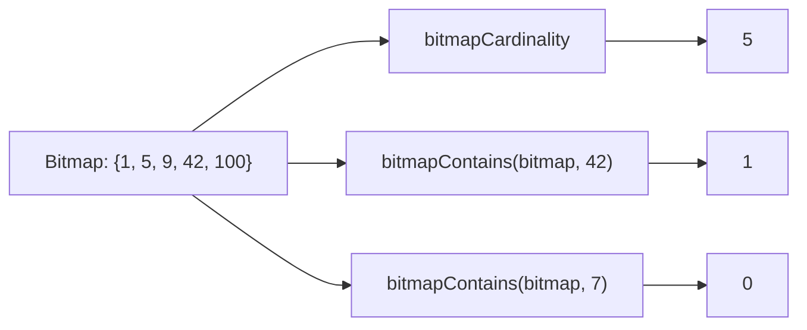

# How to Use bitmapCardinality() and bitmapContains() in ClickHouse

Author: [nawazdhandala](https://www.github.com/nawazdhandala)

Tags: ClickHouse, SQL, Bitmap, Function, bitmapCardinality, bitmapContains

Description: Learn how to count the elements in a ClickHouse bitmap using bitmapCardinality() and test membership using bitmapContains().

---

After building or aggregating bitmaps in ClickHouse, two of the most common operations are counting how many elements the bitmap contains and checking whether a specific element is in the bitmap. `bitmapCardinality()` and `bitmapContains()` handle these tasks efficiently without materializing the full element list.

## How These Functions Work

- `bitmapCardinality(bitmap)` - returns the count of unique unsigned integers stored in the bitmap as a `UInt64`. This is equivalent to `COUNT(DISTINCT user_id)` but operates directly on the compressed bitmap structure.
- `bitmapContains(bitmap, value)` - returns `1` if the specified unsigned integer is present in the bitmap, `0` otherwise.

## Syntax

```sql
bitmapCardinality(bitmap)
bitmapContains(bitmap, uint_value)
```

## Operation Overview



## Examples

### Counting Bitmap Elements

```sql
SELECT bitmapCardinality(bitmapBuild([1, 2, 3, 4, 5, 100, 200, 300])) AS element_count;
```

```text
element_count
8
```

### Checking Membership

```sql
SELECT
    bitmapContains(bitmapBuild([10, 20, 30, 40]), 20) AS has_20,
    bitmapContains(bitmapBuild([10, 20, 30, 40]), 25) AS has_25;
```

```text
has_20  has_25
1       0
```

### Counting After Set Operations

Combine cardinality with set operations for segment sizing:

```sql
SELECT
    bitmapCardinality(bitmapBuild([1,2,3,4,5]))     AS set_a_size,
    bitmapCardinality(bitmapBuild([4,5,6,7,8]))     AS set_b_size,
    bitmapCardinality(bitmapAnd(
        bitmapBuild([1,2,3,4,5]),
        bitmapBuild([4,5,6,7,8])
    ))                                               AS intersection_size,
    bitmapCardinality(bitmapOr(
        bitmapBuild([1,2,3,4,5]),
        bitmapBuild([4,5,6,7,8])
    ))                                               AS union_size;
```

```text
set_a_size  set_b_size  intersection_size  union_size
5           5           2                  8
```

### Using bitmapContains in WHERE Clauses

Check if a user ID is in an allowlist bitmap:

```sql
WITH bitmapBuild([1001, 1002, 1005, 1009, 1012]) AS allowlist
SELECT
    user_id,
    bitmapContains(allowlist, user_id) AS is_allowed
FROM (
    SELECT number + 1000 AS user_id FROM numbers(15)
)
WHERE bitmapContains(allowlist, user_id) = 1;
```

```text
user_id  is_allowed
1001     1
1002     1
1005     1
1009     1
1012     1
```

### Complete Working Example

Track daily active users with bitmaps and compute engagement metrics:

```sql
CREATE TABLE daily_active_users
(
    date        Date,
    user_bitmap AggregateFunction(groupBitmap, UInt32)
) ENGINE = AggregatingMergeTree()
ORDER BY date;

INSERT INTO daily_active_users
SELECT
    toDate('2026-03-29') AS date,
    groupBitmapState(user_id)
FROM (SELECT number + 1 AS user_id FROM numbers(1000));

INSERT INTO daily_active_users
SELECT
    toDate('2026-03-30') AS date,
    groupBitmapState(user_id)
FROM (SELECT number + 500 AS user_id FROM numbers(1000));

INSERT INTO daily_active_users
SELECT
    toDate('2026-03-31') AS date,
    groupBitmapState(user_id)
FROM (SELECT number + 800 AS user_id FROM numbers(800));

SELECT
    date,
    bitmapCardinality(groupBitmapMergeState(user_bitmap)) AS dau
FROM daily_active_users
GROUP BY date
ORDER BY date;
```

```text
date        dau
2026-03-29  1000
2026-03-30  1000
2026-03-31  800
```

## Summary

`bitmapCardinality()` returns the count of elements in a ClickHouse bitmap - a fast alternative to `COUNT(DISTINCT ...)` when working with pre-aggregated bitmap columns. `bitmapContains()` tests whether a specific unsigned integer is present in the bitmap, enabling efficient membership checks without converting the bitmap to an array. Together, these two functions cover the most common read operations on ClickHouse bitmap data.
