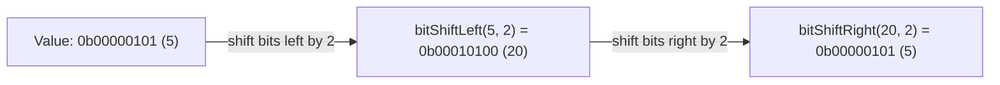

# How to Use bitShiftLeft() and bitShiftRight() in ClickHouse

Author: [nawazdhandala](https://www.github.com/nawazdhandala)

Tags: ClickHouse, SQL, Bitwise, Integer, Performance

Description: Learn how bitShiftLeft() and bitShiftRight() shift integer bits in ClickHouse for fast multiplication, division, and bit-field extraction.

---

Bit shift operations move all bits in an integer a specified number of positions to the left or right. ClickHouse provides `bitShiftLeft()` and `bitShiftRight()` for these operations. Shifting left multiplies a value by a power of two; shifting right divides it. Beyond arithmetic shortcuts, bit shifts are essential for encoding and decoding packed bit-fields, extracting sub-values from composite integers, and implementing high-performance hashing or encoding logic in SQL.

## How Bit Shifts Work



Shifting left by `n` is equivalent to multiplying by `2^n`. Shifting right by `n` is equivalent to integer-dividing by `2^n`.

## Function Signatures

```text
bitShiftLeft(a, b)  -> same type as a
bitShiftRight(a, b) -> same type as a
```

- `a` is any integer type (`UInt8` through `UInt64`, `Int8` through `Int64`).
- `b` is the number of positions to shift, typically a `UInt8` or small integer constant.
- Shifting by an amount greater than or equal to the bit width of `a` produces zero for unsigned types and is undefined behavior for signed types - always keep shift amounts within the valid range.

## Basic Examples

```sql
SELECT
    bitShiftLeft(toUInt32(1),   4)  AS one_shl_4,   -- 16  (1 * 2^4)
    bitShiftLeft(toUInt32(3),   3)  AS three_shl_3, -- 24  (3 * 2^3)
    bitShiftRight(toUInt32(128), 3) AS shr_3,        -- 16  (128 / 2^3)
    bitShiftRight(toUInt32(7),   1) AS shr_1;        -- 3   (7 / 2, truncated)
```

## Setting Up a Sample Table

Create a table that stores encoded sensor readings. Two 16-bit values - temperature and humidity - are packed into a single `UInt32` column to reduce storage footprint.

```sql
CREATE TABLE sensor_readings
(
    sensor_id   UInt32,
    recorded_at DateTime,
    packed_data UInt32   -- high 16 bits = temperature (x10), low 16 bits = humidity (x10)
)
ENGINE = MergeTree
ORDER BY (sensor_id, recorded_at);

-- Pack temperature=215 (21.5 C) and humidity=650 (65.0%) into one UInt32
-- packed = (temperature << 16) | humidity
INSERT INTO sensor_readings VALUES
(1, '2024-03-01 08:00:00', bitOr(bitShiftLeft(toUInt32(215), 16), toUInt32(650))),
(1, '2024-03-01 09:00:00', bitOr(bitShiftLeft(toUInt32(220), 16), toUInt32(680))),
(2, '2024-03-01 08:00:00', bitOr(bitShiftLeft(toUInt32(195), 16), toUInt32(720))),
(2, '2024-03-01 09:00:00', bitOr(bitShiftLeft(toUInt32(200), 16), toUInt32(700)));
```

## Extracting Packed Fields with bitShiftRight and bitAnd

Shift right to bring the high field down to the low bits, then mask with `bitAnd()` to isolate the value.

```sql
SELECT
    sensor_id,
    recorded_at,
    packed_data,
    bitShiftRight(packed_data, 16)                  AS raw_temp,      -- high 16 bits
    bitAnd(packed_data, toUInt32(0xFFFF))            AS raw_humidity,  -- low 16 bits
    bitShiftRight(packed_data, 16)       / 10.0      AS temperature_c,
    bitAnd(packed_data, toUInt32(0xFFFF)) / 10.0     AS humidity_pct
FROM sensor_readings
ORDER BY sensor_id, recorded_at;
```

## Fast Power-of-Two Multiplication

Use `bitShiftLeft()` as a zero-overhead multiply when the multiplier is a power of two. This is particularly readable when computing byte offsets or block sizes.

```sql
SELECT
    number,
    bitShiftLeft(toUInt64(number), 10) AS bytes_in_n_kilobytes
FROM numbers(8);
```

## Generating Bit Masks

Combine `bitShiftLeft()` with literal `1` to create a mask for any bit position. This pattern is cleaner than writing powers of two explicitly.

```sql
SELECT
    pos,
    bitShiftLeft(toUInt32(1), pos) AS bit_mask
FROM (
    SELECT arrayJoin([0, 1, 2, 3, 4, 5, 6, 7]) AS pos
);
```

## Extracting a Range of Bits (Bit-Field Slicing)

To extract bits `[lo, lo+width)` from an integer: shift right by `lo`, then mask off `width` bits.

```sql
WITH
    toUInt32(0b110110101010) AS value,
    4                        AS lo,     -- start at bit 4
    3                        AS width   -- extract 3 bits
SELECT
    value,
    bitAnd(bitShiftRight(value, lo), toUInt32(bitShiftLeft(toUInt32(1), width) - 1)) AS extracted_bits;
-- result: bits [4..6] = 0b101 = 5
```

## Checking Even or Odd with bitShiftRight

The lowest bit of any integer determines whether it is odd. `bitShiftRight(x, 1)` discards that bit; comparing back shows whether the original was odd.

```sql
SELECT
    number,
    if(bitAnd(toUInt64(number), 1) = 0, 'even', 'odd') AS parity
FROM numbers(10);
```

## Summary

`bitShiftLeft()` and `bitShiftRight()` are efficient building blocks for bit-field encoding, fast power-of-two arithmetic, and mask generation in ClickHouse. Use `bitShiftLeft()` to pack values into high-order bit positions or multiply by powers of two, and `bitShiftRight()` to unpack values from high-order positions or perform integer division by powers of two. Combined with `bitAnd()`, these functions enable compact multi-value storage in a single integer column, reducing storage and enabling fast filter operations without schema changes.
