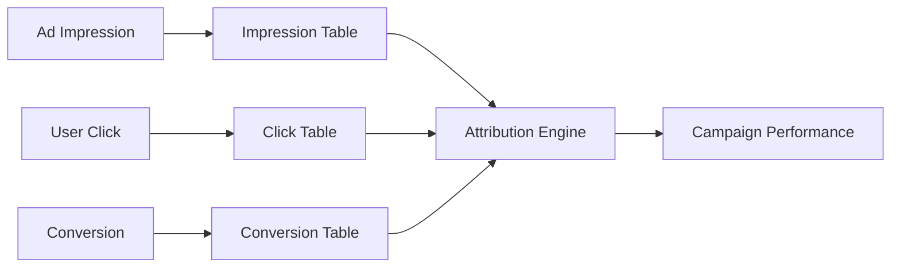
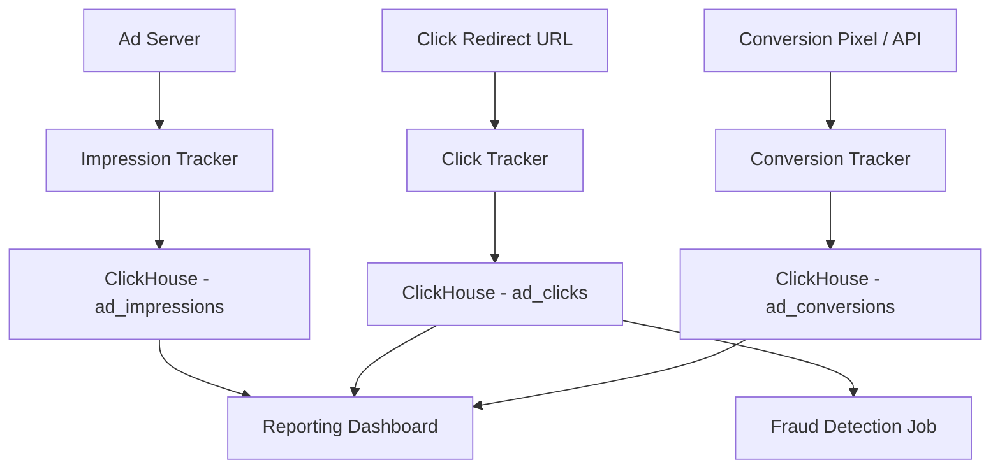

# How to Build an Ad Click Tracking System with ClickHouse

Author: [oneuptime](https://github.com/oneuptime)

Tags: ClickHouse, Advertising, Analytics, Tutorial, Database, Click tracking

Description: Learn how to build a high-throughput ad click tracking system with ClickHouse, covering schema design, deduplication, conversion attribution, and reporting queries.

## Overview

Ad click tracking requires ingesting millions of events per day, deduplicating clicks to prevent fraud, attributing conversions back to ad impressions, and reporting campaign performance in real time. ClickHouse handles all of these requirements with its high write throughput, efficient aggregations, and built-in deduplication support.



## Schema Design

Three core tables track the ad lifecycle: impressions, clicks, and conversions.

```sql
-- Impressions: when an ad is shown to a user
CREATE TABLE ad_impressions (
    impression_id   String,
    campaign_id     String,
    ad_group_id     String,
    ad_id           String,
    user_id         String,
    session_id      String,
    placement       LowCardinality(String),
    device_type     LowCardinality(String),
    country_code    LowCardinality(String),
    bid_price_usd   Decimal(10, 6),
    shown_at        DateTime64(3)
) ENGINE = MergeTree()
PARTITION BY toYYYYMM(shown_at)
ORDER BY (campaign_id, shown_at)
SETTINGS index_granularity = 8192;

-- Clicks: when a user clicks on an ad
CREATE TABLE ad_clicks (
    click_id        String,
    impression_id   String,
    campaign_id     String,
    ad_id           String,
    user_id         String,
    ip_address      String,
    user_agent      String,
    destination_url String,
    clicked_at      DateTime64(3),
    is_duplicate    UInt8 DEFAULT 0
) ENGINE = MergeTree()
PARTITION BY toYYYYMM(clicked_at)
ORDER BY (campaign_id, clicked_at)
SETTINGS index_granularity = 8192;

-- Conversions: downstream actions attributed to clicks
CREATE TABLE ad_conversions (
    conversion_id   String,
    click_id        String,
    campaign_id     String,
    user_id         String,
    conversion_type LowCardinality(String),
    revenue_usd     Decimal(10, 2),
    converted_at    DateTime64(3)
) ENGINE = MergeTree()
PARTITION BY toYYYYMM(converted_at)
ORDER BY (campaign_id, converted_at)
SETTINGS index_granularity = 8192;
```

## Click Deduplication

Duplicate clicks (same user clicking the same ad multiple times in a short window) inflate click counts and cost advertisers money. Use a ReplacingMergeTree or a separate dedup check.

```sql
-- Deduplication check: flag clicks from same user+ad within 10 minutes
WITH recent_clicks AS (
    SELECT
        user_id,
        ad_id,
        clicked_at,
        lagInFrame(clicked_at) OVER (
            PARTITION BY user_id, ad_id
            ORDER BY clicked_at
        ) AS prev_click_at
    FROM ad_clicks
    WHERE clicked_at >= now() - INTERVAL 1 HOUR
)
SELECT
    click_id,
    user_id,
    ad_id,
    clicked_at,
    if(
        dateDiff('second', prev_click_at, clicked_at) < 600,
        1,
        0
    ) AS is_duplicate
FROM recent_clicks;
```

Alternatively, use a Deduplicated table engine for strong deduplication guarantees.

```sql
CREATE TABLE ad_clicks_dedup (
    click_id        String,
    impression_id   String,
    campaign_id     String,
    ad_id           String,
    user_id         String,
    clicked_at      DateTime64(3)
) ENGINE = ReplacingMergeTree(clicked_at)
ORDER BY (user_id, ad_id, toStartOfTenMinutes(clicked_at));
```

## Campaign Performance Reporting

### Click-Through Rate

```sql
SELECT
    i.campaign_id,
    count(DISTINCT i.impression_id)             AS impressions,
    count(DISTINCT c.click_id)                  AS clicks,
    round(count(DISTINCT c.click_id) * 100.0
        / count(DISTINCT i.impression_id), 4)   AS ctr_pct,
    round(sum(i.bid_price_usd), 2)              AS total_spend_usd
FROM ad_impressions i
LEFT JOIN ad_clicks c ON i.impression_id = c.impression_id
    AND c.is_duplicate = 0
WHERE i.shown_at >= today() - 7
GROUP BY i.campaign_id
ORDER BY impressions DESC;
```

### Cost Per Conversion

```sql
SELECT
    c.campaign_id,
    count(DISTINCT cl.click_id)                 AS clicks,
    count(DISTINCT co.conversion_id)            AS conversions,
    round(count(DISTINCT co.conversion_id) * 100.0
        / nullIf(count(DISTINCT cl.click_id), 0), 2)  AS cvr_pct,
    round(sum(i.bid_price_usd), 2)              AS total_spend_usd,
    round(sum(co.revenue_usd), 2)               AS total_revenue_usd,
    round(sum(i.bid_price_usd) /
        nullIf(count(DISTINCT co.conversion_id), 0), 2) AS cost_per_conversion
FROM ad_impressions i
JOIN ad_clicks cl ON i.impression_id = cl.impression_id
LEFT JOIN ad_conversions co ON cl.click_id = co.click_id
WHERE i.shown_at >= today() - 30
GROUP BY c.campaign_id
ORDER BY total_spend_usd DESC;
```

## Attribution Modeling

First-touch and last-touch attribution are the most common models.

```sql
-- Last-touch attribution: credit the last click before conversion
SELECT
    co.campaign_id,
    count(co.conversion_id)                     AS attributed_conversions,
    sum(co.revenue_usd)                         AS attributed_revenue
FROM ad_conversions co
JOIN (
    SELECT
        click_id,
        campaign_id,
        row_number() OVER (
            PARTITION BY user_id ORDER BY clicked_at DESC
        ) AS click_rank
    FROM ad_clicks
    WHERE clicked_at >= today() - 30
) last_click ON co.click_id = last_click.click_id
    AND last_click.click_rank = 1
WHERE co.converted_at >= today() - 30
GROUP BY co.campaign_id
ORDER BY attributed_revenue DESC;
```

## Real-Time Performance Dashboard

```sql
-- Hourly campaign performance today
SELECT
    toStartOfHour(shown_at)                     AS hour,
    campaign_id,
    count()                                     AS impressions,
    sum(bid_price_usd)                          AS spend_usd
FROM ad_impressions
WHERE shown_at >= today()
GROUP BY hour, campaign_id
ORDER BY hour DESC, spend_usd DESC;
```

## Fraud Detection

Detect unusual click patterns that indicate click fraud.

```sql
-- IP addresses with abnormally high click rates
SELECT
    ip_address,
    count()                                     AS click_count,
    uniq(ad_id)                                 AS unique_ads,
    uniq(campaign_id)                           AS unique_campaigns,
    min(clicked_at)                             AS first_click,
    max(clicked_at)                             AS last_click,
    dateDiff('second', min(clicked_at), max(clicked_at)) AS window_seconds
FROM ad_clicks
WHERE clicked_at >= now() - INTERVAL 1 HOUR
GROUP BY ip_address
HAVING click_count > 50
ORDER BY click_count DESC;
```

## Architecture



## Conclusion

ClickHouse is an excellent choice for ad click tracking systems. Its high ingestion throughput handles peak ad traffic, its columnar compression reduces storage costs, and its aggregation speed enables real-time campaign performance reporting. The combination of MergeTree for raw events and ReplacingMergeTree for deduplication covers the full range of ad tracking requirements.

**Related Reading:**

- [How to Build a Web Analytics System with ClickHouse](https://oneuptime.com/blog/post/2026-03-31-clickhouse-build-web-analytics-system/view)
- [How to Build Audience Segmentation with ClickHouse](https://oneuptime.com/blog/post/2026-03-31-clickhouse-build-audience-segmentation/view)
- [How to Build an E-Commerce Analytics Platform with ClickHouse](https://oneuptime.com/blog/post/2026-03-31-clickhouse-build-ecommerce-analytics-platform/view)
