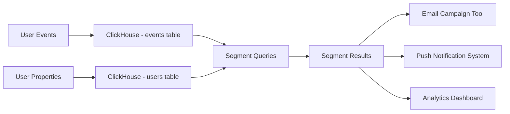
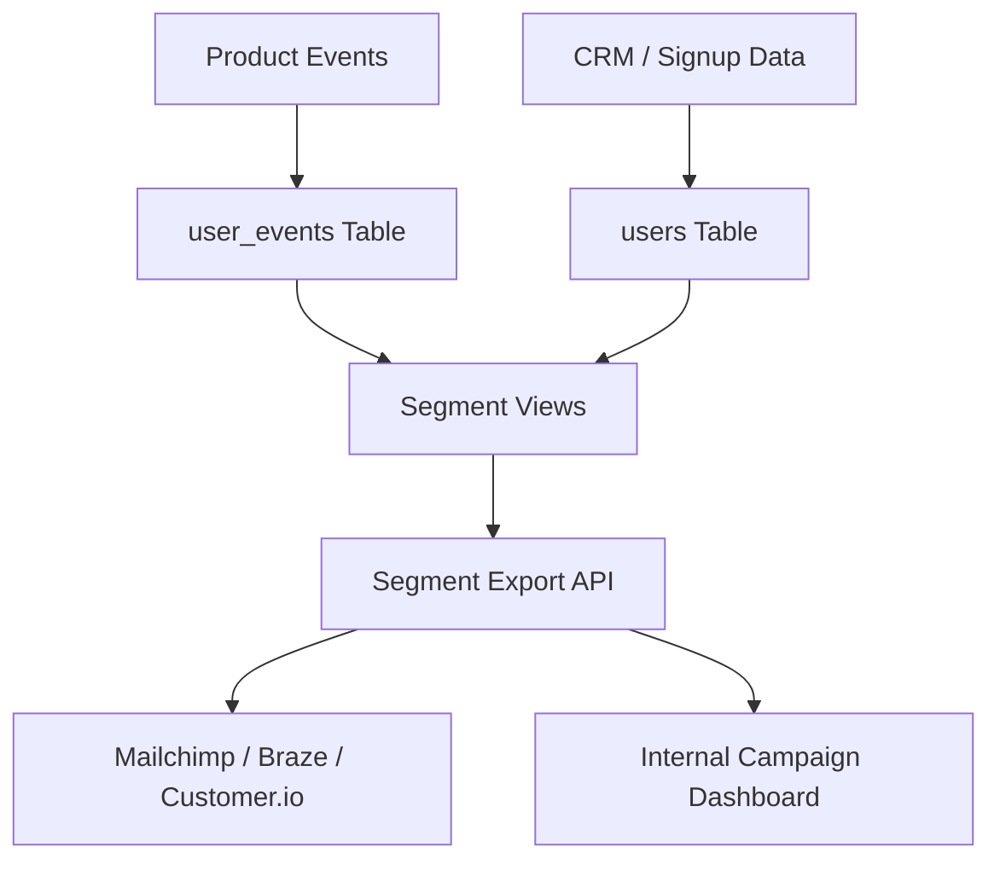

# How to Build Audience Segmentation with ClickHouse

Author: [nawazdhandala](https://www.github.com/nawazdhandala)

Tags: ClickHouse, Segmentation, Analytics, Marketing, Tutorial, Database

Description: Learn how to build a powerful audience segmentation system with ClickHouse, covering user profile tables, behavioral segments, cohort analysis, and segment export.

## Overview

Audience segmentation lets marketing and product teams group users by behavior, demographics, and product usage patterns. Building this on ClickHouse gives you the ability to define and recompute segments over hundreds of millions of users in seconds, without the overhead of a separate segmentation tool.



## Schema Design

### User Profile Table

```sql
CREATE TABLE users (
    user_id         String,
    email           String,
    created_at      DateTime,
    plan            LowCardinality(String),
    country_code    LowCardinality(String),
    industry        LowCardinality(String),
    company_size    LowCardinality(String),
    mrr_usd         Decimal(10, 2),
    is_churned      UInt8,
    churned_at      Nullable(DateTime),
    last_active_at  DateTime,
    properties      Map(String, String)
) ENGINE = ReplacingMergeTree(last_active_at)
ORDER BY user_id;
```

### Events Table

```sql
CREATE TABLE user_events (
    event_id        String,
    user_id         String,
    event_type      LowCardinality(String),
    occurred_at     DateTime,
    properties      Map(String, String)
) ENGINE = MergeTree()
PARTITION BY toYYYYMM(occurred_at)
ORDER BY (user_id, occurred_at);

-- Index for fast event type filtering
ALTER TABLE user_events ADD INDEX idx_event_type event_type
    TYPE set(100) GRANULARITY 4;
```

## Defining Behavioral Segments

### Segment: Active Users (Logged in 3+ times in last 30 days)

```sql
CREATE VIEW segment_active_users AS
SELECT DISTINCT user_id
FROM user_events
WHERE event_type = 'login'
  AND occurred_at >= today() - 30
GROUP BY user_id
HAVING count() >= 3;
```

### Segment: Power Users (Used core feature 10+ times in last 7 days)

```sql
CREATE VIEW segment_power_users AS
SELECT DISTINCT user_id
FROM user_events
WHERE event_type IN ('export', 'report_generated', 'api_call')
  AND occurred_at >= today() - 7
GROUP BY user_id
HAVING count() >= 10;
```

### Segment: At-Risk Users (No activity in last 14 days, was active before)

```sql
CREATE VIEW segment_at_risk_users AS
SELECT DISTINCT u.user_id
FROM users u FINAL
WHERE u.is_churned = 0
  AND u.last_active_at < now() - INTERVAL 14 DAY
  AND u.last_active_at >= now() - INTERVAL 60 DAY;
```

### Segment: High-Value Trial Users

```sql
CREATE VIEW segment_high_value_trial AS
SELECT
    u.user_id,
    u.email,
    u.company_size,
    e.feature_usage_count
FROM users u FINAL
JOIN (
    SELECT
        user_id,
        count() AS feature_usage_count
    FROM user_events
    WHERE event_type = 'feature_used'
      AND occurred_at >= today() - 14
    GROUP BY user_id
    HAVING feature_usage_count >= 5
) e ON u.user_id = e.user_id
WHERE u.plan = 'trial'
  AND u.company_size IN ('50-200', '200-1000', '1000+');
```

## Dynamic Segment Queries

Build segments dynamically from criteria passed by your application.

```sql
-- Template: users matching multiple behavioral criteria
SELECT DISTINCT user_id
FROM user_events
WHERE occurred_at >= today() - {lookback_days:UInt32}
GROUP BY user_id
HAVING
    countIf(event_type = {required_event:String}) >= {min_occurrences:UInt32}
    AND countIf(event_type = {exclude_event:String}) = 0;
```

## Cohort Analysis

```sql
-- Cohort analysis: what % of users from each signup month
-- are still active after N months?
WITH cohorts AS (
    SELECT
        user_id,
        toStartOfMonth(created_at)              AS cohort_month
    FROM users FINAL
    WHERE created_at >= '2024-01-01'
),
activity AS (
    SELECT DISTINCT
        user_id,
        toStartOfMonth(occurred_at)             AS active_month
    FROM user_events
    WHERE occurred_at >= '2024-01-01'
)
SELECT
    c.cohort_month,
    dateDiff('month', c.cohort_month, a.active_month) AS months_since_signup,
    uniq(c.user_id)                             AS active_users,
    round(
        uniq(c.user_id) * 100.0 /
        max(uniq(c.user_id)) OVER (PARTITION BY c.cohort_month),
        2
    )                                           AS retention_pct
FROM cohorts c
JOIN activity a USING (user_id)
GROUP BY c.cohort_month, months_since_signup
ORDER BY c.cohort_month, months_since_signup;
```

## RFM Segmentation

RFM (Recency, Frequency, Monetary) is a classic segmentation model.

```sql
WITH rfm_scores AS (
    SELECT
        user_id,
        dateDiff('day', max(occurred_at), today())  AS recency_days,
        count()                                     AS frequency,
        sum(toFloat64OrZero(properties['revenue'])) AS monetary
    FROM user_events
    WHERE event_type = 'purchase'
      AND occurred_at >= today() - 365
    GROUP BY user_id
),
rfm_ranked AS (
    SELECT
        user_id,
        recency_days,
        frequency,
        monetary,
        ntile(5) OVER (ORDER BY recency_days ASC)   AS r_score,
        ntile(5) OVER (ORDER BY frequency DESC)     AS f_score,
        ntile(5) OVER (ORDER BY monetary DESC)      AS m_score
    FROM rfm_scores
)
SELECT
    user_id,
    r_score,
    f_score,
    m_score,
    r_score + f_score + m_score                     AS rfm_total,
    CASE
        WHEN r_score >= 4 AND f_score >= 4          THEN 'Champions'
        WHEN r_score >= 3 AND f_score >= 3          THEN 'Loyal Customers'
        WHEN r_score >= 4 AND f_score <= 2          THEN 'Recent Customers'
        WHEN r_score <= 2 AND f_score >= 3          THEN 'At Risk'
        WHEN r_score <= 2 AND f_score <= 2          THEN 'Lost'
        ELSE 'Potential Loyalist'
    END                                             AS segment
FROM rfm_ranked
ORDER BY rfm_total DESC;
```

## Segment Sizing and Overlap

```sql
-- Count users in each segment and measure overlap
SELECT
    'active'      AS segment, count(DISTINCT user_id) AS size FROM segment_active_users
UNION ALL
SELECT
    'power'       AS segment, count(DISTINCT user_id) AS size FROM segment_power_users
UNION ALL
SELECT
    'at_risk'     AS segment, count(DISTINCT user_id) AS size FROM segment_at_risk_users;

-- Overlap between active and power users
SELECT count(DISTINCT a.user_id) AS in_both_segments
FROM segment_active_users a
JOIN segment_power_users p USING (user_id);
```

## Exporting Segments for Campaigns

```sql
-- Export a segment as CSV for upload to an email marketing platform
SELECT
    u.user_id,
    u.email,
    u.plan,
    u.country_code,
    u.company_size,
    u.last_active_at
FROM users u FINAL
JOIN segment_at_risk_users s ON u.user_id = s.user_id
WHERE u.email != ''
ORDER BY u.last_active_at DESC;
```

## Architecture



## Conclusion

ClickHouse enables fast, flexible audience segmentation directly on your raw behavioral data. By combining a user profile table with a behavioral event table, you can define segments of arbitrary complexity and recompute them in seconds. RFM analysis, cohort retention, and behavioral targeting all work well with ClickHouse's columnar aggregations and window functions.

**Related Reading:**

- [How to Build a Web Analytics System with ClickHouse](https://oneuptime.com/blog/post/2026-03-31-clickhouse-build-web-analytics-system/view)
- [How to Build an E-Commerce Analytics Platform with ClickHouse](https://oneuptime.com/blog/post/2026-03-31-clickhouse-build-ecommerce-analytics-platform/view)
- [How to Build a SaaS Usage Analytics System with ClickHouse](https://oneuptime.com/blog/post/2026-03-31-clickhouse-build-saas-usage-analytics/view)
