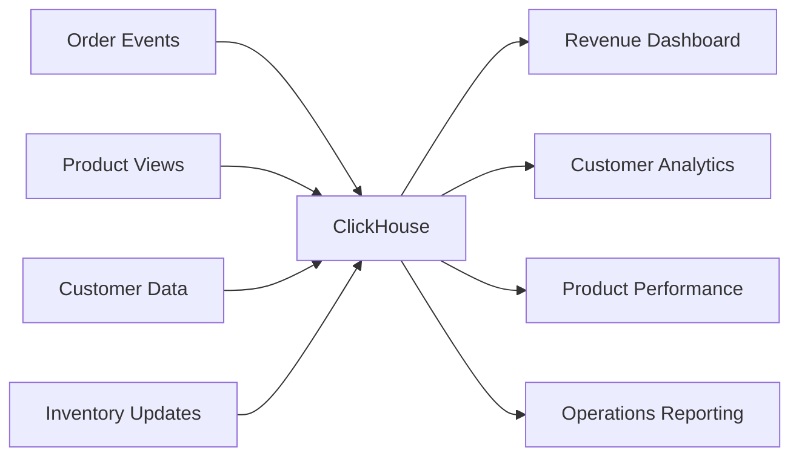
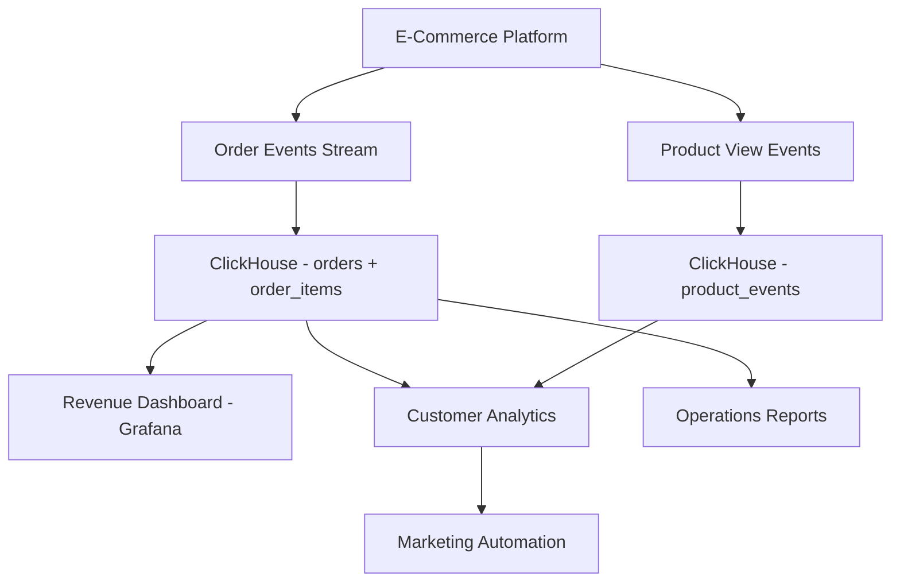

# How to Build an E-Commerce Analytics Platform with ClickHouse

Author: [oneuptime](https://github.com/oneuptime)

Tags: ClickHouse, E-commerce, Analytics, Tutorial, Database, Retail

Description: Build a complete e-commerce analytics platform with ClickHouse, covering sales reporting, customer lifetime value, cart abandonment, inventory analytics, and product performance.

## Overview

E-commerce analytics platforms need to answer questions about revenue, customer behavior, product performance, and operational metrics across millions of orders and product events. ClickHouse's speed and flexibility make it well-suited for both real-time operational dashboards and complex analytical queries.



## Schema Design

### Orders Table

```sql
CREATE TABLE orders (
    order_id        String,
    customer_id     String,
    status          LowCardinality(String),
    channel         LowCardinality(String),
    country_code    LowCardinality(String),
    currency        LowCardinality(String),
    subtotal_usd    Decimal(12, 2),
    discount_usd    Decimal(12, 2),
    shipping_usd    Decimal(12, 2),
    tax_usd         Decimal(12, 2),
    total_usd       Decimal(12, 2),
    ordered_at      DateTime,
    shipped_at      Nullable(DateTime),
    delivered_at    Nullable(DateTime)
) ENGINE = MergeTree()
PARTITION BY toYYYYMM(ordered_at)
ORDER BY (ordered_at, customer_id)
SETTINGS index_granularity = 8192;
```

### Order Items Table

```sql
CREATE TABLE order_items (
    order_item_id   String,
    order_id        String,
    product_id      String,
    sku             String,
    category        LowCardinality(String),
    quantity        UInt16,
    unit_price_usd  Decimal(10, 2),
    total_price_usd Decimal(10, 2),
    ordered_at      DateTime
) ENGINE = MergeTree()
PARTITION BY toYYYYMM(ordered_at)
ORDER BY (ordered_at, order_id, product_id);
```

### Product Events Table (Views, Add-to-Cart, etc.)

```sql
CREATE TABLE product_events (
    event_id        String,
    customer_id     String,
    session_id      String,
    product_id      String,
    category        LowCardinality(String),
    event_type      LowCardinality(String),
    occurred_at     DateTime
) ENGINE = MergeTree()
PARTITION BY toYYYYMM(occurred_at)
ORDER BY (customer_id, occurred_at);
```

## Revenue Analytics

### Daily Revenue Report

```sql
SELECT
    toDate(ordered_at)              AS day,
    channel,
    count()                         AS order_count,
    round(sum(total_usd), 2)        AS gross_revenue,
    round(sum(discount_usd), 2)     AS total_discounts,
    round(sum(total_usd) - sum(discount_usd), 2) AS net_revenue,
    round(avg(total_usd), 2)        AS avg_order_value
FROM orders
WHERE status != 'cancelled'
  AND ordered_at >= today() - 30
GROUP BY day, channel
ORDER BY day DESC, gross_revenue DESC;
```

### Revenue by Category

```sql
SELECT
    oi.category,
    count(DISTINCT oi.order_id)     AS orders,
    sum(oi.total_price_usd)         AS revenue,
    sum(oi.quantity)                AS units_sold,
    round(avg(oi.unit_price_usd), 2) AS avg_unit_price
FROM order_items oi
JOIN orders o ON oi.order_id = o.order_id
WHERE o.status != 'cancelled'
  AND oi.ordered_at >= today() - 30
GROUP BY oi.category
ORDER BY revenue DESC;
```

## Customer Lifetime Value

```sql
-- Customer LTV: total revenue per customer
WITH customer_revenue AS (
    SELECT
        customer_id,
        count(DISTINCT order_id)            AS order_count,
        min(ordered_at)                     AS first_order,
        max(ordered_at)                     AS last_order,
        sum(total_usd)                      AS total_spent,
        dateDiff('day', min(ordered_at), max(ordered_at)) AS customer_age_days
    FROM orders
    WHERE status != 'cancelled'
    GROUP BY customer_id
)
SELECT
    customer_id,
    order_count,
    round(total_spent, 2)               AS ltv_usd,
    round(total_spent / order_count, 2) AS avg_order_value,
    first_order,
    last_order,
    customer_age_days
FROM customer_revenue
ORDER BY ltv_usd DESC
LIMIT 100;

-- LTV distribution by cohort month
SELECT
    toStartOfMonth(first_order)         AS cohort_month,
    count(DISTINCT customer_id)         AS customers,
    round(avg(total_spent), 2)          AS avg_ltv,
    round(quantile(0.50)(total_spent), 2) AS median_ltv,
    round(quantile(0.90)(total_spent), 2) AS p90_ltv
FROM (
    SELECT
        customer_id,
        min(ordered_at)                 AS first_order,
        sum(total_usd)                  AS total_spent
    FROM orders
    WHERE status != 'cancelled'
    GROUP BY customer_id
)
GROUP BY cohort_month
ORDER BY cohort_month;
```

## Cart Abandonment Analysis

```sql
-- Cart abandonment rate by category
WITH cart_sessions AS (
    SELECT
        session_id,
        product_id,
        category,
        countIf(event_type = 'add_to_cart')     AS added_to_cart,
        countIf(event_type = 'purchase')         AS purchased
    FROM product_events
    WHERE occurred_at >= today() - 30
    GROUP BY session_id, product_id, category
)
SELECT
    category,
    sum(added_to_cart)                          AS total_carts,
    sum(purchased)                              AS total_purchases,
    round((1 - sum(purchased) / sum(added_to_cart)) * 100, 2) AS abandonment_rate_pct
FROM cart_sessions
WHERE added_to_cart > 0
GROUP BY category
ORDER BY abandonment_rate_pct DESC;
```

## Product Performance

```sql
-- Top products by revenue and conversion rate
SELECT
    oi.product_id,
    oi.category,
    sum(oi.total_price_usd)                     AS revenue,
    sum(oi.quantity)                            AS units_sold,
    count(DISTINCT oi.order_id)                 AS orders,
    count(DISTINCT pv.session_id)               AS product_views,
    round(
        count(DISTINCT oi.order_id) * 100.0 /
        nullIf(count(DISTINCT pv.session_id), 0),
        2
    )                                           AS view_to_purchase_pct
FROM order_items oi
JOIN orders o ON oi.order_id = o.order_id
LEFT JOIN (
    SELECT product_id, session_id
    FROM product_events
    WHERE event_type = 'product_view'
      AND occurred_at >= today() - 30
) pv ON oi.product_id = pv.product_id
WHERE o.status != 'cancelled'
  AND oi.ordered_at >= today() - 30
GROUP BY oi.product_id, oi.category
ORDER BY revenue DESC
LIMIT 50;
```

## Repeat Purchase Analysis

```sql
-- Distribution of customers by number of orders
SELECT
    order_count,
    count(DISTINCT customer_id)                 AS customer_count,
    round(count(DISTINCT customer_id) * 100.0 /
        sum(count(DISTINCT customer_id)) OVER (), 2) AS pct_of_customers
FROM (
    SELECT
        customer_id,
        count(DISTINCT order_id)                AS order_count
    FROM orders
    WHERE status != 'cancelled'
    GROUP BY customer_id
)
GROUP BY order_count
ORDER BY order_count;

-- Average days between repeat purchases
SELECT
    customer_id,
    count() - 1                                 AS repeat_purchases,
    round(avg(days_since_last_order), 1)        AS avg_days_between_orders
FROM (
    SELECT
        customer_id,
        ordered_at,
        dateDiff('day',
            lagInFrame(ordered_at) OVER (PARTITION BY customer_id ORDER BY ordered_at),
            ordered_at
        ) AS days_since_last_order
    FROM orders
    WHERE status != 'cancelled'
)
WHERE days_since_last_order IS NOT NULL
GROUP BY customer_id
HAVING repeat_purchases >= 2
ORDER BY avg_days_between_orders;
```

## Operational Metrics

```sql
-- Order fulfillment time distribution
SELECT
    channel,
    round(avg(dateDiff('hour', ordered_at, shipped_at)), 1)     AS avg_hours_to_ship,
    round(quantile(0.95)(dateDiff('hour', ordered_at, shipped_at)), 1) AS p95_hours_to_ship,
    countIf(dateDiff('hour', ordered_at, shipped_at) > 48)      AS late_shipments,
    count()                                                      AS total_orders
FROM orders
WHERE status IN ('shipped', 'delivered')
  AND shipped_at IS NOT NULL
  AND ordered_at >= today() - 30
GROUP BY channel
ORDER BY avg_hours_to_ship;
```

## Architecture



## Conclusion

ClickHouse provides the query performance and flexibility needed to power a comprehensive e-commerce analytics platform. Revenue reporting, customer LTV, cart abandonment analysis, and product performance queries all run in seconds even over years of historical data, enabling your team to make data-driven decisions in real time.

**Related Reading:**

- [How to Build Audience Segmentation with ClickHouse](https://oneuptime.com/blog/post/2026-03-31-clickhouse-build-audience-segmentation/view)
- [How to Build an Ad Click Tracking System with ClickHouse](https://oneuptime.com/blog/post/2026-03-31-clickhouse-build-ad-click-tracking-system/view)
- [How to Build a SaaS Usage Analytics System with ClickHouse](https://oneuptime.com/blog/post/2026-03-31-clickhouse-build-saas-usage-analytics/view)
