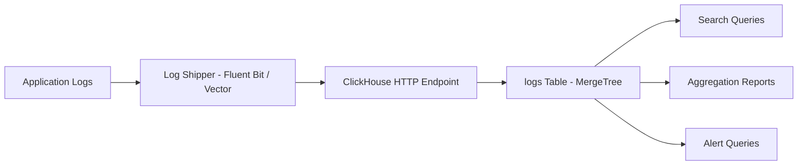
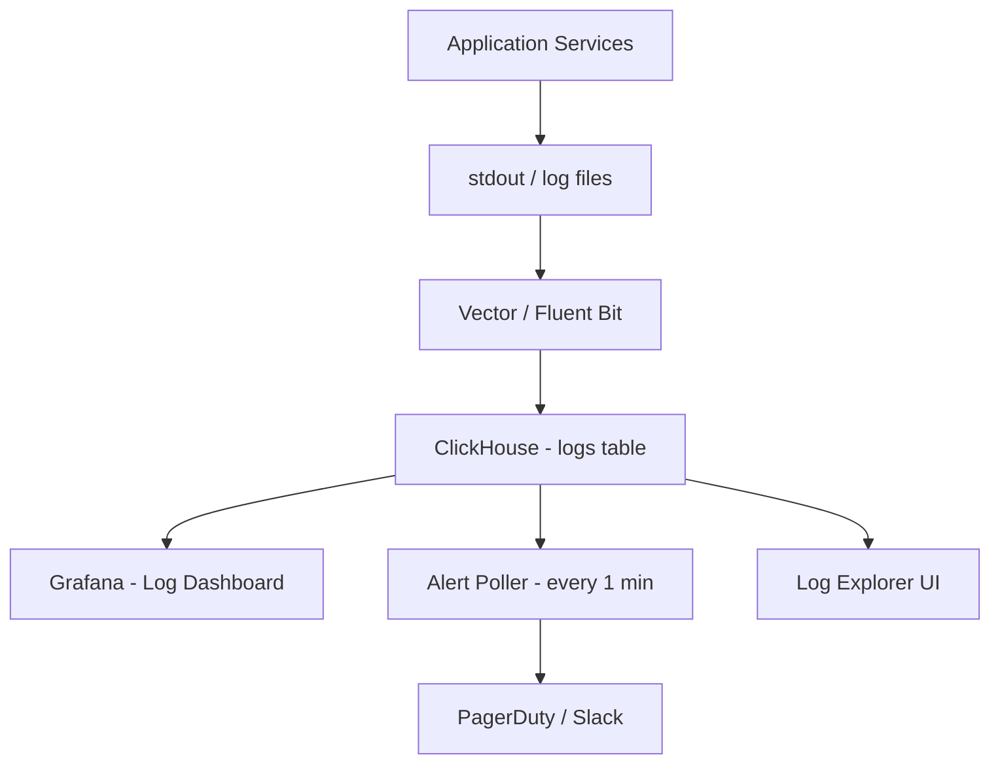

# How to Build a Log Analytics Platform with ClickHouse

Author: [nawazdhandala](https://www.github.com/nawazdhandala)

Tags: ClickHouse, Logging, Observability, Analytics, Tutorial, Database

Description: Learn how to build a scalable log analytics platform with ClickHouse, covering schema design, log ingestion pipelines, search queries, alerting, and retention management.

## Overview

Log analytics platforms must handle high write throughput (thousands to millions of log lines per second), support full-text search, and return query results fast for operations teams investigating incidents. ClickHouse handles all three requirements exceptionally well, and its columnar compression reduces storage costs by 10x or more compared to Elasticsearch.



## Schema Design

Design the schema around the most common query patterns: filtering by time, service, severity, and searching within the message field.

```sql
CREATE TABLE logs (
    -- Time and partitioning
    timestamp       DateTime64(9),
    date            Date DEFAULT toDate(timestamp),

    -- Source identification
    service         LowCardinality(String),
    hostname        LowCardinality(String),
    environment     LowCardinality(String),
    pod_name        String,
    container_name  LowCardinality(String),

    -- Log metadata
    severity        LowCardinality(String),
    trace_id        String,
    span_id         String,

    -- Content
    message         String,
    attributes      Map(String, String),

    -- Indexing helpers
    severity_number UInt8
) ENGINE = MergeTree()
PARTITION BY toYYYYMMDD(timestamp)
ORDER BY (service, timestamp)
TTL date + INTERVAL 90 DAY DELETE
SETTINGS index_granularity = 8192;

-- Full-text search index on message
ALTER TABLE logs ADD INDEX idx_message message
    TYPE tokenbf_v1(32768, 3, 0) GRANULARITY 4;

-- Bloom filter on trace_id for fast trace lookups
ALTER TABLE logs ADD INDEX idx_trace trace_id
    TYPE bloom_filter(0.01) GRANULARITY 4;
```

## Ingesting Logs

### Using Vector (Recommended)

Vector is a high-performance log shipper that writes directly to ClickHouse over HTTP.

```toml
# vector.toml
[sources.app_logs]
type = "file"
include = ["/var/log/app/*.log"]
read_from = "beginning"

[transforms.parse_logs]
type = "remap"
inputs = ["app_logs"]
source = '''
  . = parse_json!(string!(.message))
  .timestamp = parse_timestamp!(.timestamp, format: "%+")
  .date = to_date!(.timestamp)
'''

[sinks.clickhouse]
type = "clickhouse"
inputs = ["parse_logs"]
endpoint = "http://clickhouse:8123"
database = "default"
table = "logs"
batch.max_bytes = 10485760
batch.timeout_secs = 5
encoding.codec = "json"
```

### Inserting Logs via HTTP API

```bash
# Insert a batch of logs via ClickHouse HTTP interface
curl -X POST 'http://clickhouse:8123/?query=INSERT+INTO+logs+FORMAT+JSONEachRow' \
  --data-binary '{"timestamp":"2025-03-31T10:00:00.000000000Z","service":"api","hostname":"api-1","severity":"ERROR","message":"Connection timeout to database","trace_id":"abc123"}
{"timestamp":"2025-03-31T10:00:01.000000000Z","service":"api","hostname":"api-1","severity":"INFO","message":"Request completed","trace_id":"def456"}'
```

## Search Queries

### Full-Text Search

```sql
-- Search for logs containing a keyword (uses tokenbf index)
SELECT
    timestamp,
    service,
    severity,
    message
FROM logs
WHERE timestamp >= now() - INTERVAL 1 HOUR
  AND hasToken(message, 'timeout')
ORDER BY timestamp DESC
LIMIT 100;

-- Search with multiple keywords
SELECT timestamp, service, severity, message
FROM logs
WHERE timestamp >= now() - INTERVAL 1 HOUR
  AND (hasToken(message, 'error') OR hasToken(message, 'exception'))
  AND service = 'api'
ORDER BY timestamp DESC
LIMIT 200;
```

### Trace Lookup

```sql
-- Find all logs for a specific trace
SELECT
    timestamp,
    service,
    severity,
    span_id,
    message
FROM logs
WHERE trace_id = 'abc123-def456'
  AND timestamp >= now() - INTERVAL 24 HOUR
ORDER BY timestamp;
```

## Aggregation and Reporting

### Error Rate Over Time

```sql
SELECT
    toStartOfFiveMinutes(timestamp)                 AS period,
    service,
    countIf(severity = 'ERROR')                     AS error_count,
    countIf(severity = 'WARN')                      AS warn_count,
    count()                                         AS total_count,
    round(countIf(severity = 'ERROR') * 100.0
        / count(), 2)                               AS error_rate_pct
FROM logs
WHERE timestamp >= now() - INTERVAL 6 HOUR
GROUP BY period, service
ORDER BY period, service;
```

### Top Error Messages

```sql
SELECT
    service,
    message,
    count()                                         AS occurrence_count,
    min(timestamp)                                  AS first_seen,
    max(timestamp)                                  AS last_seen
FROM logs
WHERE severity IN ('ERROR', 'CRITICAL')
  AND timestamp >= today() - 1
GROUP BY service, message
ORDER BY occurrence_count DESC
LIMIT 30;
```

### Log Volume by Service

```sql
SELECT
    toStartOfHour(timestamp)                        AS hour,
    service,
    count()                                         AS log_count,
    formatReadableSize(sum(length(message)))        AS data_volume
FROM logs
WHERE timestamp >= today() - 7
GROUP BY hour, service
ORDER BY hour DESC, log_count DESC;
```

## Alerting

Create a simple alerting query that your monitoring system polls every minute.

```sql
-- Alert: error rate above 5% in last 5 minutes for any service
SELECT
    service,
    round(countIf(severity = 'ERROR') * 100.0 / count(), 2) AS error_rate_pct,
    count()                                                  AS total_logs
FROM logs
WHERE timestamp >= now() - INTERVAL 5 MINUTE
GROUP BY service
HAVING error_rate_pct > 5
ORDER BY error_rate_pct DESC;
```

## Retention Management

ClickHouse TTL handles automatic log expiry. You can also set per-partition TTL for tiered retention.

```sql
-- Keep error logs for 180 days, info logs for 30 days
ALTER TABLE logs
    MODIFY TTL
        timestamp + INTERVAL 30 DAY DELETE WHERE severity = 'DEBUG',
        timestamp + INTERVAL 30 DAY DELETE WHERE severity = 'INFO',
        timestamp + INTERVAL 90 DAY DELETE WHERE severity = 'WARN',
        timestamp + INTERVAL 180 DAY DELETE WHERE severity IN ('ERROR', 'CRITICAL');
```

## Storage Compression

ClickHouse compresses log data exceptionally well. For typical application logs with repetitive service names, hostnames, and message patterns, you can expect 10:1 to 20:1 compression ratios.

```sql
-- Check actual storage usage and compression ratio
SELECT
    table,
    formatReadableSize(sum(data_compressed_bytes))   AS compressed_size,
    formatReadableSize(sum(data_uncompressed_bytes)) AS uncompressed_size,
    round(sum(data_uncompressed_bytes) /
          sum(data_compressed_bytes), 2)             AS compression_ratio,
    sum(rows)                                        AS total_rows
FROM system.parts
WHERE table = 'logs' AND active = 1
GROUP BY table;
```

## Full Architecture



## Conclusion

Building a log analytics platform on ClickHouse gives you high ingestion throughput, fast search, powerful aggregation queries, and excellent storage efficiency. The combination of token bloom filter indexes for full-text search, columnar compression, and time-based partitioning makes ClickHouse a compelling alternative to Elasticsearch for log analytics at scale.

**Related Reading:**

- [How to Build a Security Operations Center with ClickHouse](https://oneuptime.com/blog/post/2026-03-31-clickhouse-build-security-operations-center/view)
- [How to Monitor Database Query Performance with ClickHouse](https://oneuptime.com/blog/post/2026-03-31-clickhouse-monitor-database-query-performance/view)
- [How to Build a Real-Time Metrics Dashboard with ClickHouse](https://oneuptime.com/blog/post/2026-03-31-clickhouse-build-real-time-metrics-dashboard/view)
