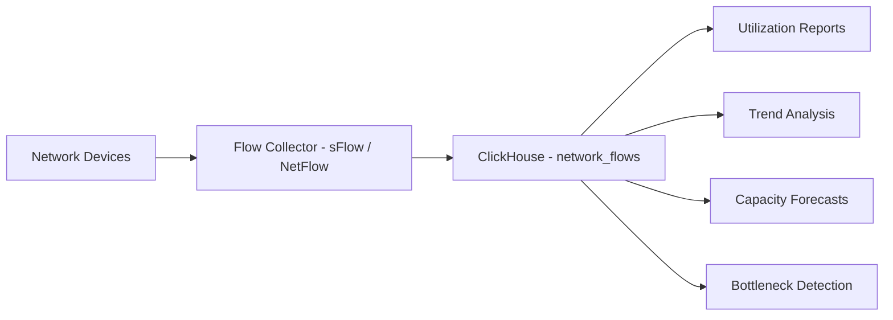
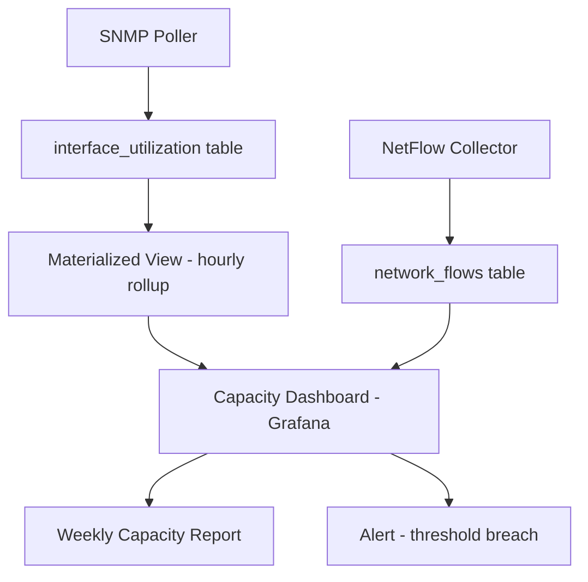

# How to Build Network Capacity Planning with ClickHouse

Author: [nawazdhandala](https://www.github.com/nawazdhandala)

Tags: ClickHouse, Network, Capacity Planning, Analytics, Tutorial, Infrastructure

Description: Learn how to store network flow data in ClickHouse, analyze bandwidth trends, forecast capacity needs, and identify traffic bottlenecks for informed infrastructure planning.

## Overview

Network capacity planning requires collecting detailed traffic data over months, identifying growth trends, detecting peak utilization periods, and forecasting when infrastructure will reach capacity limits. ClickHouse excels at this workload because it handles high-volume time-series data, compresses it efficiently, and enables fast analytical queries over long historical windows.



## Schema Design

### Interface Utilization Table

Store per-interface utilization samples from SNMP polling.

```sql
CREATE TABLE interface_utilization (
    device_hostname     LowCardinality(String),
    device_ip           IPv4,
    interface_name      LowCardinality(String),
    interface_speed_bps UInt64,
    bytes_in            UInt64,
    bytes_out           UInt64,
    packets_in          UInt64,
    packets_out         UInt64,
    errors_in           UInt32,
    errors_out          UInt32,
    discards_in         UInt32,
    discards_out        UInt32,
    polled_at           DateTime
) ENGINE = MergeTree()
PARTITION BY toYYYYMMDD(polled_at)
ORDER BY (device_hostname, interface_name, polled_at)
TTL toDate(polled_at) + INTERVAL 365 DAY DELETE
SETTINGS index_granularity = 8192;
```

### Network Flow Table (NetFlow / sFlow)

```sql
CREATE TABLE network_flows (
    flow_id             String,
    exporter_ip         IPv4,
    src_ip              IPv4,
    dst_ip              IPv4,
    src_asn             UInt32,
    dst_asn             UInt32,
    src_port            UInt16,
    dst_port            UInt16,
    protocol            LowCardinality(String),
    bytes               UInt64,
    packets             UInt32,
    duration_ms         UInt32,
    input_interface     LowCardinality(String),
    output_interface    LowCardinality(String),
    started_at          DateTime
) ENGINE = MergeTree()
PARTITION BY toYYYYMMDD(started_at)
ORDER BY (exporter_ip, started_at)
TTL toDate(started_at) + INTERVAL 90 DAY DELETE;
```

### Pre-Aggregated Rollup for Faster Queries

```sql
CREATE TABLE interface_utilization_hourly (
    device_hostname         LowCardinality(String),
    interface_name          LowCardinality(String),
    interface_speed_bps     UInt64,
    hour                    DateTime,
    avg_bytes_in_per_sec    Float64,
    avg_bytes_out_per_sec   Float64,
    max_bytes_in_per_sec    Float64,
    max_bytes_out_per_sec   Float64,
    avg_util_in_pct         Float64,
    avg_util_out_pct        Float64,
    max_util_in_pct         Float64,
    max_util_out_pct        Float64
) ENGINE = MergeTree()
PARTITION BY toYYYYMM(hour)
ORDER BY (device_hostname, interface_name, hour)
TTL toDate(hour) + INTERVAL 3 YEAR DELETE;

CREATE MATERIALIZED VIEW interface_utilization_hourly_mv
TO interface_utilization_hourly AS
SELECT
    device_hostname,
    interface_name,
    any(interface_speed_bps)                AS interface_speed_bps,
    toStartOfHour(polled_at)                AS hour,
    avg(bytes_in * 8.0 / 300)              AS avg_bytes_in_per_sec,
    avg(bytes_out * 8.0 / 300)             AS avg_bytes_out_per_sec,
    max(bytes_in * 8.0 / 300)              AS max_bytes_in_per_sec,
    max(bytes_out * 8.0 / 300)             AS max_bytes_out_per_sec,
    avg(bytes_in * 8.0 / 300 / interface_speed_bps * 100) AS avg_util_in_pct,
    avg(bytes_out * 8.0 / 300 / interface_speed_bps * 100) AS avg_util_out_pct,
    max(bytes_in * 8.0 / 300 / interface_speed_bps * 100) AS max_util_in_pct,
    max(bytes_out * 8.0 / 300 / interface_speed_bps * 100) AS max_util_out_pct
FROM interface_utilization
GROUP BY device_hostname, interface_name, hour;
```

## Current Utilization

```sql
-- Top 20 most utilized interfaces right now
SELECT
    device_hostname,
    interface_name,
    round(avg_util_in_pct, 2)       AS util_in_pct,
    round(avg_util_out_pct, 2)      AS util_out_pct,
    greatest(avg_util_in_pct, avg_util_out_pct) AS max_direction_pct
FROM interface_utilization_hourly
WHERE hour = toStartOfHour(now() - INTERVAL 1 HOUR)
ORDER BY max_direction_pct DESC
LIMIT 20;
```

## Utilization Trends

```sql
-- 30-day utilization trend for a specific interface
SELECT
    toDate(hour)                    AS day,
    avg(avg_util_in_pct)            AS avg_in,
    avg(avg_util_out_pct)           AS avg_out,
    max(max_util_in_pct)            AS peak_in,
    max(max_util_out_pct)           AS peak_out
FROM interface_utilization_hourly
WHERE device_hostname = 'core-router-01'
  AND interface_name = 'GigabitEthernet0/1'
  AND hour >= today() - 30
GROUP BY day
ORDER BY day;
```

## Peak Hour Analysis

```sql
-- Average utilization by hour of day (identifies busy hours)
SELECT
    toHour(hour)                    AS hour_of_day,
    avg(avg_util_in_pct)            AS avg_in_pct,
    avg(avg_util_out_pct)           AS avg_out_pct,
    max(max_util_in_pct)            AS peak_in_pct
FROM interface_utilization_hourly
WHERE device_hostname = 'core-router-01'
  AND interface_name = 'GigabitEthernet0/1'
  AND hour >= today() - 90
GROUP BY hour_of_day
ORDER BY hour_of_day;
```

## Capacity Threshold Reporting

Identify interfaces that have exceeded 80% utilization - a common capacity planning trigger.

```sql
-- Interfaces exceeding 80% utilization threshold in last 30 days
SELECT
    device_hostname,
    interface_name,
    interface_speed_bps / 1000000000.0                          AS speed_gbps,
    count()                                                     AS hours_above_threshold,
    max(max_util_in_pct)                                        AS max_in_pct,
    max(max_util_out_pct)                                       AS max_out_pct,
    min(hour)                                                   AS first_breach,
    max(hour)                                                   AS last_breach
FROM interface_utilization_hourly
WHERE hour >= today() - 30
  AND greatest(avg_util_in_pct, avg_util_out_pct) > 80
GROUP BY device_hostname, interface_name, interface_speed_bps
ORDER BY hours_above_threshold DESC;
```

## Growth Trend and Forecast

Use linear regression to forecast when an interface will reach capacity.

```sql
-- Linear regression on weekly average utilization
WITH weekly_data AS (
    SELECT
        toStartOfWeek(hour)         AS week,
        toUnixTimestamp(toStartOfWeek(hour)) AS week_ts,
        avg(avg_util_out_pct)       AS avg_util
    FROM interface_utilization_hourly
    WHERE device_hostname = 'core-router-01'
      AND interface_name = 'GigabitEthernet0/1'
      AND hour >= today() - 180
    GROUP BY week
),
regression AS (
    SELECT
        (count() * sum(week_ts * avg_util) - sum(week_ts) * sum(avg_util)) /
        (count() * sum(week_ts * week_ts) - sum(week_ts) * sum(week_ts)) AS slope,
        (sum(avg_util) - slope * sum(week_ts)) / count()                 AS intercept
    FROM weekly_data
)
SELECT
    slope * 604800 * 52             AS projected_annual_growth_pct,
    -- Weeks until 80% threshold
    round((80 - intercept) / slope / 604800, 0) AS weeks_to_80pct
FROM regression;
```

## Top Traffic Flows

```sql
-- Top source-destination pairs by volume in the last 24 hours
SELECT
    src_ip,
    dst_ip,
    protocol,
    dst_port,
    formatReadableSize(sum(bytes))  AS total_bytes,
    sum(packets)                    AS total_packets,
    count()                         AS flow_count
FROM network_flows
WHERE started_at >= now() - INTERVAL 24 HOUR
GROUP BY src_ip, dst_ip, protocol, dst_port
ORDER BY sum(bytes) DESC
LIMIT 30;
```

## Capacity Report Summary

```sql
-- Executive capacity report: interfaces by health status
SELECT
    device_hostname,
    interface_name,
    round(interface_speed_bps / 1e9, 0)     AS speed_gbps,
    round(max(max_util_in_pct), 1)          AS peak_in_30d,
    round(max(max_util_out_pct), 1)         AS peak_out_30d,
    round(avg(avg_util_in_pct), 1)          AS avg_in_30d,
    CASE
        WHEN max(max_util_in_pct) > 90
          OR max(max_util_out_pct) > 90     THEN 'Critical'
        WHEN max(max_util_in_pct) > 80
          OR max(max_util_out_pct) > 80     THEN 'Warning'
        WHEN max(max_util_in_pct) > 60
          OR max(max_util_out_pct) > 60     THEN 'Monitor'
        ELSE 'Healthy'
    END                                     AS status
FROM interface_utilization_hourly
WHERE hour >= today() - 30
GROUP BY device_hostname, interface_name, interface_speed_bps
ORDER BY status, peak_out_30d DESC;
```

## Architecture



## Conclusion

ClickHouse provides an excellent foundation for network capacity planning. Its efficient storage of high-frequency time-series data, fast aggregations over long historical windows, and built-in statistical functions (including linear regression for forecasting) cover the full capacity planning workflow from current utilization monitoring to multi-year trend analysis.

**Related Reading:**

- [How to Analyze CDN Performance with ClickHouse](https://oneuptime.com/blog/post/2026-03-31-clickhouse-analyze-cdn-performance/view)
- [How to Build a Real-Time Metrics Dashboard with ClickHouse](https://oneuptime.com/blog/post/2026-03-31-clickhouse-build-real-time-metrics-dashboard/view)
- [How to Build a Security Operations Center with ClickHouse](https://oneuptime.com/blog/post/2026-03-31-clickhouse-build-security-operations-center/view)
