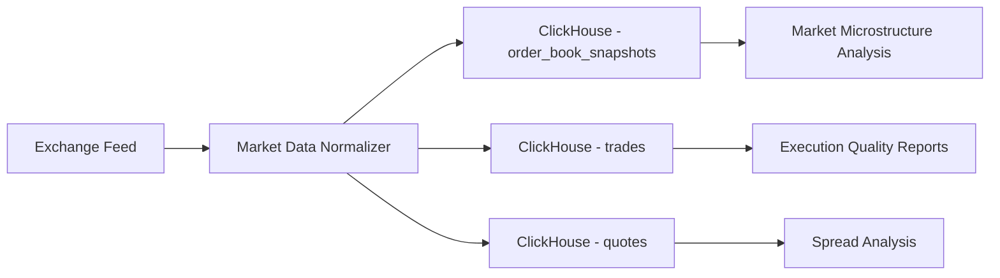
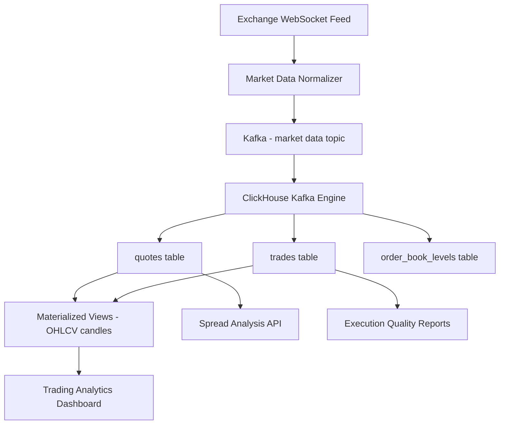

# How to Build Order Book Analytics with ClickHouse

Author: [nawazdhandala](https://www.github.com/nawazdhandala)

Tags: ClickHouse, Finance, Analytics, Tutorial, Order Book, Trading

Description: Build an order book analytics system with ClickHouse - covering tick data storage, bid-ask spread analysis, market depth, price impact, and trade execution quality reporting.

## Overview

Financial order book analytics requires storing and querying tick-level market data at extremely high throughput. Order books generate millions of updates per day per trading instrument. ClickHouse's columnar storage, high ingestion rate, and fast time-series queries make it a strong fit for this data-intensive domain.



## Schema Design

### Quotes Table (Best Bid and Offer)

```sql
CREATE TABLE quotes (
    instrument      LowCardinality(String),
    exchange        LowCardinality(String),
    bid_price       Decimal(18, 8),
    bid_size        Decimal(18, 8),
    ask_price       Decimal(18, 8),
    ask_size        Decimal(18, 8),
    sequence_num    UInt64,
    quoted_at       DateTime64(9)
) ENGINE = MergeTree()
PARTITION BY toYYYYMMDD(quoted_at)
ORDER BY (instrument, quoted_at)
SETTINGS index_granularity = 8192;
```

### Trades Table

```sql
CREATE TABLE trades (
    trade_id        String,
    instrument      LowCardinality(String),
    exchange        LowCardinality(String),
    side            LowCardinality(String),
    price           Decimal(18, 8),
    quantity        Decimal(18, 8),
    is_aggressor    UInt8,
    sequence_num    UInt64,
    traded_at       DateTime64(9)
) ENGINE = MergeTree()
PARTITION BY toYYYYMMDD(traded_at)
ORDER BY (instrument, traded_at)
SETTINGS index_granularity = 8192;
```

### Order Book Depth Snapshots

```sql
CREATE TABLE order_book_levels (
    snapshot_id     String,
    instrument      LowCardinality(String),
    exchange        LowCardinality(String),
    side            LowCardinality(String),
    level           UInt8,
    price           Decimal(18, 8),
    quantity        Decimal(18, 8),
    order_count     UInt16,
    snapshotted_at  DateTime64(9)
) ENGINE = MergeTree()
PARTITION BY toYYYYMMDD(snapshotted_at)
ORDER BY (instrument, snapshotted_at, side, level)
TTL toDate(snapshotted_at) + INTERVAL 30 DAY DELETE;
```

## Spread Analysis

### Bid-Ask Spread Over Time

```sql
-- Average bid-ask spread in basis points by 5-minute intervals
SELECT
    toStartOfFiveMinutes(quoted_at)             AS period,
    instrument,
    avg((ask_price - bid_price) / bid_price * 10000) AS avg_spread_bps,
    min((ask_price - bid_price) / bid_price * 10000) AS min_spread_bps,
    max((ask_price - bid_price) / bid_price * 10000) AS max_spread_bps,
    avg((bid_size + ask_size) / 2)              AS avg_size
FROM quotes
WHERE instrument = 'BTC-USD'
  AND quoted_at >= today()
GROUP BY period, instrument
ORDER BY period;
```

### Spread Distribution

```sql
-- Distribution of spread values (histogram)
SELECT
    round((ask_price - bid_price) / bid_price * 10000, 1) AS spread_bps,
    count()                                             AS frequency
FROM quotes
WHERE instrument = 'BTC-USD'
  AND quoted_at >= today() - 1
GROUP BY spread_bps
ORDER BY spread_bps;
```

## OHLCV Candles

Build OHLCV (Open, High, Low, Close, Volume) candles of any granularity from tick data.

```sql
-- 1-minute OHLCV candles
SELECT
    toStartOfMinute(traded_at)                  AS candle_time,
    instrument,
    argMin(price, traded_at)                    AS open_price,
    max(price)                                  AS high_price,
    min(price)                                  AS low_price,
    argMax(price, traded_at)                    AS close_price,
    sum(quantity)                               AS volume,
    count()                                     AS trade_count
FROM trades
WHERE instrument = 'ETH-USD'
  AND traded_at >= today()
GROUP BY candle_time, instrument
ORDER BY candle_time;
```

Store pre-computed candles for faster dashboard queries.

```sql
CREATE TABLE ohlcv_1m (
    instrument      LowCardinality(String),
    candle_time     DateTime,
    open_price      Decimal(18, 8),
    high_price      Decimal(18, 8),
    low_price       Decimal(18, 8),
    close_price     Decimal(18, 8),
    volume          Decimal(18, 8),
    trade_count     UInt32,
    vwap            Decimal(18, 8)
) ENGINE = MergeTree()
PARTITION BY toYYYYMM(candle_time)
ORDER BY (instrument, candle_time);

CREATE MATERIALIZED VIEW ohlcv_1m_mv TO ohlcv_1m AS
SELECT
    instrument,
    toStartOfMinute(traded_at)                  AS candle_time,
    argMin(price, traded_at)                    AS open_price,
    max(price)                                  AS high_price,
    min(price)                                  AS low_price,
    argMax(price, traded_at)                    AS close_price,
    sum(quantity)                               AS volume,
    count()                                     AS trade_count,
    sum(price * quantity) / sum(quantity)       AS vwap
FROM trades
GROUP BY instrument, candle_time;
```

## Volume-Weighted Average Price

```sql
-- VWAP over a trading session
SELECT
    instrument,
    sum(price * quantity) / sum(quantity)       AS session_vwap,
    sum(quantity)                               AS total_volume,
    min(price)                                  AS session_low,
    max(price)                                  AS session_high
FROM trades
WHERE instrument = 'BTC-USD'
  AND toDate(traded_at) = today()
GROUP BY instrument;

-- Rolling VWAP (1-hour window)
SELECT
    traded_at,
    instrument,
    price,
    quantity,
    sum(price * quantity) OVER (
        PARTITION BY instrument
        ORDER BY traded_at
        RANGE BETWEEN 3600 PRECEDING AND CURRENT ROW
    ) /
    sum(quantity) OVER (
        PARTITION BY instrument
        ORDER BY traded_at
        RANGE BETWEEN 3600 PRECEDING AND CURRENT ROW
    )                                           AS rolling_vwap_1h
FROM trades
WHERE instrument = 'BTC-USD'
  AND traded_at >= now() - INTERVAL 2 HOUR
ORDER BY traded_at;
```

## Market Depth Analysis

```sql
-- Total available liquidity at each price level
SELECT
    side,
    level,
    avg(price)                                  AS avg_price,
    avg(quantity)                               AS avg_depth,
    avg(order_count)                            AS avg_orders
FROM order_book_levels
WHERE instrument = 'BTC-USD'
  AND snapshotted_at >= now() - INTERVAL 1 HOUR
GROUP BY side, level
ORDER BY side, level;

-- Depth imbalance (buy vs sell pressure)
SELECT
    toStartOfMinute(snapshotted_at)             AS minute,
    instrument,
    sumIf(quantity, side = 'bid' AND level <= 5) AS bid_depth_top5,
    sumIf(quantity, side = 'ask' AND level <= 5) AS ask_depth_top5,
    round(
        (sumIf(quantity, side = 'bid' AND level <= 5) -
         sumIf(quantity, side = 'ask' AND level <= 5)) /
        (sumIf(quantity, side = 'bid' AND level <= 5) +
         sumIf(quantity, side = 'ask' AND level <= 5)),
        4
    )                                           AS depth_imbalance
FROM order_book_levels
WHERE instrument = 'BTC-USD'
  AND snapshotted_at >= now() - INTERVAL 2 HOUR
GROUP BY minute, instrument
ORDER BY minute;
```

## Trade Execution Quality

```sql
-- Slippage analysis: compare execution price to mid-quote at time of trade
WITH mid_quotes AS (
    SELECT
        instrument,
        quoted_at,
        (bid_price + ask_price) / 2             AS mid_price
    FROM quotes
),
trade_slippage AS (
    SELECT
        t.trade_id,
        t.instrument,
        t.side,
        t.price                                 AS execution_price,
        q.mid_price,
        (t.price - q.mid_price) / q.mid_price * 10000 AS slippage_bps
    FROM trades t
    ASOF JOIN mid_quotes q ON t.instrument = q.instrument
        AND t.traded_at >= q.quoted_at
    WHERE t.traded_at >= today()
)
SELECT
    instrument,
    side,
    count()                                     AS trade_count,
    avg(slippage_bps)                           AS avg_slippage_bps,
    quantile(0.95)(abs(slippage_bps))           AS p95_abs_slippage_bps
FROM trade_slippage
GROUP BY instrument, side
ORDER BY avg_slippage_bps;
```

## Architecture



## Conclusion

ClickHouse handles the high ingestion rates and fast analytical queries required for order book analytics. ASOF JOIN for time-series alignment, window functions for rolling aggregations, and materialized views for pre-computed OHLCV candles cover the core requirements of financial market data analytics. The columnar storage and compression make it practical to store years of tick data at a fraction of the cost of traditional time-series databases.

**Related Reading:**

- [How to Build a Real-Time Metrics Dashboard with ClickHouse](https://oneuptime.com/blog/post/2026-03-31-clickhouse-build-real-time-metrics-dashboard/view)
- [ClickHouse vs StarRocks Performance Comparison](https://oneuptime.com/blog/post/2026-03-31-clickhouse-vs-starrocks-performance/view)
- [How to Build a SaaS Usage Analytics System with ClickHouse](https://oneuptime.com/blog/post/2026-03-31-clickhouse-build-saas-usage-analytics/view)
