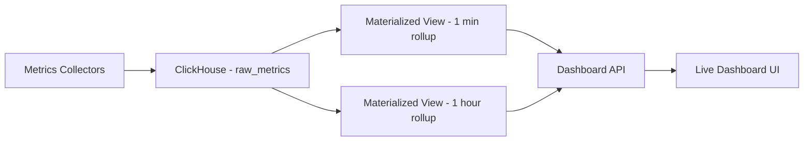
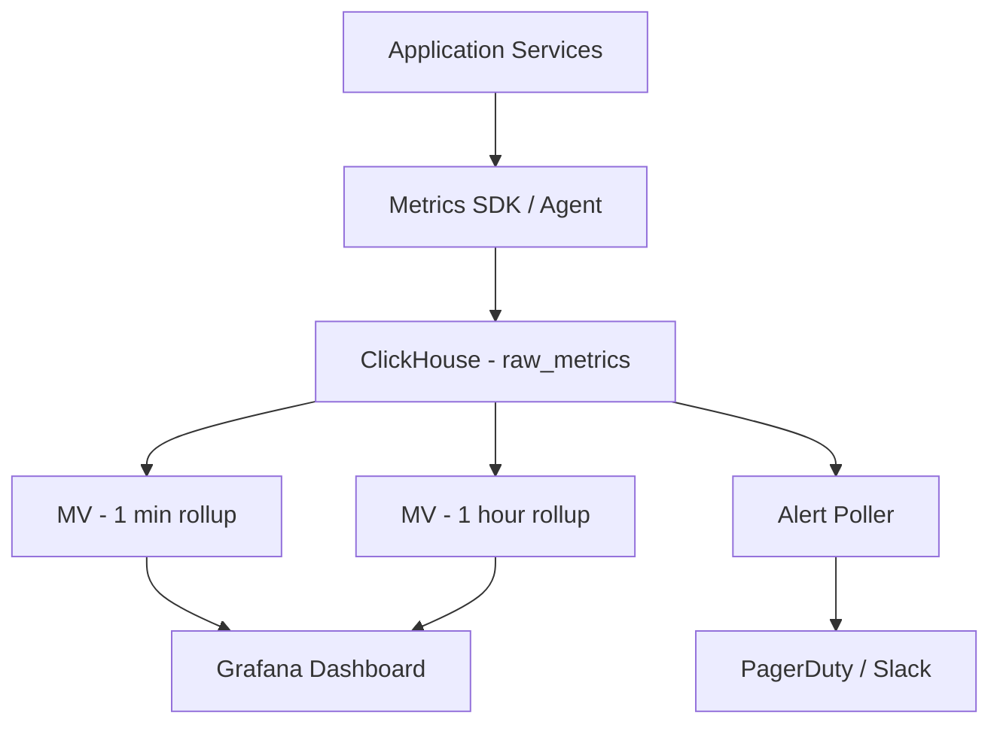

# How to Build a Real-Time Metrics Dashboard with ClickHouse

Author: [oneuptime](https://github.com/oneuptime)

Tags: ClickHouse, Monitoring, Metrics, Dashboard, Tutorial, Observability

Description: Build a real-time metrics dashboard with ClickHouse - covering schema design for time-series metrics, downsampling with materialized views, and live dashboard queries.

## Overview

A real-time metrics dashboard needs to ingest high-frequency metric data (CPU, memory, request rates, error counts) and display aggregated charts with second-level refresh. ClickHouse handles this pattern exceptionally well through its MergeTree engine, materialized views for pre-aggregation, and fast columnar aggregations.



## Schema Design

### Raw Metrics Table

```sql
CREATE TABLE raw_metrics (
    metric_name     LowCardinality(String),
    service         LowCardinality(String),
    host            LowCardinality(String),
    environment     LowCardinality(String),
    tags            Map(String, String),
    value           Float64,
    collected_at    DateTime64(3)
) ENGINE = MergeTree()
PARTITION BY toYYYYMMDD(collected_at)
ORDER BY (metric_name, service, host, collected_at)
TTL toDate(collected_at) + INTERVAL 7 DAY DELETE;
```

### Pre-Aggregated Rollup Tables

Use materialized views to maintain 1-minute and 1-hour rollups. This dramatically speeds up dashboard queries over longer time ranges.

```sql
-- 1-minute rollup table
CREATE TABLE metrics_1m (
    metric_name     LowCardinality(String),
    service         LowCardinality(String),
    host            LowCardinality(String),
    bucket          DateTime,
    min_value       SimpleAggregateFunction(min, Float64),
    max_value       SimpleAggregateFunction(max, Float64),
    sum_value       SimpleAggregateFunction(sum, Float64),
    count_value     SimpleAggregateFunction(sum, UInt64)
) ENGINE = AggregatingMergeTree()
PARTITION BY toYYYYMM(bucket)
ORDER BY (metric_name, service, host, bucket)
TTL toDate(bucket) + INTERVAL 30 DAY DELETE;

-- Materialized view to populate 1-minute rollup
CREATE MATERIALIZED VIEW metrics_1m_mv TO metrics_1m AS
SELECT
    metric_name,
    service,
    host,
    toStartOfMinute(collected_at)   AS bucket,
    min(value)                      AS min_value,
    max(value)                      AS max_value,
    sum(value)                      AS sum_value,
    count()                         AS count_value
FROM raw_metrics
GROUP BY metric_name, service, host, bucket;

-- 1-hour rollup table
CREATE TABLE metrics_1h (
    metric_name     LowCardinality(String),
    service         LowCardinality(String),
    host            LowCardinality(String),
    bucket          DateTime,
    min_value       SimpleAggregateFunction(min, Float64),
    max_value       SimpleAggregateFunction(max, Float64),
    sum_value       SimpleAggregateFunction(sum, Float64),
    count_value     SimpleAggregateFunction(sum, UInt64)
) ENGINE = AggregatingMergeTree()
PARTITION BY toYYYYMM(bucket)
ORDER BY (metric_name, service, host, bucket)
TTL toDate(bucket) + INTERVAL 365 DAY DELETE;

CREATE MATERIALIZED VIEW metrics_1h_mv TO metrics_1h AS
SELECT
    metric_name,
    service,
    host,
    toStartOfHour(collected_at)     AS bucket,
    min(value)                      AS min_value,
    max(value)                      AS max_value,
    sum(value)                      AS sum_value,
    count()                         AS count_value
FROM raw_metrics
GROUP BY metric_name, service, host, bucket;
```

## Ingesting Metrics

Send metrics from your services to ClickHouse via the HTTP API or a dedicated metrics shipper.

```python
# Python: send metrics to ClickHouse
import requests
import json
from datetime import datetime

def send_metrics(metrics):
    rows = "\n".join(json.dumps(m) for m in metrics)
    requests.post(
        "http://clickhouse:8123/?query=INSERT+INTO+raw_metrics+FORMAT+JSONEachRow",
        data=rows.encode("utf-8")
    )

# Example batch
send_metrics([
    {
        "metric_name": "cpu_usage_pct",
        "service": "api",
        "host": "api-1",
        "environment": "production",
        "tags": {"region": "us-east-1"},
        "value": 45.2,
        "collected_at": datetime.utcnow().strftime("%Y-%m-%d %H:%M:%S.%f")[:-3]
    }
])
```

## Dashboard Queries

### Current Values (Last 5 Minutes)

```sql
-- Latest value per host for a metric
SELECT
    host,
    service,
    argMax(value, collected_at)                 AS current_value,
    max(collected_at)                           AS last_seen
FROM raw_metrics
WHERE metric_name = 'cpu_usage_pct'
  AND collected_at >= now() - INTERVAL 5 MINUTE
GROUP BY host, service
ORDER BY current_value DESC;
```

### Time-Series Chart Data

Use raw table for short ranges, rollup tables for longer ranges.

```sql
-- Last 1 hour at 1-minute resolution (from rollup)
SELECT
    bucket,
    avg(sum_value / count_value)                AS avg_value,
    max(max_value)                              AS max_value,
    min(min_value)                              AS min_value
FROM metrics_1m
WHERE metric_name = 'cpu_usage_pct'
  AND service = 'api'
  AND bucket >= now() - INTERVAL 1 HOUR
GROUP BY bucket
ORDER BY bucket;

-- Last 7 days at 1-hour resolution (from rollup)
SELECT
    bucket,
    avg(sum_value / count_value)                AS avg_value,
    max(max_value)                              AS max_value
FROM metrics_1h
WHERE metric_name = 'cpu_usage_pct'
  AND service = 'api'
  AND bucket >= now() - INTERVAL 7 DAY
GROUP BY bucket
ORDER BY bucket;
```

### Percentile Queries

For latency metrics, you need percentiles. Store histogram data or use quantile functions.

```sql
-- P50, P95, P99 request latency over the last hour
SELECT
    toStartOfMinute(collected_at)               AS minute,
    service,
    quantile(0.50)(value)                       AS p50_ms,
    quantile(0.95)(value)                       AS p95_ms,
    quantile(0.99)(value)                       AS p99_ms
FROM raw_metrics
WHERE metric_name = 'request_duration_ms'
  AND collected_at >= now() - INTERVAL 1 HOUR
GROUP BY minute, service
ORDER BY minute;
```

### Anomaly Detection

```sql
-- Find metrics currently above 2 standard deviations from 7-day average
WITH baseline AS (
    SELECT
        metric_name,
        service,
        host,
        avg(sum_value / count_value)            AS avg_value,
        stddevSamp(sum_value / count_value)     AS stddev_value
    FROM metrics_1h
    WHERE bucket >= now() - INTERVAL 7 DAY
    GROUP BY metric_name, service, host
),
current AS (
    SELECT
        metric_name,
        service,
        host,
        avg(value)                              AS current_avg
    FROM raw_metrics
    WHERE collected_at >= now() - INTERVAL 5 MINUTE
    GROUP BY metric_name, service, host
)
SELECT
    c.metric_name,
    c.service,
    c.host,
    c.current_avg,
    b.avg_value                                 AS baseline_avg,
    round((c.current_avg - b.avg_value) /
        nullIf(b.stddev_value, 0), 2)           AS z_score
FROM current c
JOIN baseline b USING (metric_name, service, host)
WHERE abs(z_score) > 2
ORDER BY abs(z_score) DESC;
```

## Alert Queries

```sql
-- Services with CPU above 90% for more than 5 minutes
SELECT
    service,
    host,
    min(collected_at)                           AS high_cpu_since,
    avg(value)                                  AS avg_cpu_pct
FROM raw_metrics
WHERE metric_name = 'cpu_usage_pct'
  AND collected_at >= now() - INTERVAL 10 MINUTE
GROUP BY service, host
HAVING avg_cpu_pct > 90
ORDER BY avg_cpu_pct DESC;
```

## Integration with Grafana

ClickHouse has an official Grafana plugin. Configure a ClickHouse data source and use the query editor to build panels.

```sql
-- Grafana panel query (uses $__timeFilter and $__interval macros)
SELECT
    toStartOfInterval(collected_at, INTERVAL $__interval second) AS time,
    service,
    avg(value)                                  AS avg_cpu
FROM raw_metrics
WHERE metric_name = 'cpu_usage_pct'
  AND $__timeFilter(collected_at)
GROUP BY time, service
ORDER BY time;
```

## Architecture



## Conclusion

ClickHouse is highly effective for real-time metrics dashboards. The combination of high-throughput inserts, materialized views for pre-aggregation, and fast columnar queries enables dashboards that refresh every few seconds over billions of data points. The tiered rollup architecture ensures queries over long time ranges remain fast without scanning raw data.

**Related Reading:**

- [How to Monitor Database Query Performance with ClickHouse](https://oneuptime.com/blog/post/2026-03-31-clickhouse-monitor-database-query-performance/view)
- [How to Build a Log Analytics Platform with ClickHouse](https://oneuptime.com/blog/post/2026-03-31-clickhouse-build-log-analytics-platform/view)
- [How to Build a Smart Home Data Platform with ClickHouse](https://oneuptime.com/blog/post/2026-03-31-clickhouse-build-smart-home-data-platform/view)
