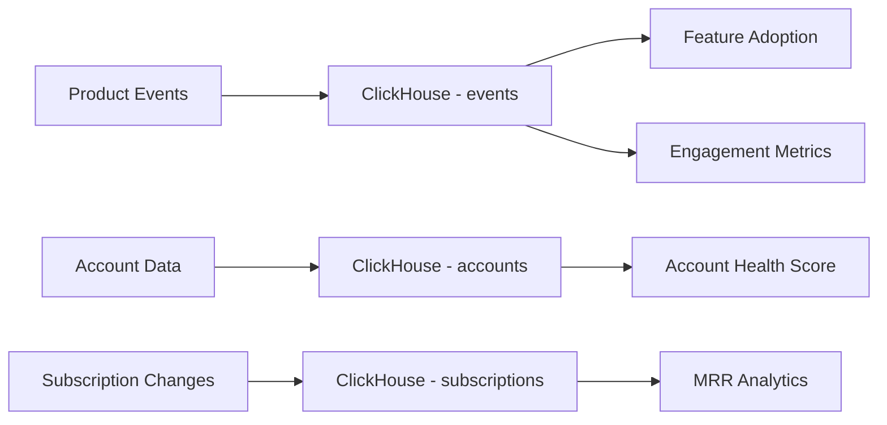
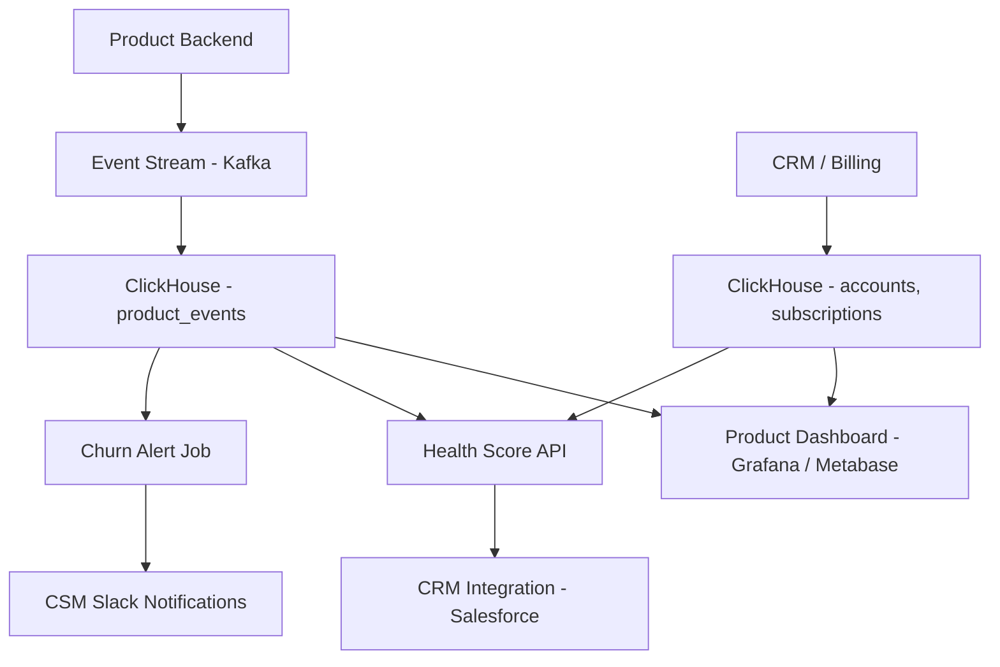

# How to Build a SaaS Usage Analytics System with ClickHouse

Author: [nawazdhandala](https://www.github.com/nawazdhandala)

Tags: ClickHouse, SaaS, Analytics, Product Analytics, Tutorial, Database

Description: Build a comprehensive SaaS usage analytics system with ClickHouse, covering feature adoption tracking, DAU/MAU metrics, churn signals, account health scoring, and product dashboards.

## Overview

SaaS companies need to understand how users engage with their product: which features are being adopted, which accounts are at risk of churning, and which behaviors correlate with expansion revenue. ClickHouse enables fast, flexible queries over billions of product events, making it possible to answer these questions in real time without expensive analytics tooling.



## Schema Design

### Events Table

```sql
CREATE TABLE product_events (
    event_id        String,
    account_id      String,
    user_id         String,
    event_type      LowCardinality(String),
    feature         LowCardinality(String),
    occurred_at     DateTime,
    properties      Map(String, String)
) ENGINE = MergeTree()
PARTITION BY toYYYYMM(occurred_at)
ORDER BY (account_id, occurred_at)
SETTINGS index_granularity = 8192;
```

### Accounts Table

```sql
CREATE TABLE accounts (
    account_id      String,
    name            String,
    plan            LowCardinality(String),
    mrr_usd         Decimal(10, 2),
    seat_count      UInt16,
    industry        LowCardinality(String),
    region          LowCardinality(String),
    created_at      DateTime,
    churned_at      Nullable(DateTime),
    is_churned      UInt8,
    csm_owner       String,
    last_updated_at DateTime
) ENGINE = ReplacingMergeTree(last_updated_at)
ORDER BY account_id;
```

### Subscriptions Table

```sql
CREATE TABLE subscription_events (
    event_id        String,
    account_id      String,
    event_type      LowCardinality(String),
    plan_from       LowCardinality(String),
    plan_to         LowCardinality(String),
    mrr_before      Decimal(10, 2),
    mrr_after       Decimal(10, 2),
    occurred_at     DateTime
) ENGINE = MergeTree()
ORDER BY (account_id, occurred_at);
```

## Daily and Monthly Active Users

```sql
-- DAU, WAU, MAU with stickiness ratios
SELECT
    toDate(occurred_at)                             AS day,
    uniq(user_id)                                   AS dau
FROM product_events
WHERE occurred_at >= today() - 30
GROUP BY day
ORDER BY day;

-- Stickiness: DAU/MAU ratio
WITH dau AS (
    SELECT toDate(occurred_at) AS day, uniq(user_id) AS value
    FROM product_events
    WHERE occurred_at >= today() - 30
    GROUP BY day
),
mau AS (
    SELECT uniq(user_id) AS value
    FROM product_events
    WHERE occurred_at >= today() - 30
)
SELECT
    d.day,
    d.value                                         AS dau,
    m.value                                         AS mau,
    round(d.value * 100.0 / m.value, 2)             AS stickiness_pct
FROM dau d, mau m
ORDER BY d.day;
```

## Feature Adoption

```sql
-- Feature adoption rate: % of accounts that used each feature
SELECT
    feature,
    uniq(account_id)                                AS accounts_used,
    (SELECT uniq(account_id) FROM accounts FINAL
     WHERE is_churned = 0)                          AS total_active_accounts,
    round(uniq(account_id) * 100.0 /
        (SELECT uniq(account_id) FROM accounts FINAL
         WHERE is_churned = 0), 2)                  AS adoption_rate_pct,
    avg(feature_uses_per_account)                   AS avg_uses_per_adopter
FROM (
    SELECT
        feature,
        account_id,
        count()                                     AS feature_uses_per_account
    FROM product_events
    WHERE occurred_at >= today() - 30
    GROUP BY feature, account_id
)
GROUP BY feature
ORDER BY adoption_rate_pct DESC;
```

### Feature Adoption Trend

```sql
-- Week-over-week feature adoption
SELECT
    toMonday(occurred_at)                           AS week,
    feature,
    uniq(account_id)                                AS accounts_used
FROM product_events
WHERE occurred_at >= today() - 90
GROUP BY week, feature
ORDER BY feature, week;
```

## Account Health Scoring

Define a health score based on engagement signals.

```sql
-- Account health score based on recent activity
WITH account_activity AS (
    SELECT
        account_id,
        countIf(occurred_at >= today() - 7)         AS events_last_7d,
        countIf(occurred_at >= today() - 30)        AS events_last_30d,
        uniqIf(user_id, occurred_at >= today() - 7) AS active_users_last_7d,
        uniqIf(feature, occurred_at >= today() - 30) AS features_used_last_30d,
        max(occurred_at)                            AS last_active_at
    FROM product_events
    WHERE occurred_at >= today() - 30
    GROUP BY account_id
)
SELECT
    a.account_id,
    a.name,
    a.plan,
    a.mrr_usd,
    act.events_last_7d,
    act.active_users_last_7d,
    act.features_used_last_30d,
    act.last_active_at,
    -- Simple weighted health score
    least(100,
        (act.events_last_7d * 0.3) +
        (act.active_users_last_7d / greatest(a.seat_count, 1) * 100 * 0.4) +
        (act.features_used_last_30d * 5 * 0.3)
    )                                               AS health_score,
    CASE
        WHEN dateDiff('day', act.last_active_at, today()) > 14 THEN 'Critical'
        WHEN dateDiff('day', act.last_active_at, today()) > 7  THEN 'At Risk'
        WHEN act.events_last_7d = 0                            THEN 'At Risk'
        ELSE 'Healthy'
    END                                             AS health_status
FROM accounts a FINAL
LEFT JOIN account_activity act ON a.account_id = act.account_id
WHERE a.is_churned = 0
ORDER BY health_score ASC;
```

## MRR Analytics

```sql
-- Monthly MRR movement: new, expansion, contraction, churn
SELECT
    toStartOfMonth(occurred_at)                     AS month,
    sumIf(mrr_after - mrr_before,
        event_type = 'expansion')                   AS expansion_mrr,
    sumIf(mrr_before - mrr_after,
        event_type = 'contraction')                 AS contraction_mrr,
    sumIf(mrr_after,
        event_type = 'new')                         AS new_mrr,
    sumIf(mrr_before,
        event_type = 'churn')                       AS churned_mrr,
    sumIf(mrr_after, event_type = 'new') +
    sumIf(mrr_after - mrr_before, event_type = 'expansion') -
    sumIf(mrr_before - mrr_after, event_type = 'contraction') -
    sumIf(mrr_before, event_type = 'churn')         AS net_new_mrr
FROM subscription_events
WHERE occurred_at >= today() - 365
GROUP BY month
ORDER BY month;
```

## Churn Prediction Signals

```sql
-- Accounts showing churn warning signs
SELECT
    a.account_id,
    a.name,
    a.plan,
    a.mrr_usd,
    a.csm_owner,
    dateDiff('day', act.last_active_at, today())    AS days_since_last_activity,
    act.events_last_30d,
    act.active_users_last_7d,
    -- Warning flags
    (dateDiff('day', act.last_active_at, today()) > 7)      AS no_activity_warning,
    (act.events_last_30d < avg_events * 0.5)                AS usage_drop_warning,
    (act.active_users_last_7d < a.seat_count * 0.3)         AS low_adoption_warning
FROM accounts a FINAL
JOIN (
    SELECT
        account_id,
        max(occurred_at)                            AS last_active_at,
        count()                                     AS events_last_30d,
        uniqIf(user_id, occurred_at >= today() - 7) AS active_users_last_7d,
        avg(daily_events)                           AS avg_events
    FROM (
        SELECT
            account_id,
            toDate(occurred_at)                     AS day,
            uniq(user_id)                           AS active_users,
            count()                                 AS daily_events
        FROM product_events
        WHERE occurred_at >= today() - 30
        GROUP BY account_id, day
    )
    GROUP BY account_id
) act ON a.account_id = act.account_id
WHERE a.is_churned = 0
  AND a.mrr_usd > 0
  AND (
      no_activity_warning
      OR usage_drop_warning
      OR low_adoption_warning
  )
ORDER BY a.mrr_usd DESC;
```

## Product Usage Funnel

```sql
-- Onboarding funnel: steps completed by new accounts in first 14 days
WITH new_accounts AS (
    SELECT account_id, created_at
    FROM accounts FINAL
    WHERE created_at >= today() - 90
),
steps AS (
    SELECT
        e.account_id,
        countIf(event_type = 'invite_sent')         > 0 AS step_invite,
        countIf(event_type = 'integration_connected') > 0 AS step_integrate,
        countIf(event_type = 'first_report')        > 0 AS step_report,
        countIf(event_type = 'dashboard_created')   > 0 AS step_dashboard
    FROM product_events e
    JOIN new_accounts na ON e.account_id = na.account_id
    WHERE e.occurred_at <= na.created_at + INTERVAL 14 DAY
    GROUP BY e.account_id
)
SELECT
    count()                                         AS total_new_accounts,
    countIf(step_invite)                            AS completed_invite,
    countIf(step_integrate)                         AS completed_integrate,
    countIf(step_report)                            AS completed_report,
    countIf(step_dashboard)                         AS completed_dashboard,
    round(countIf(step_invite) * 100.0 / count(), 1) AS invite_pct,
    round(countIf(step_dashboard) * 100.0 / count(), 1) AS full_onboard_pct
FROM steps;
```

## Architecture



## Conclusion

ClickHouse enables SaaS companies to build a powerful product analytics platform in-house. Feature adoption rates, DAU/MAU stickiness, account health scoring, MRR analytics, and churn prediction signals are all achievable with standard SQL and ClickHouse's built-in aggregation functions. The result is a fast, cost-effective alternative to commercial product analytics tools that keeps your data in your own infrastructure.

**Related Reading:**

- [How to Build Audience Segmentation with ClickHouse](https://oneuptime.com/blog/post/2026-03-31-clickhouse-build-audience-segmentation/view)
- [How to Build a Web Analytics System with ClickHouse](https://oneuptime.com/blog/post/2026-03-31-clickhouse-build-web-analytics-system/view)
- [ClickHouse vs Snowflake for Analytics](https://oneuptime.com/blog/post/2026-03-31-clickhouse-vs-snowflake-analytics/view)
