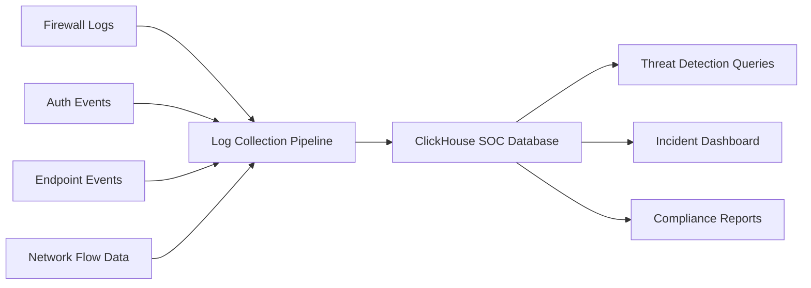
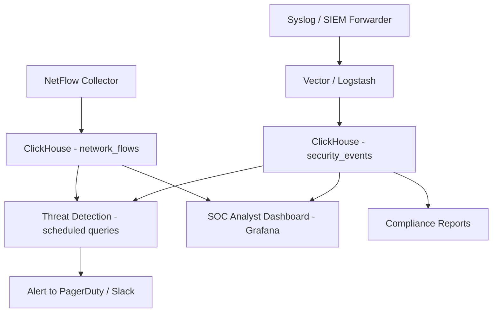

# How to Build a Security Operations Center with ClickHouse

Author: [nawazdhandala](https://www.github.com/nawazdhandala)

Tags: ClickHouse, Security, Analytics, Tutorial, Database, SOC

Description: Build a Security Operations Center data platform with ClickHouse, covering log ingestion, threat detection queries, anomaly detection, incident tracking, and compliance reporting.

## Overview

A Security Operations Center (SOC) needs to ingest and analyze massive volumes of security logs, network events, and authentication data. The core challenge is to identify threats among billions of benign events. ClickHouse handles this with high ingestion throughput, fast filtering and aggregation, and powerful time-series analysis - all at significantly lower cost than commercial SIEM solutions.



## Schema Design

### Security Events Table

```sql
CREATE TABLE security_events (
    event_id        String,
    source_system   LowCardinality(String),
    event_type      LowCardinality(String),
    severity        LowCardinality(String),
    severity_level  UInt8,

    -- Actor
    user_id         String,
    username        String,
    source_ip       IPv4,
    source_country  LowCardinality(String),

    -- Target
    target_host     String,
    target_ip       Nullable(IPv4),
    target_port     Nullable(UInt16),
    target_resource String,

    -- Outcome
    action          LowCardinality(String),
    outcome         LowCardinality(String),

    -- Payload
    raw_log         String,
    attributes      Map(String, String),

    occurred_at     DateTime64(3)
) ENGINE = MergeTree()
PARTITION BY toYYYYMMDD(occurred_at)
ORDER BY (source_system, occurred_at)
TTL toDate(occurred_at) + INTERVAL 365 DAY DELETE
SETTINGS index_granularity = 8192;

-- Indexes for threat hunting
ALTER TABLE security_events ADD INDEX idx_source_ip source_ip
    TYPE bloom_filter(0.01) GRANULARITY 4;
ALTER TABLE security_events ADD INDEX idx_user username
    TYPE bloom_filter(0.01) GRANULARITY 4;
ALTER TABLE security_events ADD INDEX idx_event_type event_type
    TYPE set(100) GRANULARITY 4;
```

### Network Flow Table

```sql
CREATE TABLE network_flows (
    flow_id         String,
    src_ip          IPv4,
    dst_ip          IPv4,
    src_port        UInt16,
    dst_port        UInt16,
    protocol        LowCardinality(String),
    bytes_sent      UInt64,
    bytes_received  UInt64,
    packets_sent    UInt32,
    packets_received UInt32,
    duration_ms     UInt32,
    started_at      DateTime64(3),
    is_blocked      UInt8
) ENGINE = MergeTree()
PARTITION BY toYYYYMMDD(started_at)
ORDER BY (src_ip, started_at)
TTL toDate(started_at) + INTERVAL 90 DAY DELETE;
```

## Threat Detection Queries

### Brute Force Detection

```sql
-- IP addresses with many failed authentication attempts
SELECT
    source_ip,
    source_country,
    username,
    count()                                         AS failed_attempts,
    min(occurred_at)                                AS first_attempt,
    max(occurred_at)                                AS last_attempt,
    dateDiff('second', min(occurred_at), max(occurred_at)) AS window_seconds
FROM security_events
WHERE event_type = 'authentication'
  AND outcome = 'failure'
  AND occurred_at >= now() - INTERVAL 1 HOUR
GROUP BY source_ip, source_country, username
HAVING failed_attempts >= 10
ORDER BY failed_attempts DESC;
```

### Credential Stuffing Detection

```sql
-- IPs attempting to login with many different usernames
SELECT
    source_ip,
    source_country,
    uniq(username)                                  AS unique_usernames_tried,
    count()                                         AS total_attempts,
    countIf(outcome = 'failure')                    AS failures,
    countIf(outcome = 'success')                    AS successes
FROM security_events
WHERE event_type = 'authentication'
  AND occurred_at >= now() - INTERVAL 1 HOUR
GROUP BY source_ip, source_country
HAVING unique_usernames_tried >= 5
ORDER BY unique_usernames_tried DESC;
```

### Lateral Movement Detection

```sql
-- Users authenticating to many different internal hosts
SELECT
    username,
    user_id,
    uniq(target_host)                               AS hosts_accessed,
    count()                                         AS total_auth_events,
    groupArray(10)(DISTINCT target_host)            AS sample_hosts
FROM security_events
WHERE event_type = 'authentication'
  AND outcome = 'success'
  AND source_system IN ('active_directory', 'ssh', 'rdp')
  AND occurred_at >= now() - INTERVAL 2 HOUR
GROUP BY username, user_id
HAVING hosts_accessed >= 10
ORDER BY hosts_accessed DESC;
```

### Data Exfiltration Detection

```sql
-- Users transferring unusually large amounts of data
WITH user_baselines AS (
    SELECT
        username,
        avg(bytes_sent)                             AS avg_daily_bytes
    FROM (
        SELECT
            username,
            toDate(occurred_at)                     AS day,
            sum(toUInt64OrZero(attributes['bytes_transferred'])) AS bytes_sent
        FROM security_events
        WHERE event_type = 'file_transfer'
          AND occurred_at >= today() - 30
        GROUP BY username, day
    )
    GROUP BY username
),
today_activity AS (
    SELECT
        username,
        sum(toUInt64OrZero(attributes['bytes_transferred'])) AS bytes_today
    FROM security_events
    WHERE event_type = 'file_transfer'
      AND toDate(occurred_at) = today()
    GROUP BY username
)
SELECT
    t.username,
    t.bytes_today,
    b.avg_daily_bytes,
    round(t.bytes_today / nullIf(b.avg_daily_bytes, 0), 1) AS anomaly_ratio
FROM today_activity t
JOIN user_baselines b ON t.username = b.username
WHERE anomaly_ratio > 5
  AND t.bytes_today > 100000000      -- at least 100MB
ORDER BY anomaly_ratio DESC;
```

### Impossible Travel Detection

```sql
-- Users logging in from geographically distant IPs within a short window
SELECT
    a.user_id,
    a.username,
    a.source_ip                                     AS ip_1,
    a.source_country                                AS country_1,
    a.occurred_at                                   AS login_1,
    b.source_ip                                     AS ip_2,
    b.source_country                                AS country_2,
    b.occurred_at                                   AS login_2,
    dateDiff('minute', a.occurred_at, b.occurred_at) AS minutes_between
FROM security_events a
JOIN security_events b ON a.user_id = b.user_id
WHERE a.event_type = 'authentication'
  AND b.event_type = 'authentication'
  AND a.outcome = 'success'
  AND b.outcome = 'success'
  AND a.source_country != b.source_country
  AND b.occurred_at > a.occurred_at
  AND dateDiff('minute', a.occurred_at, b.occurred_at) < 120
  AND a.occurred_at >= now() - INTERVAL 24 HOUR
ORDER BY minutes_between;
```

## Network Anomaly Detection

```sql
-- Hosts communicating with unusual destinations (new IPs not seen in last 30 days)
WITH known_destinations AS (
    SELECT DISTINCT src_ip, dst_ip
    FROM network_flows
    WHERE started_at >= today() - 30
      AND started_at < today()
),
today_flows AS (
    SELECT DISTINCT src_ip, dst_ip
    FROM network_flows
    WHERE started_at >= today()
)
SELECT
    t.src_ip,
    t.dst_ip,
    count()                                         AS connection_count,
    sum(bytes_sent)                                 AS bytes_sent
FROM today_flows t
LEFT JOIN known_destinations k ON t.src_ip = k.src_ip AND t.dst_ip = k.dst_ip
JOIN network_flows nf ON t.src_ip = nf.src_ip AND t.dst_ip = nf.dst_ip
WHERE k.dst_ip IS NULL    -- new destination, not seen in last 30 days
  AND nf.started_at >= today()
GROUP BY t.src_ip, t.dst_ip
ORDER BY bytes_sent DESC;
```

## Incident Tracking

```sql
CREATE TABLE incidents (
    incident_id     String,
    title           String,
    severity        LowCardinality(String),
    status          LowCardinality(String),
    assigned_to     String,
    source_system   LowCardinality(String),
    related_ips     Array(String),
    related_users   Array(String),
    opened_at       DateTime,
    closed_at       Nullable(DateTime),
    notes           String
) ENGINE = MergeTree()
ORDER BY opened_at;

-- Mean time to resolve by severity
SELECT
    severity,
    count()                                         AS total_incidents,
    countIf(status = 'closed')                      AS resolved,
    round(avg(dateDiff('hour', opened_at, closed_at)), 1) AS avg_mttр_hours
FROM incidents
WHERE opened_at >= today() - 90
  AND closed_at IS NOT NULL
GROUP BY severity
ORDER BY severity;
```

## Compliance Reporting

```sql
-- Access audit: privileged account activity in the last 30 days
SELECT
    username,
    source_ip,
    source_country,
    target_host,
    action,
    outcome,
    occurred_at
FROM security_events
WHERE event_type IN ('privileged_access', 'sudo', 'admin_login')
  AND occurred_at >= today() - 30
ORDER BY occurred_at DESC
LIMIT 1000;
```

## Architecture



## Conclusion

ClickHouse is a powerful platform for SOC analytics. Its ability to ingest billions of security events, search through them with bloom filter indexes, and run complex correlation queries in seconds makes it a cost-effective alternative or complement to commercial SIEM platforms. The combination of fast time-series queries, rich aggregation functions, and low storage cost makes it well-suited for both real-time threat detection and long-term forensic investigation.

**Related Reading:**

- [How to Build a Log Analytics Platform with ClickHouse](https://oneuptime.com/blog/post/2026-03-31-clickhouse-build-log-analytics-platform/view)
- [How to Build Network Capacity Planning with ClickHouse](https://oneuptime.com/blog/post/2026-03-31-clickhouse-build-network-capacity-planning/view)
- [How to Monitor Database Query Performance with ClickHouse](https://oneuptime.com/blog/post/2026-03-31-clickhouse-monitor-database-query-performance/view)
