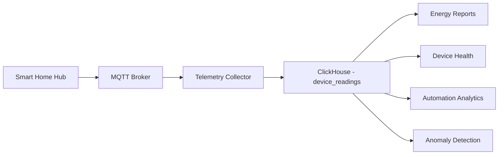
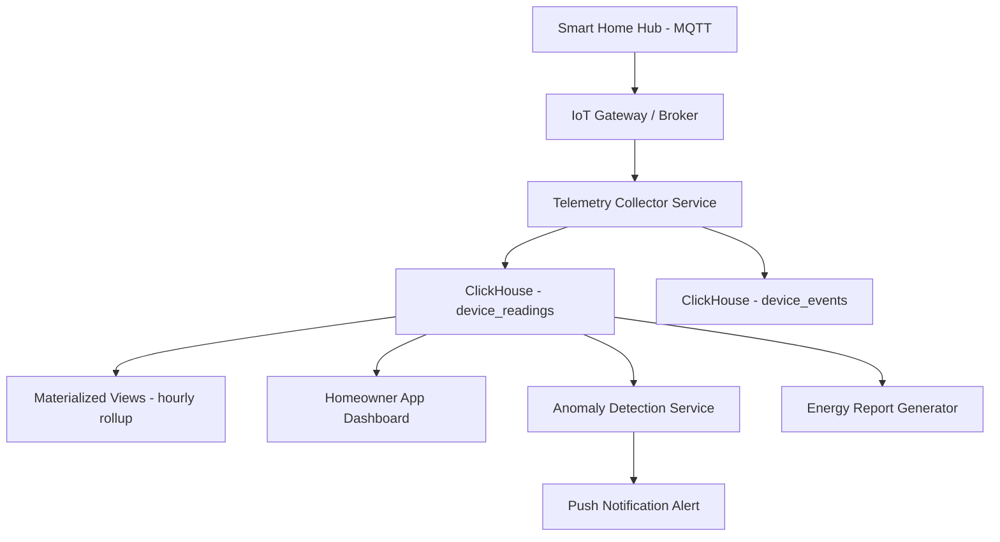

# How to Build a Smart Home Data Platform with ClickHouse

Author: [oneuptime](https://github.com/oneuptime)

Tags: ClickHouse, IoT, Smart home, Analytics, Tutorial, Time-series

Description: Build a smart home data platform with ClickHouse - covering device telemetry ingestion, energy consumption analysis, automation rule analytics, anomaly detection, and multi-home reporting.

## Overview

Smart home platforms collect continuous telemetry from dozens of devices per household: thermostats, energy meters, door sensors, lighting controllers, and appliances. Aggregating this data across thousands of homes and answering questions about energy usage, device health, and automation effectiveness requires a database built for time-series scale. ClickHouse handles this workload with efficient columnar storage, fast aggregations, and excellent time-series functions.



## Schema Design

### Device Readings Table

```sql
CREATE TABLE device_readings (
    -- Device identification
    home_id         String,
    device_id       String,
    device_type     LowCardinality(String),
    device_name     LowCardinality(String),
    room            LowCardinality(String),

    -- Metric
    metric          LowCardinality(String),
    value           Float64,
    unit            LowCardinality(String),

    -- State
    quality         LowCardinality(String),
    battery_pct     Nullable(UInt8),

    collected_at    DateTime64(3)
) ENGINE = MergeTree()
PARTITION BY toYYYYMMDD(collected_at)
ORDER BY (home_id, device_id, collected_at)
TTL toDate(collected_at) + INTERVAL 730 DAY DELETE
SETTINGS index_granularity = 8192;
```

### Device Events Table (State Changes, Triggers)

```sql
CREATE TABLE device_events (
    event_id        String,
    home_id         String,
    device_id       String,
    device_type     LowCardinality(String),
    event_type      LowCardinality(String),
    previous_state  String,
    new_state       String,
    triggered_by    LowCardinality(String),
    occurred_at     DateTime
) ENGINE = MergeTree()
PARTITION BY toYYYYMM(occurred_at)
ORDER BY (home_id, occurred_at);
```

### Pre-Aggregated Hourly Rollup

```sql
CREATE TABLE device_readings_hourly (
    home_id         LowCardinality(String),
    device_id       LowCardinality(String),
    metric          LowCardinality(String),
    hour            DateTime,
    avg_value       Float64,
    min_value       Float64,
    max_value       Float64,
    reading_count   UInt32
) ENGINE = AggregatingMergeTree()
PARTITION BY toYYYYMM(hour)
ORDER BY (home_id, device_id, metric, hour)
TTL toDate(hour) + INTERVAL 5 YEAR DELETE;

CREATE MATERIALIZED VIEW device_readings_hourly_mv
TO device_readings_hourly AS
SELECT
    home_id,
    device_id,
    metric,
    toStartOfHour(collected_at)         AS hour,
    avg(value)                          AS avg_value,
    min(value)                          AS min_value,
    max(value)                          AS max_value,
    count()                             AS reading_count
FROM device_readings
GROUP BY home_id, device_id, metric, hour;
```

## Energy Consumption Analysis

### Daily Energy Usage per Home

```sql
-- Daily kWh consumption per home
SELECT
    toDate(collected_at)                        AS day,
    home_id,
    sum(value) / 12.0                           AS kwh_consumed  -- 5-min readings * 12 = hourly
FROM device_readings
WHERE metric = 'power_watts'
  AND device_type = 'energy_meter'
  AND collected_at >= today() - 30
GROUP BY day, home_id
ORDER BY day DESC, kwh_consumed DESC;
```

### Energy by Room and Device

```sql
SELECT
    home_id,
    room,
    device_name,
    round(sum(avg_value) / 1000, 2)             AS kwh_last_30d
FROM device_readings_hourly
WHERE metric = 'power_watts'
  AND hour >= today() - 30
GROUP BY home_id, room, device_name
ORDER BY kwh_last_30d DESC;
```

### Peak Demand Hours

```sql
-- Identify peak energy demand hours across all homes
SELECT
    toHour(collected_at)                        AS hour_of_day,
    round(avg(value), 0)                        AS avg_watts,
    round(max(value), 0)                        AS max_watts
FROM device_readings
WHERE metric = 'power_watts'
  AND device_type = 'energy_meter'
  AND collected_at >= today() - 90
GROUP BY hour_of_day
ORDER BY hour_of_day;
```

## Temperature and Climate Analytics

```sql
-- Temperature distribution by room and time of day
SELECT
    room,
    toHour(collected_at)                        AS hour_of_day,
    round(avg(value), 1)                        AS avg_temp_c,
    round(min(value), 1)                        AS min_temp_c,
    round(max(value), 1)                        AS max_temp_c
FROM device_readings
WHERE metric = 'temperature_celsius'
  AND home_id = 'home_001'
  AND collected_at >= today() - 7
GROUP BY room, hour_of_day
ORDER BY room, hour_of_day;

-- Thermostat effectiveness: how often is the home within target range?
SELECT
    home_id,
    countIf(value >= 20 AND value <= 22) * 100.0 / count() AS pct_in_comfort_zone,
    countIf(value < 18)                                     AS too_cold_readings,
    countIf(value > 24)                                     AS too_hot_readings
FROM device_readings
WHERE metric = 'temperature_celsius'
  AND device_type = 'thermostat'
  AND collected_at >= today() - 30
GROUP BY home_id
ORDER BY pct_in_comfort_zone DESC;
```

## Device Health Monitoring

```sql
-- Devices with low battery
SELECT
    home_id,
    device_id,
    device_name,
    device_type,
    room,
    avg(battery_pct)                            AS current_battery_pct,
    max(collected_at)                           AS last_reading
FROM device_readings
WHERE battery_pct IS NOT NULL
  AND collected_at >= now() - INTERVAL 1 HOUR
GROUP BY home_id, device_id, device_name, device_type, room
HAVING current_battery_pct < 20
ORDER BY current_battery_pct;

-- Devices that have stopped reporting (potential offline devices)
SELECT
    home_id,
    device_id,
    device_name,
    device_type,
    room,
    max(collected_at)                           AS last_seen,
    dateDiff('hour', max(collected_at), now())  AS hours_offline
FROM device_readings
WHERE collected_at >= today() - 3
GROUP BY home_id, device_id, device_name, device_type, room
HAVING hours_offline > 2
ORDER BY hours_offline DESC;
```

## Anomaly Detection

```sql
-- Temperature anomalies: readings far outside normal range for that device/hour
WITH device_baselines AS (
    SELECT
        home_id,
        device_id,
        metric,
        toHour(collected_at)                    AS hour_of_day,
        avg(value)                              AS avg_value,
        stddevSamp(value)                       AS stddev_value
    FROM device_readings
    WHERE collected_at >= today() - 30
    GROUP BY home_id, device_id, metric, hour_of_day
)
SELECT
    r.home_id,
    r.device_id,
    r.room,
    r.metric,
    r.value,
    b.avg_value,
    round(abs(r.value - b.avg_value) / nullIf(b.stddev_value, 0), 2) AS z_score,
    r.collected_at
FROM device_readings r
JOIN device_baselines b ON r.home_id = b.home_id
    AND r.device_id = b.device_id
    AND r.metric = b.metric
    AND toHour(r.collected_at) = b.hour_of_day
WHERE r.collected_at >= now() - INTERVAL 1 HOUR
  AND abs(r.value - b.avg_value) / nullIf(b.stddev_value, 0) > 3
ORDER BY z_score DESC;
```

## Automation Rule Analytics

```sql
-- How often does each automation rule trigger?
SELECT
    triggered_by                                AS automation_rule,
    event_type,
    device_type,
    count()                                     AS trigger_count,
    countIf(toHour(occurred_at) BETWEEN 22 AND 6) AS night_triggers,
    countIf(toDayOfWeek(occurred_at) IN (6, 7)) AS weekend_triggers
FROM device_events
WHERE triggered_by != 'manual'
  AND occurred_at >= today() - 30
GROUP BY automation_rule, event_type, device_type
ORDER BY trigger_count DESC;
```

## Multi-Home Fleet Reporting

```sql
-- Fleet summary: key metrics across all homes
SELECT
    count(DISTINCT home_id)                     AS total_homes,
    count(DISTINCT device_id)                   AS total_devices,
    countIf(metric = 'power_watts')             AS energy_readings_today,
    round(avg(value), 0)                        AS avg_power_watts_now,
    countIf(battery_pct < 20)                   AS low_battery_devices
FROM device_readings
WHERE collected_at >= now() - INTERVAL 1 HOUR;

-- Homes ranked by energy efficiency (lower avg daily kWh is better)
SELECT
    home_id,
    round(sum(value) / count(DISTINCT toDate(collected_at)) / 12, 2) AS avg_daily_kwh
FROM device_readings
WHERE metric = 'power_watts'
  AND device_type = 'energy_meter'
  AND collected_at >= today() - 30
GROUP BY home_id
ORDER BY avg_daily_kwh;
```

## Architecture



## Conclusion

ClickHouse is an excellent foundation for smart home data platforms. Its efficient storage of high-frequency sensor data, fast time-series aggregations, materialized views for pre-computed rollups, and built-in statistical functions for anomaly detection cover the full range of smart home analytics requirements. The platform scales from a single home installation to fleet analytics across thousands of homes without changes to the core schema or query patterns.

**Related Reading:**

- [ClickHouse vs CrateDB for IoT Data](https://oneuptime.com/blog/post/2026-03-31-clickhouse-vs-cratedb-for-iot-data/view)
- [How to Build a Real-Time Metrics Dashboard with ClickHouse](https://oneuptime.com/blog/post/2026-03-31-clickhouse-build-real-time-metrics-dashboard/view)
- [How to Build Network Capacity Planning with ClickHouse](https://oneuptime.com/blog/post/2026-03-31-clickhouse-build-network-capacity-planning/view)
