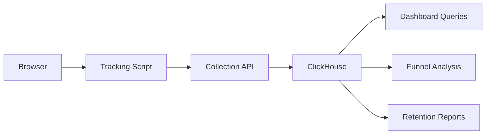
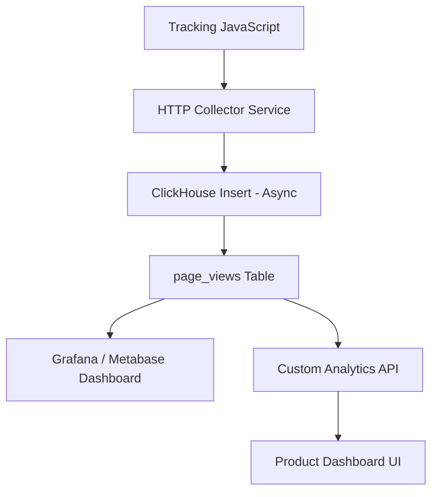

# How to Build a Web Analytics System with ClickHouse

Author: [nawazdhandala](https://www.github.com/nawazdhandala)

Tags: ClickHouse, Web Analytics, Analytics, Database, Tutorial, SQL

Description: Step-by-step guide to building a web analytics system with ClickHouse - covering schema design, event ingestion, session analysis, funnel tracking, and dashboard queries.

## Overview

Web analytics platforms need to ingest millions of page views and user events per day, and then answer questions about traffic, sessions, funnels, and user behavior in real time. ClickHouse is an excellent fit: it handles high-throughput inserts and returns analytical query results in milliseconds.



## Schema Design

The core table is a page views / events table. Use `MergeTree` partitioned by month for efficient time-range queries.

```sql
CREATE TABLE page_views (
    -- Identifiers
    event_id        UUID            DEFAULT generateUUIDv4(),
    session_id      String,
    user_id         String,

    -- Request metadata
    site_id         String,
    url             String,
    path            String,
    referrer        String,
    referrer_domain String,

    -- UTM parameters
    utm_source      String,
    utm_medium      String,
    utm_campaign    String,

    -- Browser / device
    user_agent      String,
    browser         LowCardinality(String),
    os              LowCardinality(String),
    device_type     LowCardinality(String),

    -- Geo
    country_code    LowCardinality(String),
    region          String,
    city            String,

    -- Timing
    viewed_at       DateTime64(3),
    load_time_ms    UInt32,

    -- Custom properties
    properties      String   -- JSON
) ENGINE = MergeTree()
PARTITION BY toYYYYMM(viewed_at)
ORDER BY (site_id, viewed_at, user_id)
SETTINGS index_granularity = 8192;

-- Add a skip index on path for fast path filtering
ALTER TABLE page_views ADD INDEX idx_path path TYPE bloom_filter(0.01) GRANULARITY 4;
```

## Ingesting Events

Collect events from browser tracking scripts and send them to an HTTP endpoint that writes to ClickHouse.

```sql
-- Batch insert from your collection service
INSERT INTO page_views
    (session_id, user_id, site_id, url, path, referrer,
     browser, os, device_type, country_code, viewed_at, load_time_ms)
VALUES
    ('sess_abc', 'user_123', 'mysite.com', 'https://mysite.com/pricing',
     '/pricing', 'https://google.com', 'Chrome', 'macOS', 'desktop',
     'US', '2025-03-31 10:00:00.000', 342),
    ('sess_def', 'user_456', 'mysite.com', 'https://mysite.com/',
     '/', '', 'Safari', 'iOS', 'mobile', 'GB',
     '2025-03-31 10:00:01.000', 210);
```

## Core Analytics Queries

### Unique Visitors and Page Views

```sql
-- Daily unique visitors and page views for the last 30 days
SELECT
    toDate(viewed_at)           AS day,
    uniq(user_id)               AS unique_visitors,
    count()                     AS page_views,
    round(count() / uniq(user_id), 2) AS pages_per_visitor
FROM page_views
WHERE site_id = 'mysite.com'
  AND viewed_at >= today() - 30
GROUP BY day
ORDER BY day;
```

### Top Pages

```sql
SELECT
    path,
    count()                     AS page_views,
    uniq(user_id)               AS unique_visitors,
    round(avg(load_time_ms))    AS avg_load_ms
FROM page_views
WHERE site_id = 'mysite.com'
  AND viewed_at >= today() - 7
GROUP BY path
ORDER BY page_views DESC
LIMIT 20;
```

### Traffic Sources

```sql
SELECT
    if(referrer_domain = '', 'direct', referrer_domain) AS source,
    count()                     AS sessions,
    uniq(user_id)               AS unique_users
FROM page_views
WHERE site_id = 'mysite.com'
  AND viewed_at >= today() - 30
GROUP BY source
ORDER BY sessions DESC
LIMIT 20;
```

## Session Analysis

```sql
-- Session duration and pages per session
WITH sessions AS (
    SELECT
        session_id,
        user_id,
        min(viewed_at)                              AS session_start,
        max(viewed_at)                              AS session_end,
        count()                                     AS pages_in_session,
        dateDiff('second', min(viewed_at), max(viewed_at)) AS duration_seconds
    FROM page_views
    WHERE site_id = 'mysite.com'
      AND viewed_at >= today() - 7
    GROUP BY session_id, user_id
)
SELECT
    round(avg(duration_seconds) / 60, 2)            AS avg_session_minutes,
    round(avg(pages_in_session), 2)                 AS avg_pages_per_session,
    countIf(pages_in_session = 1) * 100.0 / count() AS bounce_rate_pct
FROM sessions;
```

## Funnel Analysis

Track how users progress through a conversion funnel.

```sql
-- Conversion funnel: landing -> pricing -> signup
SELECT
    countIf(has_landing)                    AS step1_landing,
    countIf(has_pricing)                    AS step2_pricing,
    countIf(has_signup)                     AS step3_signup,
    round(countIf(has_pricing) * 100.0
        / countIf(has_landing), 2)          AS landing_to_pricing_pct,
    round(countIf(has_signup) * 100.0
        / countIf(has_pricing), 2)          AS pricing_to_signup_pct
FROM (
    SELECT
        user_id,
        countIf(path = '/')         > 0     AS has_landing,
        countIf(path = '/pricing')  > 0     AS has_pricing,
        countIf(path = '/signup')   > 0     AS has_signup
    FROM page_views
    WHERE site_id = 'mysite.com'
      AND viewed_at >= today() - 30
    GROUP BY user_id
);
```

## Retention Analysis

```sql
-- Weekly retention: cohort of users who first visited in a given week
WITH first_visits AS (
    SELECT
        user_id,
        toMonday(min(viewed_at))            AS cohort_week
    FROM page_views
    WHERE site_id = 'mysite.com'
    GROUP BY user_id
),
activity AS (
    SELECT DISTINCT
        user_id,
        toMonday(viewed_at)                 AS active_week
    FROM page_views
    WHERE site_id = 'mysite.com'
)
SELECT
    f.cohort_week,
    dateDiff('week', f.cohort_week, a.active_week)  AS weeks_since_first,
    uniq(f.user_id)                                 AS retained_users
FROM first_visits f
JOIN activity a USING (user_id)
WHERE f.cohort_week >= today() - 90
GROUP BY f.cohort_week, weeks_since_first
ORDER BY f.cohort_week, weeks_since_first;
```

## Real-Time Dashboard Queries

```sql
-- Live stats: last 30 minutes
SELECT
    toStartOfFiveMinutes(viewed_at)         AS period,
    count()                                 AS page_views,
    uniq(session_id)                        AS active_sessions,
    uniq(user_id)                           AS unique_users
FROM page_views
WHERE site_id = 'mysite.com'
  AND viewed_at >= now() - INTERVAL 30 MINUTE
GROUP BY period
ORDER BY period;
```

## Architecture Overview



## Conclusion

ClickHouse makes it straightforward to build a high-performance web analytics system. With the right schema design and partitioning strategy, you can ingest millions of events per day and answer complex questions about user behavior in milliseconds. The built-in functions for time-series analysis, approximate counting, and window operations cover nearly every analytics use case without requiring additional tooling.

**Related Reading:**

- [How to Build an Ad Click Tracking System with ClickHouse](https://oneuptime.com/blog/post/2026-03-31-clickhouse-build-ad-click-tracking-system/view)
- [How to Build Audience Segmentation with ClickHouse](https://oneuptime.com/blog/post/2026-03-31-clickhouse-build-audience-segmentation/view)
- [How to Build a SaaS Usage Analytics System with ClickHouse](https://oneuptime.com/blog/post/2026-03-31-clickhouse-build-saas-usage-analytics/view)
