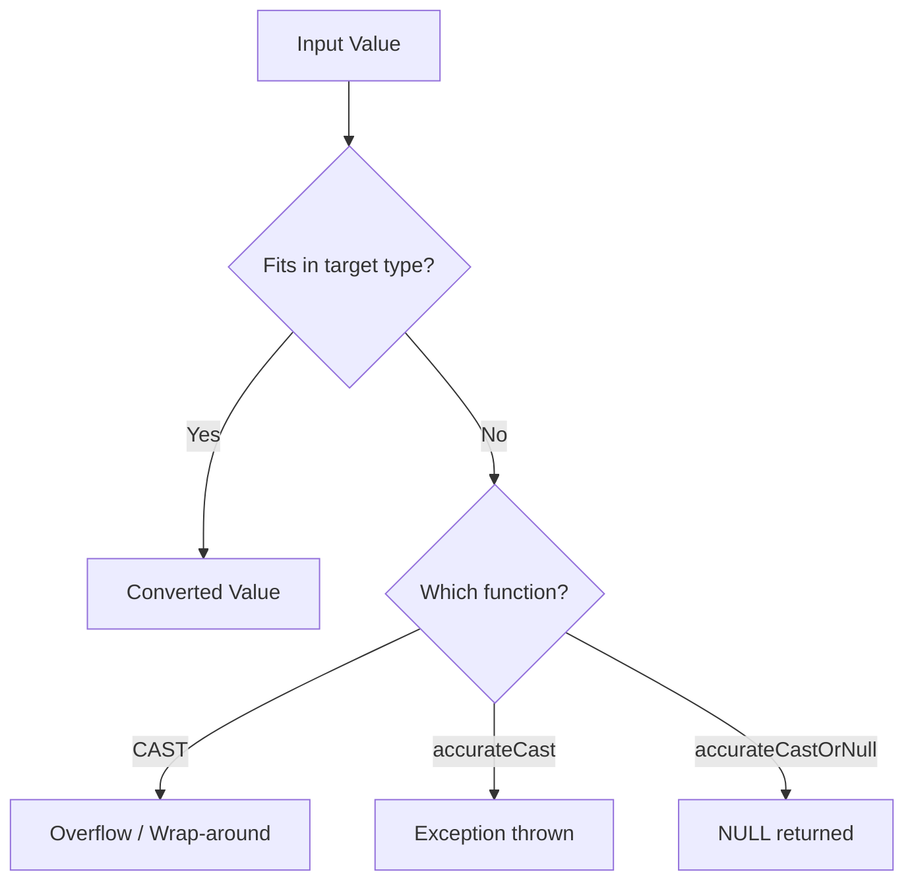

# How to Use CAST() and accurateCast() in ClickHouse

Author: [nawazdhandala](https://www.github.com/nawazdhandala)

Tags: ClickHouse, SQL, Type Conversion, Function, CAST

Description: Understand the difference between CAST() and accurateCast() in ClickHouse, and learn when to use each for safe and predictable type conversions.

---

ClickHouse provides two primary generic type-casting functions: `CAST()` and `accurateCast()`. While both convert a value from one type to another, they behave differently when the value is out of range for the target type. Understanding this difference is critical for writing correct queries.

## How CAST() Works

`CAST(value AS type)` or `CAST(value, 'type')` converts a value to the specified target type. When the source value is out of range for the target type, `CAST()` performs an overflow wrap-around silently, which can produce unexpected results.

## How accurateCast() Works

`accurateCast(value, 'type')` also converts a value, but throws an exception if the source value does not fit in the target type. This makes it the safer choice when you want to detect invalid data rather than silently corrupt it.

## Syntax

```sql
-- CAST variants
CAST(value AS TypeName)
CAST(value, 'TypeName')

-- accurateCast
accurateCast(value, 'TypeName')

-- accurateCastOrNull - returns NULL on failure instead of throwing
accurateCastOrNull(value, 'TypeName')
```

## Behavior Comparison



## Examples

### Basic CAST Usage

Cast a string to an integer and a float:

```sql
SELECT
    CAST('42' AS Int32)       AS str_to_int,
    CAST(3.99 AS Int32)       AS float_to_int,
    CAST(100 AS Float64)      AS int_to_float;
```

```text
str_to_int  float_to_int  int_to_float
42          3             100
```

### Overflow with CAST

`CAST()` wraps around silently on overflow:

```sql
SELECT CAST(300 AS Int8) AS overflowed;
```

```text
overflowed
44
```

### Safe Overflow Detection with accurateCastOrNull

Use `accurateCastOrNull()` to detect values that do not fit the target type:

```sql
SELECT
    accurateCastOrNull(127,  'Int8') AS fits,
    accurateCastOrNull(200,  'Int8') AS doesnt_fit,
    accurateCastOrNull(-128, 'Int8') AS min_fits;
```

```text
fits  doesnt_fit  min_fits
127   NULL        -128
```

### Casting to Nullable Types

You can cast to a `Nullable` type wrapper:

```sql
SELECT
    CAST(NULL AS Nullable(Int32))   AS nullable_int,
    CAST(42   AS Nullable(Int32))   AS nullable_val;
```

```text
nullable_int  nullable_val
NULL          42
```

### Casting Between Date Types

```sql
SELECT
    CAST(today() AS String)                 AS date_to_str,
    CAST('2026-03-31' AS Date)              AS str_to_date,
    CAST('2026-03-31 12:00:00' AS DateTime) AS str_to_datetime;
```

```text
date_to_str  str_to_date  str_to_datetime
2026-03-31   2026-03-31   2026-03-31 12:00:00
```

### Complete Working Example

Validate and clean an ingestion pipeline where ages might be stored as large integers:

```sql
CREATE TABLE user_profiles
(
    user_id UInt32,
    raw_age Int64,
    age     Int8
) ENGINE = MergeTree()
ORDER BY user_id;

INSERT INTO user_profiles (user_id, raw_age, age)
VALUES
    (1, 25,  accurateCastOrNull(25,  'Int8')),
    (2, 42,  accurateCastOrNull(42,  'Int8')),
    (3, 300, accurateCastOrNull(300, 'Int8'));

SELECT user_id, raw_age, age,
    if(isNull(age), 'INVALID', 'OK') AS status
FROM user_profiles;
```

```text
user_id  raw_age  age   status
1        25       25    OK
2        42       42    OK
3        300      NULL  INVALID
```

## Summary

`CAST()` is the SQL-standard casting function that silently wraps values on overflow, while `accurateCast()` throws an exception and `accurateCastOrNull()` returns NULL when the value does not fit. Use `CAST()` for trusted data with known ranges, and use `accurateCastOrNull()` in data validation pipelines where you need to detect and handle out-of-range values gracefully.
