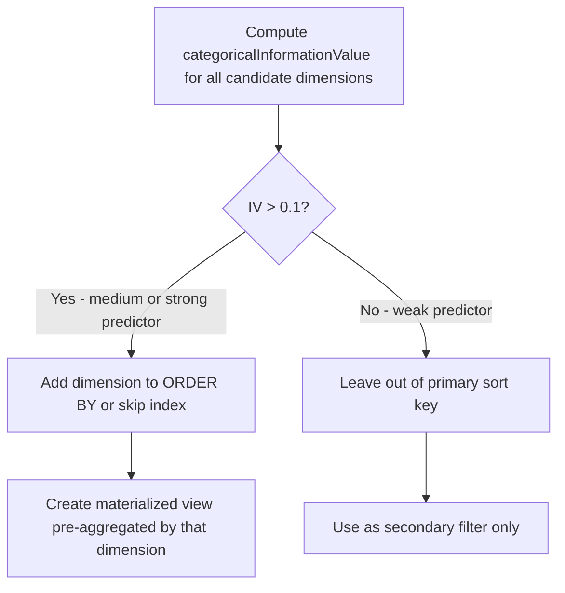

# How to Use categoricalInformationValue() in ClickHouse

Author: [OneUptime](https://www.github.com/OneUptime)

Tags: ClickHouse, SQL, Aggregate Function, Statistics, Feature Selection

Description: Learn how to use categoricalInformationValue() in ClickHouse to measure how much a categorical variable predicts a binary outcome, enabling feature selection and root-cause analysis.

---

`categoricalInformationValue(category, outcome)` computes the information value (IV) of a categorical predictor with respect to a binary outcome. Information value is a statistical measure borrowed from credit scoring and feature selection: a higher IV indicates that the categorical variable is a stronger predictor of the binary outcome. ClickHouse exposes this as a native aggregate function, making it straightforward to run across large event tables.

## Concept

Information value is derived from the Weight of Evidence (WoE) formula. For each category `c`, ClickHouse computes:

```text
IV = sum over c of (P(outcome=1 | c) - P(outcome=0 | c)) * WoE(c)
```

A common rule of thumb:
- IV < 0.02: not predictive
- 0.02 to 0.1: weak predictor
- 0.1 to 0.3: medium predictor
- > 0.3: strong predictor

## Syntax

```sql
-- outcome must be 0 or 1 (UInt8 or similar)
SELECT categoricalInformationValue(category_column, outcome_column) AS iv
FROM table_name;
```

## Basic Example

```sql
-- Does browser type predict whether a user converts?
SELECT
    categoricalInformationValue(browser, converted) AS iv_browser
FROM user_sessions
WHERE session_date >= today() - 30;
```

## Comparing Multiple Features

```sql
-- Rank features by their predictive power for churn
SELECT
    categoricalInformationValue(plan_tier,      churned) AS iv_plan,
    categoricalInformationValue(country,        churned) AS iv_country,
    categoricalInformationValue(signup_channel, churned) AS iv_channel,
    categoricalInformationValue(device_type,    churned) AS iv_device
FROM user_profiles
WHERE cohort_month >= '2025-01-01';
```

## Root-Cause Analysis: Which Dimension Best Predicts Errors?

```sql
-- Find which categorical dimension best predicts HTTP 5xx errors
SELECT
    categoricalInformationValue(service_name,   toUInt8(status_code >= 500)) AS iv_service,
    categoricalInformationValue(region,         toUInt8(status_code >= 500)) AS iv_region,
    categoricalInformationValue(endpoint_group, toUInt8(status_code >= 500)) AS iv_endpoint,
    categoricalInformationValue(host_name,      toUInt8(status_code >= 500)) AS iv_host
FROM request_logs
WHERE log_date = today();
```

## Segmented Analysis Per Product Area

```sql
-- Run IV analysis per product area to find area-specific predictors
SELECT
    product_area,
    categoricalInformationValue(error_type, toUInt8(ticket_created)) AS iv_error_type,
    categoricalInformationValue(user_tier,  toUInt8(ticket_created)) AS iv_user_tier,
    count() AS total_events
FROM support_events
WHERE event_date >= today() - 90
GROUP BY product_area
ORDER BY iv_error_type DESC;
```

## Handling Low-Cardinality vs High-Cardinality Categories

For high-cardinality categories (like `user_id`), IV will be inflated due to overfitting on individual rows. Group high-cardinality columns into buckets first.

```sql
-- Bucket response times into ranges before computing IV
SELECT
    categoricalInformationValue(
        multiIf(
            response_time_ms < 100,  'fast',
            response_time_ms < 500,  'medium',
            response_time_ms < 2000, 'slow',
            'very_slow'
        ),
        toUInt8(status_code >= 500)
    ) AS iv_latency_bucket
FROM request_logs
WHERE log_date = today();
```

## Using IV Results to Guide Index and Materialized View Design



## Time-Series IV: Tracking Feature Importance Over Time

```sql
-- Has the predictive power of 'region' for errors changed over time?
SELECT
    toStartOfWeek(log_date) AS week,
    categoricalInformationValue(region, toUInt8(status_code >= 500)) AS iv_region
FROM request_logs
WHERE log_date >= today() - 90
GROUP BY week
ORDER BY week;
```

## Summary

`categoricalInformationValue(category, outcome)` computes the information value of a categorical predictor relative to a binary target variable. Higher IV means the category is more predictive of the outcome. Use it in ClickHouse for feature selection in ML pipelines, root-cause analysis of errors or churn, A/B test dimension scoring, and guiding schema design decisions such as choosing ORDER BY keys. Always bucket high-cardinality raw identifiers before computing IV to avoid inflated scores from sparse categories.
