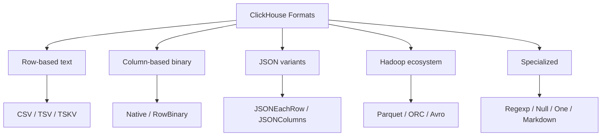
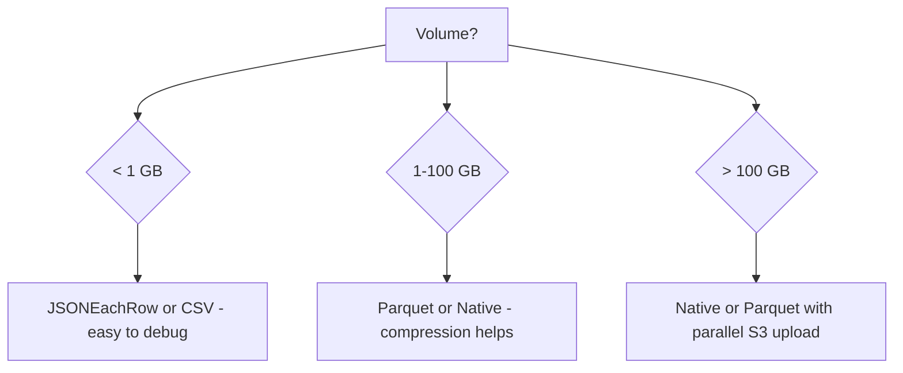
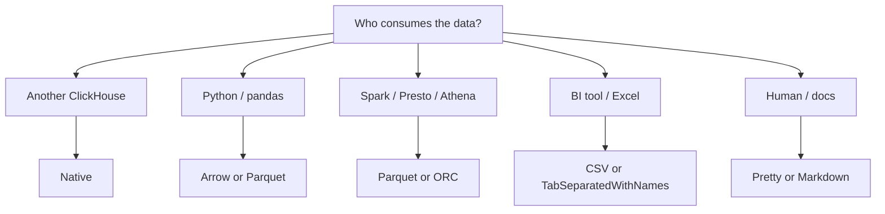

# How to Choose the Right Data Format for Your ClickHouse Use Case

Author: [nawazdhandala](https://www.github.com/nawazdhandala)

Tags: ClickHouse, Format, DataIngestion, Performance, BestPractice

Description: A practical guide to selecting the best ClickHouse data format for bulk ingest, streaming, exports, inter-service transfer, and human-readable output.

---

ClickHouse supports over 70 data formats for reading and writing. Choosing the wrong one can cost you throughput, storage, or developer time. This guide maps the most important formats to the scenarios where they excel.

## Format Categories



## Decision Framework

| Scenario | Recommended format | Reason |
|---|---|---|
| High-throughput bulk insert | `Native` or `RowBinary` | Binary, no parsing overhead |
| Streaming events from Kafka | `JSONEachRow` | One JSON object per line, easy to produce |
| Analytics export to data lake | `Parquet` | Columnar, compressed, Spark/Athena compatible |
| Human-readable debugging | `Pretty` / `PrettyCompact` | Aligned columns in terminal |
| Documentation / reports | `Markdown` | Renders in GitHub/Confluence |
| Interoperability with Python/pandas | `Arrow` or `Parquet` | Zero-copy reads |
| NumPy arrays | `Npy` | Direct numpy dtype encoding |
| Unstructured log parsing | `Regexp` | Named capture group mapping |
| Schema-tolerant log lines | `TSKV` | Key=value, missing keys get defaults |
| S3 batch export | `Parquet` or `CSV` | Broadly supported by query engines |
| Pipe to /dev/null benchmark | `Null` | Zero serialization cost |
| Single scalar result | `One` | Returns exactly one row/value |
| Legacy tab-separated pipelines | `TabSeparated` / `TabSeparatedWithNames` | Ubiquitous in Unix toolchains |
| Cross-ClickHouse replication | `Native` | Native block format with no type loss |

## Text Formats: When to Use Them

### CSV and TSV

Use `CSV` when integrating with spreadsheets, ETL tools, or legacy pipelines. Use `TabSeparated` when column order is known and you want slightly lower overhead than CSV (no quoting).

```sql
-- Export to CSV for Excel/BI tools
SELECT * FROM orders LIMIT 1000 FORMAT CSV;

-- Fast tab-separated export
SELECT id, event_type, ts FROM events FORMAT TabSeparated;
```

### JSONEachRow

The most popular streaming ingest format. Each line is a complete JSON object, making it fault-tolerant (a bad line can be skipped) and easy to produce from any language.

```sql
-- Ingest from Kafka Connect or Debezium
INSERT INTO orders FORMAT JSONEachRow;
```

### TSKV

Best for Yandex-style log systems or any producer that emits key=value log lines. Key order does not matter and missing keys are filled with column defaults.

```sql
INSERT INTO app_logs FORMAT TSKV;
```

## Binary Formats: When to Use Them

### Native

ClickHouse's internal format. Zero conversion cost. Use for intra-cluster copies, replication streams, or when writing a custom high-throughput producer.

```sql
-- Fastest possible insert from clickhouse-client
clickhouse-client --query "INSERT INTO t FORMAT Native" < dump.bin
```

### RowBinary and RowBinaryWithNames

`RowBinary` has no column headers; types must match exactly. `RowBinaryWithNames` adds a header block. Use when writing a binary producer in Go, Rust, or C++.

### Arrow and Parquet

Use for columnar analytics pipelines, data lake storage, or Python integration. Parquet is more portable (Hive, Athena, BigQuery). Arrow is faster for in-process Python/pandas work.

```python
import clickhouse_connect
client = clickhouse_connect.get_client()
df = client.query_arrow("SELECT * FROM events LIMIT 100000").to_pandas()
```

## JSON Column Formats

| Format | Structure | Best for |
|---|---|---|
| `JSONEachRow` | One object per line | Streaming, Kafka |
| `JSONCompactEachRow` | One array per line | Compact streaming |
| `JSONColumns` | Object of arrays | Columnar JSON export |
| `JSON` | Single object with metadata | REST API responses |

## Columnar Ecosystem Formats

### Parquet

Best for S3, Hadoop, BigQuery, and Athena. Supports predicate pushdown and column pruning.

```sql
INSERT INTO FUNCTION s3('s3://my-bucket/export/data.parquet', 'Parquet')
SELECT * FROM events WHERE ts >= today() - 7;
```

### ORC

Similar to Parquet. Preferred in the Hive/Hudi ecosystem.

### Avro

Schema-registry compatible. Use when schema evolution is critical and you are working with Confluent or Karapace.

## Choosing Based on Volume



## Choosing Based on Consumer



## Summary

Start with `JSONEachRow` for streaming ingest, `Parquet` for data lake exports, `Native` for ClickHouse-to-ClickHouse transfers, and `CSV`/`TabSeparated` for compatibility with legacy tools. Reach for `Regexp` or `TSKV` when you need schema-tolerant text parsing, and `Null` or `One` for benchmarking and single-value queries.
